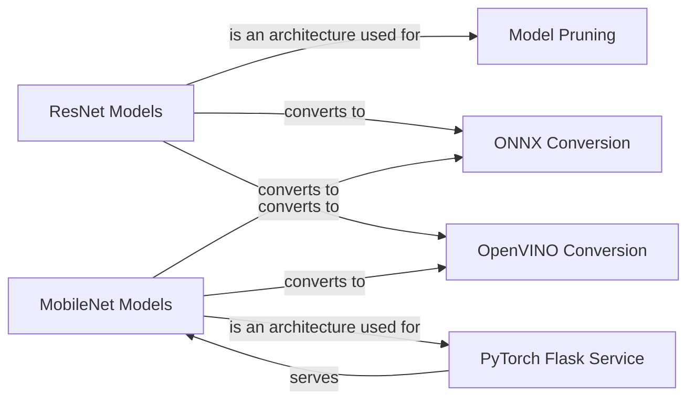

## Component Details

The Model Deployment Service provides tools for deploying PyTorch models, focusing on ONNX and OpenVINO conversion, model pruning, and serving models via a Flask API. It supports various model architectures like ResNet and MobileNet, enabling efficient deployment on different platforms.

### ResNet Models
ResNet models (e.g., resnet34, resnet101) serve as foundational architectures for image classification tasks within the deployment service. They are utilized in ONNX and OpenVINO conversion processes, as well as in model pruning functionalities to optimize model size and performance.
- **Related Classes/Methods**: `deep-learning-for-image-processing.deploying_service.deploying_pytorch.convert_onnx_cls.model.ResNet`, `deep-learning-for-image-processing.deploying_service.pruning_model_pytorch.model.ResNet`, `deep-learning-for-image-processing.deploying_service.deploying_pytorch.convert_onnx_cls.model:resnet34`, `deep-learning-for-image-processing.deploying_service.deploying_pytorch.convert_onnx_cls.model:resnet101`, `deep-learning-for-image-processing.deploying_service.pruning_model_pytorch.model:resnet34`, `deep-learning-for-image-processing.deploying_service.pruning_model_pytorch.model:resnet101`

### MobileNet Models
MobileNetV2 and MobileNetV3 are lightweight architectures optimized for mobile and edge deployments. MobileNetV2 is deployed using a Flask service, while MobileNetV3 is converted to OpenVINO format for optimized inference on Intel hardware. These models incorporate InvertedResidual blocks and SqueezeExcitation modules to enhance performance.
- **Related Classes/Methods**: `deep-learning-for-image-processing.deploying_service.deploying_pytorch.pytorch_flask_service.model.MobileNetV2`, `deep-learning-for-image-processing.deploying_service.deploying_pytorch.convert_openvino.convert_resnet34.model.MobileNetV3`, `deep-learning-for-image-processing.deploying_service.deploying_pytorch.convert_openvino.convert_resnet34.model:mobilenet_v3_large`, `deep-learning-for-image-processing.deploying_service.deploying_pytorch.convert_openvino.convert_resnet34.model:mobilenet_v3_small`

### ONNX Conversion
The ONNX Conversion component converts PyTorch models (ResNet, MobileNet) into the ONNX format, facilitating interoperability and deployment across various platforms and runtimes. This conversion enables the models to be used with different inference engines and hardware accelerators.
- **Related Classes/Methods**: `deep-learning-for-image-processing.deploying_service.deploying_pytorch.convert_onnx_cls`

### OpenVINO Conversion
The OpenVINO Conversion component converts PyTorch models (ResNet, MobileNetV3) into the OpenVINO format, optimizing them for inference on Intel hardware. This conversion leverages Intel's Deep Learning Deployment Toolkit to accelerate model execution on CPUs, GPUs, and other Intel accelerators.
- **Related Classes/Methods**: `deep-learning-for-image-processing.deploying_service.deploying_pytorch.convert_openvino`

### PyTorch Flask Service
The PyTorch Flask Service component deploys PyTorch models (specifically MobileNetV2) using a Flask API, enabling real-time prediction serving. This service provides an HTTP endpoint for clients to submit image data and receive model predictions, making it suitable for web-based applications.
- **Related Classes/Methods**: `deep-learning-for-image-processing.deploying_service.deploying_pytorch.pytorch_flask_service`

### Model Pruning
The Model Pruning component focuses on reducing the size and computational cost of PyTorch models (ResNet) by removing unimportant weights or connections. This process helps to improve inference speed and reduce memory footprint, making the models more suitable for deployment on resource-constrained devices.
- **Related Classes/Methods**: `deep-learning-for-image-processing.deploying_service.pruning_model_pytorch.main:main`
