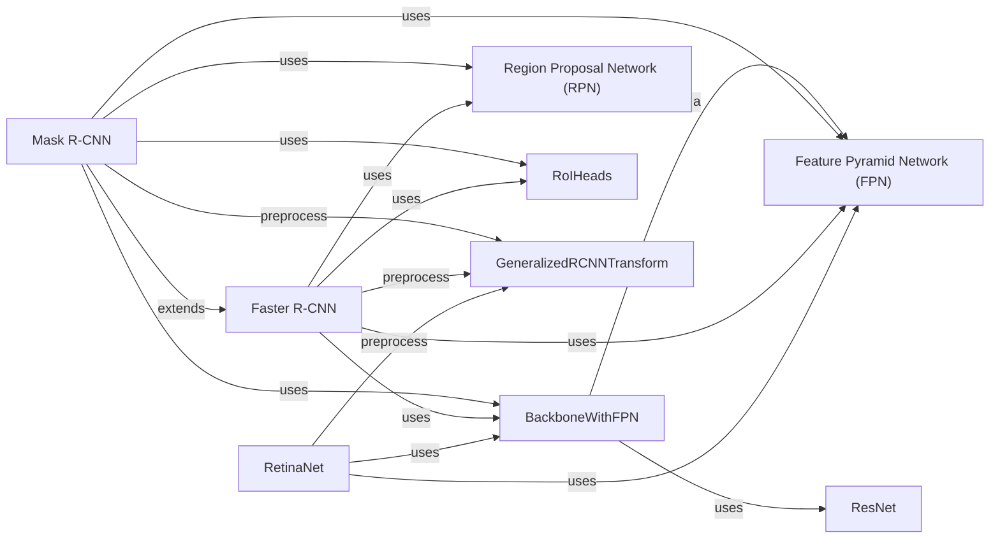

## Component Details

The object detection models component provides a suite of PyTorch-based models for identifying and localizing objects within images. The core of this component revolves around several popular object detection architectures, including Faster R-CNN, Mask R-CNN, and RetinaNet. These models leverage backbone networks like ResNet and feature extraction techniques like Feature Pyramid Networks (FPN) to achieve state-of-the-art performance. The component also includes utility functions for training, evaluation, and data preprocessing, enabling users to easily train and deploy these models for various object detection tasks.

### RetinaNet
RetinaNet is a single-stage object detection model that uses a Feature Pyramid Network (FPN) on top of a backbone network (e.g., ResNet) to detect objects at different scales. It consists of classification and regression heads for predicting object classes and bounding boxes, respectively.
- **Related Classes/Methods**: `deep-learning-for-image-processing.pytorch_object_detection.retinaNet.network_files.retinanet.RetinaNet`, `deep-learning-for-image-processing.pytorch_object_detection.retinaNet.network_files.retinanet.RetinaNetHead`, `deep-learning-for-image-processing.pytorch_object_detection.retinaNet.network_files.retinanet.RetinaNetClassificationHead`, `deep-learning-for-image-processing.pytorch_object_detection.retinaNet.network_files.retinanet.RetinaNetRegressionHead`

### Faster R-CNN
Faster R-CNN is a two-stage object detection model. It uses a Region Proposal Network (RPN) to generate candidate object proposals, which are then refined by a RoI head to predict object classes and bounding boxes.
- **Related Classes/Methods**: `deep-learning-for-image-processing.pytorch_object_detection.faster_rcnn.network_files.faster_rcnn_framework.FasterRCNN`, `deep-learning-for-image-processing.pytorch_object_detection.faster_rcnn.network_files.rpn_function.RegionProposalNetwork`, `deep-learning-for-image-processing.pytorch_object_detection.faster_rcnn.network_files.roi_head.RoIHeads`

### Mask R-CNN
Mask R-CNN extends Faster R-CNN by adding a mask prediction branch to the RoI head, enabling instance segmentation. It predicts a segmentation mask for each detected object.
- **Related Classes/Methods**: `deep-learning-for-image-processing.pytorch_object_detection.mask_rcnn.network_files.mask_rcnn.MaskRCNN`, `deep-learning-for-image-processing.pytorch_object_detection.mask_rcnn.network_files.roi_head.RoIHeads`

### Feature Pyramid Network (FPN)
FPN is a feature extractor that builds a feature pyramid from a single-scale input. It combines low-resolution, semantically strong features with high-resolution, semantically weak features to detect objects at different scales.
- **Related Classes/Methods**: `deep-learning-for-image-processing.pytorch_object_detection.retinaNet.backbone.feature_pyramid_network.FeaturePyramidNetwork`, `deep-learning-for-image-processing.pytorch_object_detection.faster_rcnn.backbone.feature_pyramid_network.FeaturePyramidNetwork`, `deep-learning-for-image-processing.pytorch_object_detection.mask_rcnn.backbone.feature_pyramid_network.FeaturePyramidNetwork`

### BackboneWithFPN
BackboneWithFPN combines a backbone network (e.g., ResNet) with a Feature Pyramid Network (FPN). It extracts features from the backbone and feeds them into the FPN to generate a feature pyramid.
- **Related Classes/Methods**: `deep-learning-for-image-processing.pytorch_object_detection.retinaNet.backbone.feature_pyramid_network.BackboneWithFPN`, `deep-learning-for-image-processing.pytorch_object_detection.faster_rcnn.backbone.feature_pyramid_network.BackboneWithFPN`, `deep-learning-for-image-processing.pytorch_object_detection.mask_rcnn.backbone.feature_pyramid_network.BackboneWithFPN`

### ResNet
ResNet is a deep residual network used as a backbone for feature extraction. It consists of multiple residual blocks that learn residual mappings to address the vanishing gradient problem.
- **Related Classes/Methods**: `deep-learning-for-image-processing.pytorch_object_detection.retinaNet.backbone.resnet50_fpn_model.ResNet`, `deep-learning-for-image-processing.pytorch_object_detection.faster_rcnn.backbone.resnet50_fpn_model.ResNet`, `deep-learning-for-image-processing.pytorch_object_detection.mask_rcnn.backbone.resnet50_fpn_model.ResNet`

### Region Proposal Network (RPN)
RPN generates candidate object proposals by predicting objectness scores and bounding box regressions for a set of anchors. It is used in Faster R-CNN and Mask R-CNN.
- **Related Classes/Methods**: `deep-learning-for-image-processing.pytorch_object_detection.faster_rcnn.network_files.rpn_function.RegionProposalNetwork`, `deep-learning-for-image-processing.pytorch_object_detection.mask_rcnn.network_files.rpn_function.RegionProposalNetwork`

### RoIHeads
RoIHeads refines the object proposals generated by RPN. It predicts object classes, bounding box regressions, and segmentation masks (in Mask R-CNN) for each RoI (Region of Interest).
- **Related Classes/Methods**: `deep-learning-for-image-processing.pytorch_object_detection.faster_rcnn.network_files.roi_head.RoIHeads`, `deep-learning-for-image-processing.pytorch_object_detection.mask_rcnn.network_files.roi_head.RoIHeads`

### GeneralizedRCNNTransform
GeneralizedRCNNTransform preprocesses the input images and targets. It resizes the images, normalizes the pixel values, and batches the images into a single tensor.
- **Related Classes/Methods**: `deep-learning-for-image-processing.pytorch_object_detection.retinaNet.network_files.transform.GeneralizedRCNNTransform`, `deep-learning-for-image-processing.pytorch_object_detection.faster_rcnn.network_files.transform.GeneralizedRCNNTransform`, `deep-learning-for-image-processing.pytorch_object_detection.mask_rcnn.network_files.transform.GeneralizedRCNNTransform`
