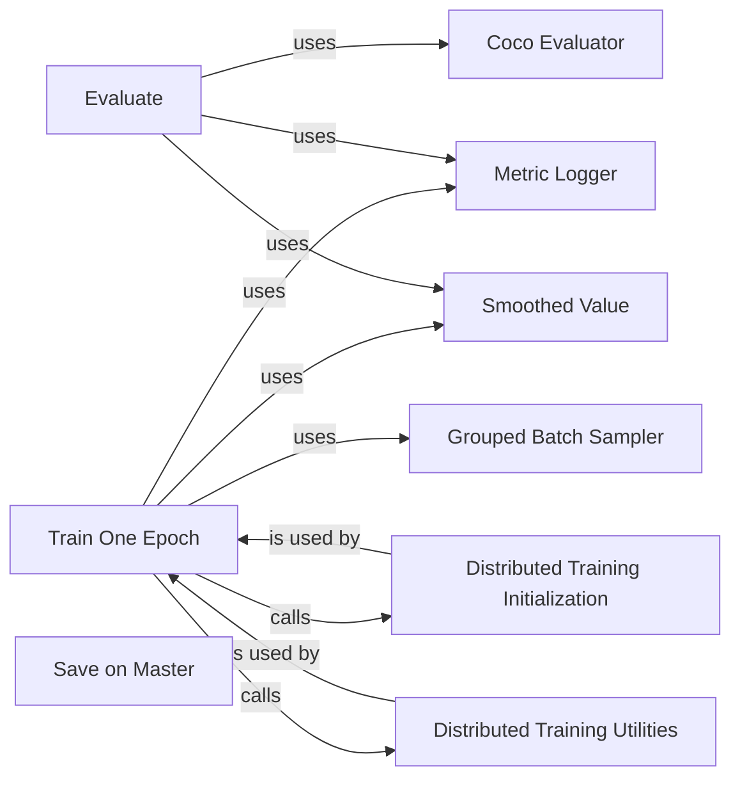

## Component Details

The Training Utilities component provides a set of reusable tools and functions to facilitate the training and evaluation of deep learning models. It includes functionalities for distributed training, evaluation using COCO metrics, and custom batch samplers to optimize training efficiency. The component abstracts away common training-related tasks, allowing developers to focus on model design and experimentation.

### Train One Epoch
This component encapsulates the training loop for a single epoch. It iterates through the training dataset, performs forward and backward passes, and updates the model's weights using the optimizer. It also uses MetricLogger and SmoothedValue to log and track training metrics.
- **Related Classes/Methods**: `deep-learning-for-image-processing.pytorch_classification.train_multi_GPU.multi_train_utils.train_eval_utils:train_one_epoch`, `deep-learning-for-image-processing.pytorch_keypoint.DeepPose.train_utils.train_eval_utils:train_one_epoch`, `deep-learning-for-image-processing.pytorch_keypoint.HRNet.train_utils.train_eval_utils:train_one_epoch`, `deep-learning-for-image-processing.pytorch_segmentation.unet.train_utils.train_and_eval:train_one_epoch`, `deep-learning-for-image-processing.pytorch_segmentation.deeplab_v3.train_utils.train_and_eval:train_one_epoch`, `deep-learning-for-image-processing.pytorch_segmentation.lraspp.train_utils.train_and_eval:train_one_epoch`, `deep-learning-for-image-processing.pytorch_segmentation.u2net.train_utils.train_and_eval:train_one_epoch`, `deep-learning-for-image-processing.pytorch_segmentation.fcn.train_utils.train_and_eval:train_one_epoch`, `deep-learning-for-image-processing.pytorch_object_detection.retinaNet.train_utils.train_eval_utils:train_one_epoch`, `deep-learning-for-image-processing.pytorch_object_detection.faster_rcnn.train_utils.train_eval_utils:train_one_epoch`, `deep-learning-for-image-processing.pytorch_object_detection.mask_rcnn.train_utils.train_eval_utils:train_one_epoch`, `deep-learning-for-image-processing.pytorch_object_detection.yolov3_spp.train_utils.train_eval_utils:train_one_epoch`, `deep-learning-for-image-processing.pytorch_object_detection.train_coco_dataset.train_utils.train_eval_utils:train_one_epoch`

### Evaluate
This component evaluates the trained model on a validation dataset. It calculates relevant metrics to assess the model's performance, often using the CocoEvaluator for object detection tasks. It also uses MetricLogger and SmoothedValue to log and track evaluation metrics.
- **Related Classes/Methods**: `deep-learning-for-image-processing.pytorch_classification.train_multi_GPU.multi_train_utils.train_eval_utils:evaluate`, `deep-learning-for-image-processing.pytorch_keypoint.DeepPose.train_utils.train_eval_utils:evaluate`, `deep-learning-for-image-processing.pytorch_keypoint.HRNet.train_utils.train_eval_utils:evaluate`, `deep-learning-for-image-processing.pytorch_segmentation.unet.train_utils.train_and_eval:evaluate`, `deep-learning-for-image-processing.pytorch_segmentation.deeplab_v3.train_utils.train_and_eval:evaluate`, `deep-learning-for-image-processing.pytorch_segmentation.lraspp.train_utils.train_and_eval:evaluate`, `deep-learning-for-image-processing.pytorch_segmentation.u2net.train_utils.train_and_eval:evaluate`, `deep-learning-for-image-processing.pytorch_segmentation.fcn.train_utils.train_and_eval:evaluate`, `deep-learning-for-image-processing.pytorch_object_detection.retinaNet.train_utils.train_eval_utils:evaluate`, `deep-learning-for-image-processing.pytorch_object_detection.faster_rcnn.train_utils.train_eval_utils:evaluate`, `deep-learning-for-image-processing.pytorch_object_detection.mask_rcnn.train_utils.train_eval_utils:evaluate`, `deep-learning-for-image-processing.pytorch_object_detection.yolov3_spp.train_utils.train_eval_utils:evaluate`, `deep-learning-for-image-processing.pytorch_object_detection.train_coco_dataset.train_utils.train_eval_utils:evaluate`

### Distributed Training Initialization
This component initializes the distributed training environment, setting up communication between processes for multi-GPU or multi-node training. It uses `torch.distributed` to manage the distributed setup.
- **Related Classes/Methods**: `deep-learning-for-image-processing.pytorch_keypoint.DeepPose.train_utils.distributed_utils:init_distributed_mode`, `deep-learning-for-image-processing.pytorch_keypoint.HRNet.train_utils.distributed_utils:init_distributed_mode`, `deep-learning-for-image-processing.pytorch_segmentation.unet.train_utils.distributed_utils:init_distributed_mode`, `deep-learning-for-image-processing.pytorch_segmentation.deeplab_v3.train_utils.distributed_utils:init_distributed_mode`, `deep-learning-for-image-processing.pytorch_segmentation.lraspp.train_utils.distributed_utils:init_distributed_mode`, `deep-learning-for-image-processing.pytorch_segmentation.u2net.train_utils.distributed_utils:init_distributed_mode`, `deep-learning-for-image-processing.pytorch_segmentation.fcn.train_utils.distributed_utils:init_distributed_mode`, `deep-learning-for-image-processing.pytorch_object_detection.retinaNet.train_utils.distributed_utils:init_distributed_mode`, `deep-learning-for-image-processing.pytorch_object_detection.faster_rcnn.train_utils.distributed_utils:init_distributed_mode`, `deep-learning-for-image-processing.pytorch_object_detection.mask_rcnn.train_utils.distributed_utils:init_distributed_mode`, `deep-learning-for-image-processing.pytorch_object_detection.yolov3_spp.train_utils.distributed_utils:init_distributed_mode`

### Distributed Training Utilities
This component provides utility functions for distributed training, such as getting the world size, rank, and checking if the current process is the main process. These utilities are essential for coordinating training across multiple processes.
- **Related Classes/Methods**: `deep-learning-for-image-processing.pytorch_classification.train_multi_GPU.multi_train_utils.distributed_utils:get_world_size`, `deep-learning-for-image-processing.pytorch_classification.train_multi_GPU.multi_train_utils.distributed_utils:get_rank`, `deep-learning-for-image-processing.pytorch_classification.train_multi_GPU.multi_train_utils.distributed_utils:is_main_process`, `deep-learning-for-image-processing.pytorch_keypoint.DeepPose.train_utils.distributed_utils:get_world_size`, `deep-learning-for-image-processing.pytorch_keypoint.DeepPose.train_utils.distributed_utils:get_rank`, `deep-learning-for-image-processing.pytorch_keypoint.DeepPose.train_utils.distributed_utils:is_main_process`, `deep-learning-for-image-processing.pytorch_keypoint.HRNet.train_utils.distributed_utils:get_world_size`, `deep-learning-for-image-processing.pytorch_keypoint.HRNet.train_utils.distributed_utils:get_rank`, `deep-learning-for-image-processing.pytorch_keypoint.HRNet.train_utils.distributed_utils:is_main_process`, `deep-learning-for-image-processing.pytorch_segmentation.unet.train_utils.distributed_utils:get_world_size`, `deep-learning-for-image-processing.pytorch_segmentation.unet.train_utils.distributed_utils:get_rank`, `deep-learning-for-image-processing.pytorch_segmentation.unet.train_utils.distributed_utils:is_main_process`, `deep-learning-for-image-processing.pytorch_segmentation.deeplab_v3.train_utils.distributed_utils:get_world_size`, `deep-learning-for-image-processing.pytorch_segmentation.deeplab_v3.train_utils.distributed_utils:get_rank`, `deep-learning-for-image-processing.pytorch_segmentation.deeplab_v3.train_utils.distributed_utils:is_main_process`, `deep-learning-for-image-processing.pytorch_segmentation.lraspp.train_utils.distributed_utils:get_world_size`, `deep-learning-for-image-processing.pytorch_segmentation.lraspp.train_utils.distributed_utils:get_rank`, `deep-learning-for-image-processing.pytorch_segmentation.lraspp.train_utils.distributed_utils:is_main_process`, `deep-learning-for-image-processing.pytorch_segmentation.u2net.train_utils.distributed_utils:get_world_size`, `deep-learning-for-image-processing.pytorch_segmentation.u2net.train_utils.distributed_utils:get_rank`, `deep-learning-for-image-processing.pytorch_segmentation.u2net.train_utils.distributed_utils:is_main_process`, `deep-learning-for-image-processing.pytorch_segmentation.fcn.train_utils.distributed_utils:get_world_size`, `deep-learning-for-image-processing.pytorch_segmentation.fcn.train_utils.distributed_utils:get_rank`, `deep-learning-for-image-processing.pytorch_segmentation.fcn.train_utils.distributed_utils:is_main_process`, `deep-learning-for-image-processing.pytorch_object_detection.retinaNet.train_utils.distributed_utils:get_world_size`, `deep-learning-for-image-processing.pytorch_object_detection.retinaNet.train_utils.distributed_utils:get_rank`, `deep-learning-for-image-processing.pytorch_object_detection.retinaNet.train_utils.distributed_utils:is_main_process`, `deep-learning-for-image-processing.pytorch_object_detection.faster_rcnn.train_utils.distributed_utils:get_world_size`, `deep-learning-for-image-processing.pytorch_object_detection.faster_rcnn.train_utils.distributed_utils:get_rank`, `deep-learning-for-image-processing.pytorch_object_detection.faster_rcnn.train_utils.distributed_utils:is_main_process`, `deep-learning-for-image-processing.pytorch_object_detection.mask_rcnn.train_utils.distributed_utils:get_world_size`, `deep-learning-for-image-processing.pytorch_object_detection.mask_rcnn.train_utils.distributed_utils:get_rank`, `deep-learning-for-image-processing.pytorch_object_detection.mask_rcnn.train_utils.distributed_utils:is_main_process`, `deep-learning-for-image-processing.pytorch_object_detection.yolov3_spp.train_utils.distributed_utils:get_world_size`, `deep-learning-for-image-processing.pytorch_object_detection.yolov3_spp.train_utils.distributed_utils:get_rank`, `deep-learning-for-image-processing.pytorch_object_detection.yolov3_spp.train_utils.distributed_utils:is_main_process`

### Save on Master
This component ensures that model checkpoints are saved only on the main process in a distributed training setup, preventing redundant saves and potential conflicts.
- **Related Classes/Methods**: `deep-learning-for-image-processing.pytorch_keypoint.HRNet.train_utils.distributed_utils:save_on_master`, `deep-learning-for-image-processing.pytorch_segmentation.unet.train_utils.distributed_utils:save_on_master`, `deep-learning-for-image-processing.pytorch_segmentation.deeplab_v3.train_utils.distributed_utils:save_on_master`, `deep-learning-for-image-processing.pytorch_segmentation.lraspp.train_utils.distributed_utils:save_on_master`, `deep-learning-for-image-processing.pytorch_segmentation.u2net.train_utils.distributed_utils:save_on_master`, `deep-learning-for-image-processing.pytorch_segmentation.fcn.train_utils.distributed_utils:save_on_master`, `deep-learning-for-image-processing.pytorch_object_detection.retinaNet.train_utils.distributed_utils:save_on_master`, `deep-learning-for-image-processing.pytorch_object_detection.faster_rcnn.train_utils.distributed_utils:save_on_master`, `deep-learning-for-image-processing.pytorch_object_detection.mask_rcnn.train_utils.distributed_utils:save_on_master`, `deep-learning-for-image-processing.pytorch_object_detection.yolov3_spp.train_utils.distributed_utils:save_on_master`

### Grouped Batch Sampler
This component is a custom batch sampler that groups images with similar aspect ratios together. This improves training efficiency, especially for object detection tasks, by reducing padding and improving GPU utilization.
- **Related Classes/Methods**: `deep-learning-for-image-processing.pytorch_keypoint.HRNet.train_utils.group_by_aspect_ratio.GroupedBatchSampler:__iter__`, `deep-learning-for-image-processing.pytorch_object_detection.retinaNet.train_utils.group_by_aspect_ratio.GroupedBatchSampler:__iter__`, `deep-learning-for-image-processing.pytorch_object_detection.faster_rcnn.train_utils.group_by_aspect_ratio.GroupedBatchSampler:__iter__`, `deep-learning-for-image-processing.pytorch_object_detection.mask_rcnn.train_utils.group_by_aspect_ratio.GroupedBatchSampler:__iter__`, `deep-learning-for-image-processing.pytorch_object_detection.yolov3_spp.train_utils.group_by_aspect_ratio.GroupedBatchSampler:__iter__`, `deep-learning-for-image-processing.pytorch_object_detection.train_coco_dataset.train_utils.group_by_aspect_ratio.GroupedBatchSampler:__iter__`

### Coco Evaluator
This component is used to evaluate object detection models using the COCO evaluation metrics. It calculates metrics such as mAP (mean Average Precision) and AR (Average Recall) to assess the model's performance on object detection tasks.
- **Related Classes/Methods**: `deep-learning-for-image-processing.pytorch_object_detection.retinaNet.train_utils.coco_eval.CocoEvaluator:update`, `deep-learning-for-image-processing.pytorch_object_detection.retinaNet.train_utils.coco_eval.CocoEvaluator:synchronize_between_processes`, `deep-learning-for-image-processing.pytorch_object_detection.retinaNet.train_utils.coco_eval.CocoEvaluator:prepare`, `deep-learning-for-image-processing.pytorch_object_detection.retinaNet.train_utils.coco_eval.CocoEvaluator:prepare_for_coco_detection`, `deep-learning-for-image-processing.pytorch_object_detection.retinaNet.train_utils.coco_eval.CocoEvaluator:prepare_for_coco_keypoint`, `deep-learning-for-image-processing.pytorch_object_detection.faster_rcnn.train_utils.coco_eval.CocoEvaluator:update`, `deep-learning-for-image-processing.pytorch_object_detection.faster_rcnn.train_utils.coco_eval.CocoEvaluator:synchronize_between_processes`, `deep-learning-for-image-processing.pytorch_object_detection.faster_rcnn.train_utils.coco_eval.CocoEvaluator:prepare`, `deep-learning-for-image-processing.pytorch_object_detection.faster_rcnn.train_utils.coco_eval.CocoEvaluator:prepare_for_coco_detection`, `deep-learning-for-image-processing.pytorch_object_detection.faster_rcnn.train_utils.coco_eval.CocoEvaluator:prepare_for_coco_keypoint`, `deep-learning-for-image-processing.pytorch_object_detection.yolov3_spp.train_utils.coco_eval.CocoEvaluator:update`, `deep-learning-for-image-processing.pytorch_object_detection.yolov3_spp.train_utils.coco_eval.CocoEvaluator:synchronize_between_processes`, `deep-learning-for-image-processing.pytorch_object_detection.yolov3_spp.train_utils.coco_eval.CocoEvaluator:prepare`, `deep-learning-for-image-processing.pytorch_object_detection.yolov3_spp.train_utils.coco_eval.CocoEvaluator:prepare_for_coco_detection`, `deep-learning-for-image-processing.pytorch_object_detection.yolov3_spp.train_utils.coco_eval.CocoEvaluator:prepare_for_coco_keypoint`

### Metric Logger
This component logs training and evaluation metrics to the console or a file. It provides a convenient way to track the progress of training and identify potential issues.
- **Related Classes/Methods**: `deep-learning-for-image-processing.pytorch_keypoint.HRNet.train_utils.distributed_utils.MetricLogger:log_every`, `deep-learning-for-image-processing.pytorch_segmentation.unet.train_utils.distributed_utils.MetricLogger:log_every`, `deep-learning-for-image-processing.pytorch_segmentation.deeplab_v3.train_utils.distributed_utils.MetricLogger:log_every`, `deep-learning-for-image-processing.pytorch_segmentation.lraspp.train_utils.distributed_utils.MetricLogger:log_every`, `deep-learning-for-image-processing.pytorch_segmentation.u2net.train_utils.distributed_utils.MetricLogger:log_every`, `deep-learning-for-image-processing.pytorch_segmentation.fcn.train_utils.distributed_utils.MetricLogger:log_every`, `deep-learning-for-image-processing.pytorch_object_detection.retinaNet.train_utils.distributed_utils.MetricLogger:log_every`, `deep-learning-for-image-processing.pytorch_object_detection.faster_rcnn.train_utils.distributed_utils.MetricLogger:log_every`, `deep-learning-for-image-processing.pytorch_object_detection.mask_rcnn.train_utils.distributed_utils.MetricLogger:log_every`, `deep-learning-for-image-processing.pytorch_object_detection.yolov3_spp.train_utils.distributed_utils.MetricLogger:log_every`

### Smoothed Value
This component keeps track of a series of values and provides a smoothed average. This is useful for reducing noise in training metrics and getting a more stable view of the training progress.
- **Related Classes/Methods**: `deep-learning-for-image-processing.pytorch_keypoint.HRNet.train_utils.distributed_utils.SmoothedValue:synchronize_between_processes`, `deep-learning-for-image-processing.pytorch_segmentation.unet.train_utils.distributed_utils.SmoothedValue:synchronize_between_processes`, `deep-learning-for-image-processing.pytorch_segmentation.deeplab_v3.train_utils.distributed_utils.SmoothedValue:synchronize_between_processes`, `deep-learning-for-image-processing.pytorch_segmentation.lraspp.train_utils.distributed_utils.SmoothedValue:synchronize_between_processes`, `deep-learning-for-image-processing.pytorch_segmentation.u2net.train_utils.distributed_utils.SmoothedValue:synchronize_between_processes`, `deep-learning-for-image-processing.pytorch_segmentation.fcn.train_utils.distributed_utils.SmoothedValue:synchronize_between_processes`, `deep-learning-for-image-processing.pytorch_object_detection.retinaNet.train_utils.distributed_utils.SmoothedValue:synchronize_between_processes`, `deep-learning-for-image-processing.pytorch_object_detection.faster_rcnn.train_utils.distributed_utils.SmoothedValue:synchronize_between_processes`, `deep-learning-for-image-processing.pytorch_object_detection.mask_rcnn.train_utils.distributed_utils.SmoothedValue:synchronize_between_processes`, `deep-learning-for-image-processing.pytorch_object_detection.yolov3_spp.train_utils.distributed_utils.SmoothedValue:synchronize_between_processes`
