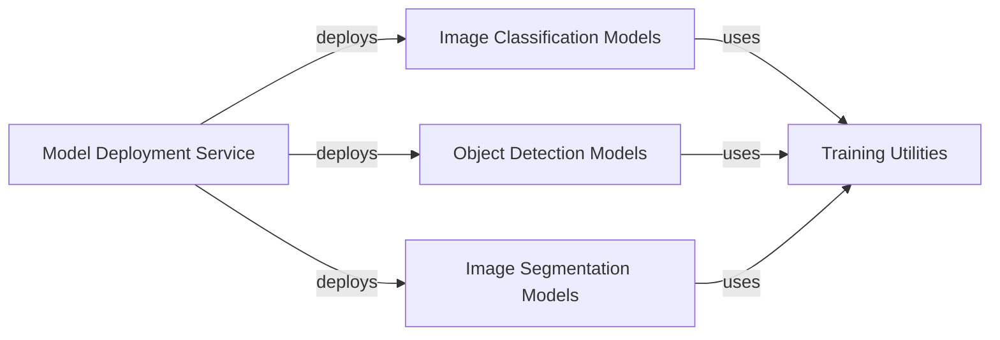

## Component Details

The project provides a comprehensive suite of deep learning models and utilities for image processing tasks. It includes implementations of popular classification, object detection, and segmentation models in both TensorFlow and PyTorch. The project also offers a deployment service for PyTorch models and common training utilities to facilitate model development and evaluation.

### Image Classification Models
This component encompasses a wide range of image classification models implemented in both TensorFlow and PyTorch. It includes popular architectures like EfficientNetV2, MobileNetV2/V3, Swin Transformer, Vision Transformer, ResNet, VGG, ConvNeXt, DenseNet, ShuffleNet, and RegNet. The component provides pre-built and customizable classification models for various image classification tasks.
- **Related Classes/Methods**: `deep-learning-for-image-processing.tensorflow_classification.*`, `deep-learning-for-image-processing.pytorch_classification.*`

### Object Detection Models
This component focuses on object detection models implemented in PyTorch. It includes models like Faster R-CNN, Mask R-CNN, RetinaNet, and YOLOv3, along with necessary backbones and network files. The component provides a set of object detection models for identifying and localizing objects within images.
- **Related Classes/Methods**: `deep-learning-for-image-processing.pytorch_object_detection.*`

### Image Segmentation Models
This component deals with image segmentation models implemented in PyTorch. It includes models like UNet, DeepLabV3, LRASPP, U2Net, and FCN. It also provides training loops and distributed training utilities. The component offers a collection of image segmentation models for pixel-level classification of images.
- **Related Classes/Methods**: `deep-learning-for-image-processing.pytorch_segmentation.*`

### Model Deployment Service
This component focuses on deploying PyTorch models, potentially using Flask. It also includes ONNX conversion and model pruning functionalities. The component provides tools and services for deploying trained PyTorch models to production environments.
- **Related Classes/Methods**: `deep-learning-for-image-processing.deploying_service.*`

### Training Utilities
This component provides common training and evaluation utilities, including distributed training support, COCO evaluation, and grouped batch samplers. The component offers reusable tools and functions to facilitate the training and evaluation of deep learning models across different tasks.
- **Related Classes/Methods**: `deep-learning-for-image-processing.*.train_utils.*`, `deep-learning-for-image-processing.*.multi_train_utils.*`