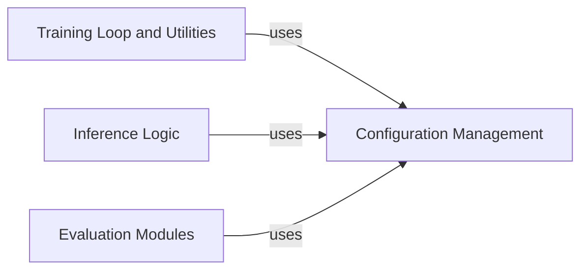

## Details

Analysis of molecular design process components and their relationships based on the provided component overview for Configuration Management and its interactions with other modules.

### Configuration Management [[Expand]](./Configuration_Management.md)
This component is responsible for defining, parsing, and managing all configurable parameters for the molecular design process. It provides a structured and centralized mechanism for handling various operational modes (training, molecule generation, and evaluation) and different model architectures (Transformer and Seq2Seq). This ensures that all experiments are consistent and reproducible by providing a single source of truth for model hyperparameters, training options, data paths, and evaluation criteria. It uses `argparse` to allow flexible configuration at runtime.

**Related Classes/Methods**:

- <a href="https://github.com/MolecularAI/deep-molecular-optimization/blob/main/configuration/opts.py#L4-L27" target="_blank" rel="noopener noreferrer">`configuration.opts.train_opts` (4:27)</a>
- <a href="https://github.com/MolecularAI/deep-molecular-optimization/blob/main/configuration/opts.py#L29-L63" target="_blank" rel="noopener noreferrer">`configuration.opts.train_opts_transformer` (29:63)</a>
- <a href="https://github.com/MolecularAI/deep-molecular-optimization/blob/main/configuration/opts.py#L66-L91" target="_blank" rel="noopener noreferrer">`configuration.opts.train_opts_seq2seq` (66:91)</a>
- <a href="https://github.com/MolecularAI/deep-molecular-optimization/blob/main/configuration/opts.py#L94-L115" target="_blank" rel="noopener noreferrer">`configuration.opts.generate_opts` (94:115)</a>
- <a href="https://github.com/MolecularAI/deep-molecular-optimization/blob/main/configuration/opts.py#L118-L132" target="_blank" rel="noopener noreferrer">`configuration.opts.evaluation_opts` (118:132)</a>
- <a href="https://github.com/MolecularAI/deep-molecular-optimization/blob/main/configuration/config_default.py" target="_blank" rel="noopener noreferrer">`configuration/config_default.py`</a>

### Training Loop and Utilities

**Related Classes/Methods**: _None_

### Inference Logic

**Related Classes/Methods**: _None_

### Evaluation Modules

**Related Classes/Methods**: _None_

### [FAQ](https://github.com/CodeBoarding/GeneratedOnBoardings/tree/main?tab=readme-ov-file#faq)