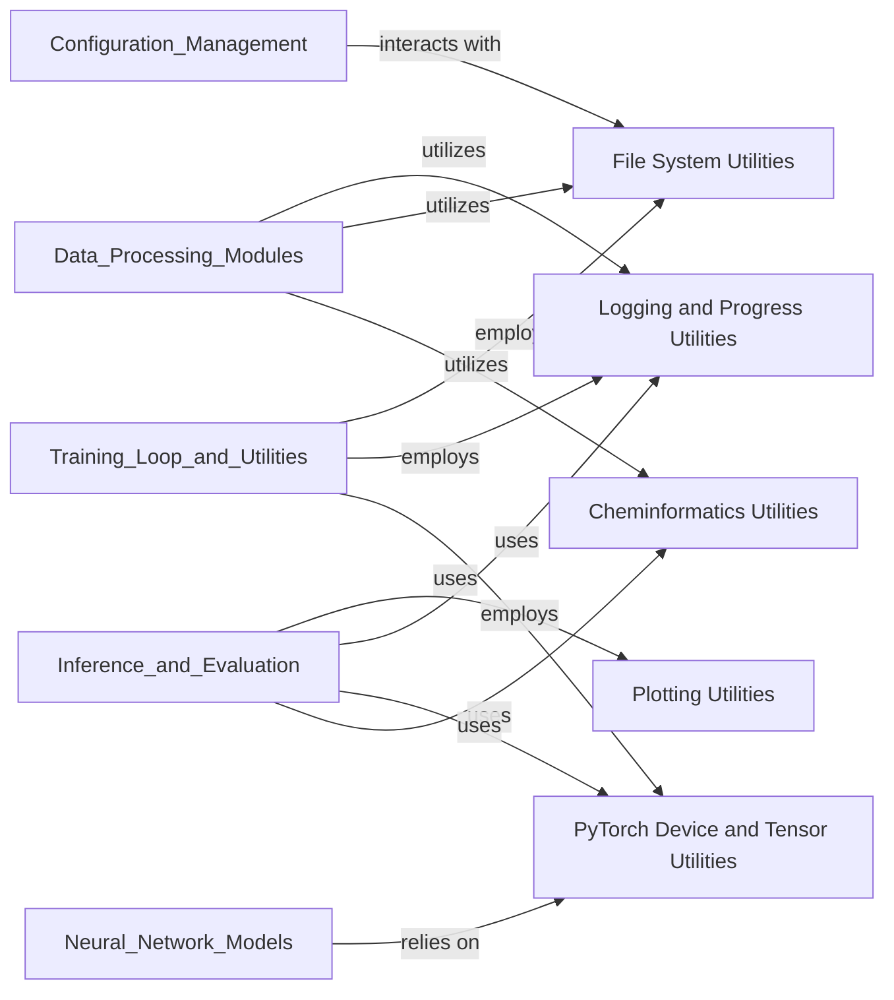

## Details

The `Core Utilities` component serves as the foundational backbone for the entire project, providing a suite of highly reusable helper functions and modules.

### Cheminformatics Utilities
This module provides essential functions for handling molecular data, including operations like molecular similarity calculations, validation of chemical structures, and conversions between different molecular representations (e.g., SMILES, DeepSMILES). It directly supports the project's core domain.

**Related Classes/Methods**:

- <a href="https://github.com/MolecularAI/deep-molecular-optimization/blob/main/utils/chem.py#L1-L1" target="_blank" rel="noopener noreferrer">`utils.chem` (1:1)</a>

### File System Utilities
Offers robust helper functions for managing files and directories. This includes creating directories, checking file existence, handling file paths, and ensuring proper file I/O operations. It's crucial for data loading, saving models, and managing experiment outputs.

**Related Classes/Methods**:

- <a href="https://github.com/MolecularAI/deep-molecular-optimization/blob/main/utils/file.py#L1-L1" target="_blank" rel="noopener noreferrer">`utils.file` (1:1)</a>

### Logging and Progress Utilities
Implements a flexible logging system for tracking execution flow, debugging, and reporting status messages. It also includes functionalities for displaying progress bars, which are vital for providing user feedback during long-running operations like data processing or model training.

**Related Classes/Methods**:

- <a href="https://github.com/MolecularAI/deep-molecular-optimization/blob/main/utils/log.py#L1-L1" target="_blank" rel="noopener noreferrer">`utils.log` (1:1)</a>

### PyTorch Device and Tensor Utilities
Contains specialized helper functions for managing PyTorch devices (CPU/GPU), efficiently moving tensors between devices, and other PyTorch-specific operations. These utilities are crucial for optimizing performance and ensuring compatibility across different hardware setups.

**Related Classes/Methods**:

- <a href="https://github.com/MolecularAI/deep-molecular-optimization/blob/main/utils/torch_util.py#L1-L1" target="_blank" rel="noopener noreferrer">`utils.torch_util` (1:1)</a>

### Plotting Utilities
Provides functions for generating various plots and visualizations. These are invaluable for analyzing data distributions, visualizing model performance metrics, and illustrating molecular properties, aiding in understanding and interpreting results.

**Related Classes/Methods**:

- <a href="https://github.com/MolecularAI/deep-molecular-optimization/blob/main/utils/plot.py#L1-L1" target="_blank" rel="noopener noreferrer">`utils.plot` (1:1)</a>

### [FAQ](https://github.com/CodeBoarding/GeneratedOnBoardings/tree/main?tab=readme-ov-file#faq)