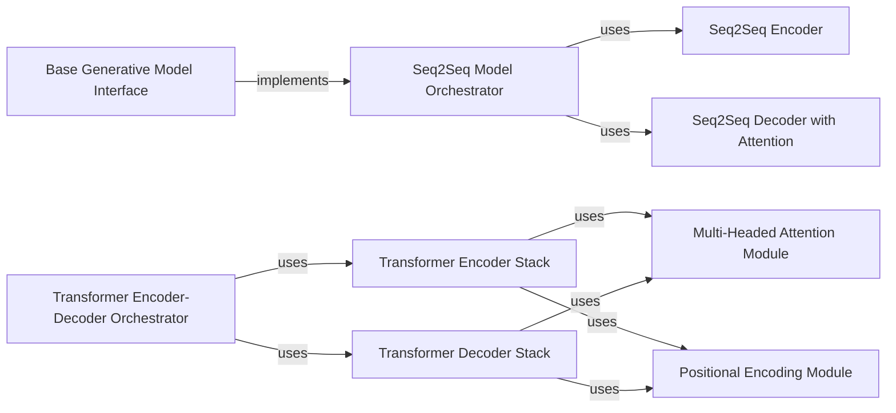

## Details

The Generative Models subsystem implements core neural network architectures for molecular generation, including Seq2Seq and Transformer models, providing foundational building blocks for creating novel molecular structures.

### Base Generative Model Interface
Provides a standardized interface for all generative models, abstracting common functionalities such as model instantiation, loading, saving, and performing molecular generation (inference). This promotes reusability and consistency across different model architectures.

**Related Classes/Methods**:

- <a href="https://github.com/MolecularAI/deep-molecular-optimization/blob/main/models/seq2seq/model.py#L9-L192" target="_blank" rel="noopener noreferrer">`models.seq2seq.model.Model` (9:192)</a>

### Seq2Seq Model Orchestrator
Integrates the Seq2Seq Encoder and Decoder components to form a complete sequence-to-sequence neural network capable of generating molecular sequences.

**Related Classes/Methods**:

- <a href="https://github.com/MolecularAI/deep-molecular-optimization/blob/main/models/seq2seq/seq2seq.py#L268-L282" target="_blank" rel="noopener noreferrer">`models.seq2seq.seq2seq.Seq2Seq` (268:282)</a>

### Seq2Seq Encoder
The recurrent neural network component responsible for processing the input molecular sequence and encoding it into a fixed-size context vector, capturing its essential features.

**Related Classes/Methods**:

- <a href="https://github.com/MolecularAI/deep-molecular-optimization/blob/main/models/seq2seq/seq2seq.py#L11-L136" target="_blank" rel="noopener noreferrer">`models.seq2seq.seq2seq.EncoderRNN` (11:136)</a>

### Seq2Seq Decoder with Attention
The recurrent neural network component that generates the output molecular sequence token by token, utilizing the encoded context vector and an attention mechanism to dynamically focus on relevant parts of the input during generation.

**Related Classes/Methods**:

- <a href="https://github.com/MolecularAI/deep-molecular-optimization/blob/main/models/seq2seq/seq2seq.py#L193-L265" target="_blank" rel="noopener noreferrer">`models.seq2seq.seq2seq.LuongAttnDecoderRNN` (193:265)</a>
- <a href="https://github.com/MolecularAI/deep-molecular-optimization/blob/main/models/seq2seq/seq2seq.py#L139-L190" target="_blank" rel="noopener noreferrer">`models.seq2seq.seq2seq.Attn` (139:190)</a>

### Transformer Encoder-Decoder Orchestrator
The top-level structure of the Transformer model, coordinating the interaction between the Transformer Encoder Stack and Transformer Decoder Stack to perform sequence-to-sequence molecular generation.

**Related Classes/Methods**:

- <a href="https://github.com/MolecularAI/deep-molecular-optimization/blob/main/models/transformer/encode_decode/model.py#L14-L72" target="_blank" rel="noopener noreferrer">`models.transformer.encode_decode.model.EncoderDecoder` (14:72)</a>

### Transformer Encoder Stack
The component of the Transformer model responsible for processing the input sequence, consisting of multiple identical encoder layers that learn rich, contextualized representations.

**Related Classes/Methods**:

- <a href="https://github.com/MolecularAI/deep-molecular-optimization/blob/main/models/transformer/encode_decode/encoder.py#L6-L19" target="_blank" rel="noopener noreferrer">`models.transformer.encode_decode.encoder.Encoder` (6:19)</a>
- <a href="https://github.com/MolecularAI/deep-molecular-optimization/blob/main/models/transformer/encode_decode/encoder_layer.py#L6-L19" target="_blank" rel="noopener noreferrer">`models.transformer.encode_decode.encoder_layer.EncoderLayer` (6:19)</a>

### Transformer Decoder Stack
The component of the Transformer model responsible for generating the output sequence, composed of multiple identical decoder layers that leverage both self-attention and encoder-decoder attention.

**Related Classes/Methods**:

- <a href="https://github.com/MolecularAI/deep-molecular-optimization/blob/main/models/transformer/encode_decode/decoder.py#L6-L22" target="_blank" rel="noopener noreferrer">`models.transformer.encode_decode.decoder.Decoder` (6:22)</a>
- <a href="https://github.com/MolecularAI/deep-molecular-optimization/blob/main/models/transformer/encode_decode/decoder_layer.py#L5-L26" target="_blank" rel="noopener noreferrer">`models.transformer.encode_decode.decoder_layer.DecoderLayer` (5:26)</a>

### Multi-Headed Attention Module
A fundamental building block within Transformer models that allows the model to jointly attend to information from different representation subspaces at different positions in the sequence.

**Related Classes/Methods**:

- <a href="https://github.com/MolecularAI/deep-molecular-optimization/blob/main/models/transformer/module/multi_headed_attention.py#L22-L54" target="_blank" rel="noopener noreferrer">`models.transformer.module.multi_headed_attention.MultiHeadedAttention` (22:54)</a>

### Positional Encoding Module
Injects information about the relative or absolute position of tokens into the input embeddings, as Transformer models inherently lack a mechanism to process sequence order.

**Related Classes/Methods**:

- <a href="https://github.com/MolecularAI/deep-molecular-optimization/blob/main/models/transformer/module/positional_encoding.py#L6-L26" target="_blank" rel="noopener noreferrer">`models.transformer.module.positional_encoding.PositionalEncoding` (6:26)</a>

### [FAQ](https://github.com/CodeBoarding/GeneratedOnBoardings/tree/main?tab=readme-ov-file#faq)