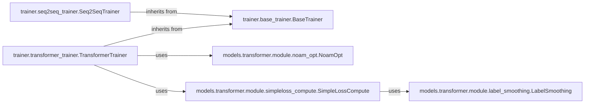

## Details

The `Training & Evaluation Orchestrator` subsystem is crucial for managing the entire training and validation lifecycle of the generative models. It ensures that models are trained effectively, optimized correctly, and evaluated thoroughly.

### trainer.base_trainer.BaseTrainer
This component serves as the abstract base class for all trainers. It establishes the foundational structure for training processes, including common utilities like data loader initialization, logging setup, TensorBoard integration, and management of directories for saving training artifacts. It defines the essential interface that all specific trainer implementations must adhere to, ensuring consistency across different model types.

**Related Classes/Methods**: _None_

### trainer.seq2seq_trainer.Seq2SeqTrainer
This component specializes in orchestrating the training and validation lifecycle for Seq2Seq models. It extends `BaseTrainer` and provides the concrete logic for loading Seq2Seq models, managing their optimization, and executing epoch-wise training and validation steps specifically tailored to Seq2Seq architectures.

**Related Classes/Methods**:

- <a href="https://github.com/MolecularAI/deep-molecular-optimization/blob/main/trainer/base_trainer.py#L12-L62" target="_blank" rel="noopener noreferrer">`trainer.base_trainer.BaseTrainer` (12:62)</a>

### trainer.transformer_trainer.TransformerTrainer
This component is responsible for orchestrating the training and validation lifecycle specifically for Transformer models. It extends `BaseTrainer` and implements the concrete logic for loading Transformer models, applying Transformer-specific optimization strategies (like NoamOpt), and managing the training and validation procedures unique to Transformer architectures.

**Related Classes/Methods**:

- <a href="https://github.com/MolecularAI/deep-molecular-optimization/blob/main/trainer/base_trainer.py#L12-L62" target="_blank" rel="noopener noreferrer">`trainer.base_trainer.BaseTrainer` (12:62)</a>
- <a href="https://github.com/MolecularAI/deep-molecular-optimization/blob/main/models/transformer/module/noam_opt.py#L1-L42" target="_blank" rel="noopener noreferrer">`models.transformer.module.noam_opt.NoamOpt` (1:42)</a>
- <a href="https://github.com/MolecularAI/deep-molecular-optimization/blob/main/models/transformer/module/simpleloss_compute.py#L1-L21" target="_blank" rel="noopener noreferrer">`models.transformer.module.simpleloss_compute.SimpleLossCompute` (1:21)</a>

### models.transformer.module.noam_opt.NoamOpt
This component implements the Noam optimizer, a specialized learning rate scheduler that is critical for the stable and effective training of Transformer models. It dynamically adjusts the learning rate based on the training step and model dimensions, which is essential for the convergence of Transformer architectures.

**Related Classes/Methods**: _None_

### models.transformer.module.label_smoothing.LabelSmoothing
This component applies a regularization technique during training, which is particularly beneficial for sequence-to-sequence models like Transformers. It modifies the target probabilities to prevent the model from becoming overly confident in its predictions, thereby improving generalization and reducing overfitting.

**Related Classes/Methods**: _None_

### models.transformer.module.simpleloss_compute.SimpleLossCompute
This component handles the computation of the loss function during the training process. It takes the model's output and the target labels, potentially incorporating `LabelSmoothing`, to calculate the final loss value that guides backpropagation and model optimization.

**Related Classes/Methods**:

- <a href="https://github.com/MolecularAI/deep-molecular-optimization/blob/main/models/transformer/module/label_smoothing.py#L5-L28" target="_blank" rel="noopener noreferrer">`models.transformer.module.label_smoothing.LabelSmoothing` (5:28)</a>

### [FAQ](https://github.com/CodeBoarding/GeneratedOnBoardings/tree/main?tab=readme-ov-file#faq)