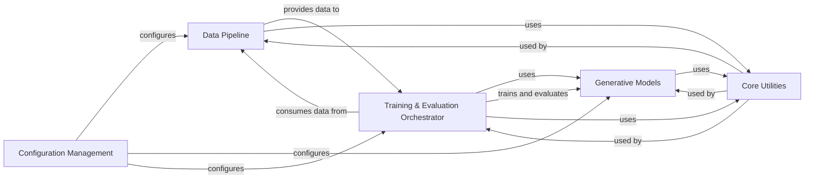

## Details

This project implements a Deep Learning-based Generative Model for Molecular Design, focusing on modularity and clear separation of concerns. The architecture is structured around a data pipeline, distinct generative models, and a robust training and evaluation framework, all supported by a set of core utilities and a centralized configuration system.

### Configuration Management [[Expand]](./Configuration_Management.md)
Centralizes and manages all configurable parameters for the molecular design process, including model hyperparameters, training options, and data paths. Ensures consistent and reproducible experimental setups.

**Related Classes/Methods**:

- <a href="https://github.com/MolecularAI/deep-molecular-optimization/blob/main/configuration/opts.py" target="_blank" rel="noopener noreferrer">`configuration.opts`</a>

### Data Pipeline
Responsible for the entire data lifecycle, from raw molecular data preprocessing (e.g., SMILES tokenization, vocabulary creation, property encoding) to efficient batching and loading for model consumption during training and inference.

**Related Classes/Methods**:

- <a href="https://github.com/MolecularAI/deep-molecular-optimization/blob/main/preprocess/data_preparation.py" target="_blank" rel="noopener noreferrer">`preprocess.data_preparation`</a>
- <a href="https://github.com/MolecularAI/deep-molecular-optimization/blob/main/preprocess/property_change_encoder.py" target="_blank" rel="noopener noreferrer">`preprocess.property_change_encoder`</a>
- <a href="https://github.com/MolecularAI/deep-molecular-optimization/blob/main/preprocess/vocabulary.py#L9-L78" target="_blank" rel="noopener noreferrer">`preprocess.vocabulary.Vocabulary` (9:78)</a>
- <a href="https://github.com/MolecularAI/deep-molecular-optimization/blob/main/preprocess/vocabulary.py#L81-L119" target="_blank" rel="noopener noreferrer">`preprocess.vocabulary.SMILESTokenizer` (81:119)</a>
- <a href="https://github.com/MolecularAI/deep-molecular-optimization/blob/main/models/dataset.py#L14-L111" target="_blank" rel="noopener noreferrer">`models.dataset.Dataset` (14:111)</a>
- <a href="https://github.com/MolecularAI/deep-molecular-optimization/blob/main/models/dataset.py" target="_blank" rel="noopener noreferrer">`models.dataset.collate_fn`</a>

### Generative Models [[Expand]](./Generative_Models.md)
Implements the core neural network architectures (Seq2Seq and Transformer) for molecular generation. Provides interfaces for model instantiation, loading, saving, and performing molecular generation (inference).

**Related Classes/Methods**:

- <a href="https://github.com/MolecularAI/deep-molecular-optimization/blob/main/models/seq2seq/seq2seq.py#L11-L136" target="_blank" rel="noopener noreferrer">`models.seq2seq.seq2seq.EncoderRNN` (11:136)</a>
- <a href="https://github.com/MolecularAI/deep-molecular-optimization/blob/main/models/seq2seq/seq2seq.py#L193-L265" target="_blank" rel="noopener noreferrer">`models.seq2seq.seq2seq.LuongAttnDecoderRNN` (193:265)</a>
- <a href="https://github.com/MolecularAI/deep-molecular-optimization/blob/main/models/seq2seq/seq2seq.py#L139-L190" target="_blank" rel="noopener noreferrer">`models.seq2seq.seq2seq.Attn` (139:190)</a>
- <a href="https://github.com/MolecularAI/deep-molecular-optimization/blob/main/models/seq2seq/seq2seq.py#L268-L282" target="_blank" rel="noopener noreferrer">`models.seq2seq.seq2seq.Seq2Seq` (268:282)</a>
- <a href="https://github.com/MolecularAI/deep-molecular-optimization/blob/main/models/seq2seq/model.py#L9-L192" target="_blank" rel="noopener noreferrer">`models.seq2seq.model.Model` (9:192)</a>
- <a href="https://github.com/MolecularAI/deep-molecular-optimization/blob/main/models/transformer/encode_decode/encoder.py" target="_blank" rel="noopener noreferrer">`models.transformer.encode_decode.encoder`</a>
- <a href="https://github.com/MolecularAI/deep-molecular-optimization/blob/main/models/transformer/encode_decode/decoder.py" target="_blank" rel="noopener noreferrer">`models.transformer.encode_decode.decoder`</a>
- <a href="https://github.com/MolecularAI/deep-molecular-optimization/blob/main/models/transformer/encode_decode/encoder_layer.py" target="_blank" rel="noopener noreferrer">`models.transformer.encode_decode.encoder_layer`</a>
- <a href="https://github.com/MolecularAI/deep-molecular-optimization/blob/main/models/transformer/encode_decode/decoder_layer.py" target="_blank" rel="noopener noreferrer">`models.transformer.encode_decode.decoder_layer`</a>
- <a href="https://github.com/MolecularAI/deep-molecular-optimization/blob/main/models/transformer/module/multi_headed_attention.py#L22-L54" target="_blank" rel="noopener noreferrer">`models.transformer.module.MultiHeadedAttention` (22:54)</a>
- <a href="https://github.com/MolecularAI/deep-molecular-optimization/blob/main/models/transformer/module/positional_encoding.py#L6-L26" target="_blank" rel="noopener noreferrer">`models.transformer.module.PositionalEncoding` (6:26)</a>
- <a href="https://github.com/MolecularAI/deep-molecular-optimization/blob/main/models/transformer/encode_decode/model.py#L14-L72" target="_blank" rel="noopener noreferrer">`models.transformer.encode_decode.model.EncoderDecoder` (14:72)</a>

### Training & Evaluation Orchestrator [[Expand]](./Training_Evaluation_Orchestrator.md)
Orchestrates the entire training and validation lifecycle for the generative models. Manages training loops, optimization, loss computation, checkpointing, and integrates with experiment tracking. Also handles model evaluation metrics.

**Related Classes/Methods**:

- <a href="https://github.com/MolecularAI/deep-molecular-optimization/blob/main/trainer/base_trainer.py#L12-L62" target="_blank" rel="noopener noreferrer">`trainer.base_trainer.BaseTrainer` (12:62)</a>
- <a href="https://github.com/MolecularAI/deep-molecular-optimization/blob/main/trainer/seq2seq_trainer.py#L15-L183" target="_blank" rel="noopener noreferrer">`trainer.seq2seq_trainer.Seq2SeqTrainer` (15:183)</a>
- <a href="https://github.com/MolecularAI/deep-molecular-optimization/blob/main/trainer/transformer_trainer.py#L18-L220" target="_blank" rel="noopener noreferrer">`trainer.transformer_trainer.TransformerTrainer` (18:220)</a>
- <a href="https://github.com/MolecularAI/deep-molecular-optimization/blob/main/models/transformer/module/noam_opt.py#L1-L42" target="_blank" rel="noopener noreferrer">`models.transformer.module.noam_opt.NoamOpt` (1:42)</a>
- <a href="https://github.com/MolecularAI/deep-molecular-optimization/blob/main/models/transformer/module/label_smoothing.py#L5-L28" target="_blank" rel="noopener noreferrer">`models.transformer.module.label_smoothing.LabelSmoothing` (5:28)</a>
- <a href="https://github.com/MolecularAI/deep-molecular-optimization/blob/main/models/transformer/module/simpleloss_compute.py#L1-L21" target="_blank" rel="noopener noreferrer">`models.transformer.module.simpleloss_compute.SimpleLossCompute` (1:21)</a>

### Core Utilities [[Expand]](./Core_Utilities.md)
Provides a collection of reusable helper functions for common tasks across the project, including cheminformatics operations (e.g., molecular similarity, validation), file system interactions, logging, progress display, and PyTorch device management.

**Related Classes/Methods**:

- <a href="https://github.com/MolecularAI/deep-molecular-optimization/blob/main/utils/chem.py" target="_blank" rel="noopener noreferrer">`utils.chem`</a>
- <a href="https://github.com/MolecularAI/deep-molecular-optimization/blob/main/utils/file.py#L2-L8" target="_blank" rel="noopener noreferrer">`utils.file.make_directory` (2:8)</a>
- <a href="https://github.com/MolecularAI/deep-molecular-optimization/blob/main/utils/log.py#L6-L26" target="_blank" rel="noopener noreferrer">`utils.log.get_logger` (6:26)</a>
- <a href="https://github.com/MolecularAI/deep-molecular-optimization/blob/main/utils/log.py#L29-L30" target="_blank" rel="noopener noreferrer">`utils.log.progress_bar` (29:30)</a>
- <a href="https://github.com/MolecularAI/deep-molecular-optimization/blob/main/utils/torch_util.py" target="_blank" rel="noopener noreferrer">`utils.torch_util`</a>

### [FAQ](https://github.com/CodeBoarding/GeneratedOnBoardings/tree/main?tab=readme-ov-file#faq)