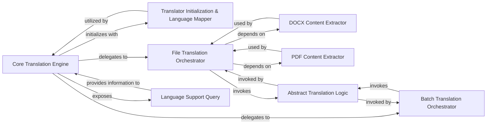

## Details

The `Core Translation Engine` subsystem is primarily encapsulated within the `deep_translator.base` module, specifically centered around the `BaseTranslator` class and its associated methods. This module acts as the foundational layer for all translation operations, providing abstract interfaces and common functionalities that concrete translator implementations extend.

### Core Translation Engine [[Expand]](./Core_Translation_Engine.md)
The central orchestrator and facade for all translation operations. It provides the foundational structure and common functionalities for specific translator implementations, embodying the Adapter and Facade patterns to simplify complex operations and promote modularity and extensibility.

**Related Classes/Methods**:

- <a href="https://github.com/nidhaloff/deep-translator/blob/master/deep_translator/base.py#L16-L183" target="_blank" rel="noopener noreferrer">`deep_translator.base.BaseTranslator`:16-183</a>

### Translator Initialization & Language Mapper
Manages the initial setup of a translator instance, including handling language mapping from human-readable names to standardized codes to ensure consistency across all translation operations.

**Related Classes/Methods**:

- <a href="https://github.com/nidhaloff/deep-translator/blob/master/deep_translator/base.py#L1-L1000" target="_blank" rel="noopener noreferrer">`deep_translator.base.BaseTranslator:__init__`:1-1000</a>
- <a href="https://github.com/nidhaloff/deep-translator/blob/master/deep_translator/base.py#L1-L1000" target="_blank" rel="noopener noreferrer">`deep_translator.base.BaseTranslator:_map_language_to_code`:1-1000</a>

### File Translation Orchestrator
Orchestrates the translation of entire files by delegating file content extraction to specific readers (DOCX, PDF) and then invoking the core translation logic on the extracted text.

**Related Classes/Methods**:

- <a href="https://github.com/nidhaloff/deep-translator/blob/master/deep_translator/base.py#L1-L1000" target="_blank" rel="noopener noreferrer">`deep_translator.base.BaseTranslator:_translate_file`:1-1000</a>

### DOCX Content Extractor
Extracts plain text content from DOCX formatted files, preparing the text for subsequent translation processing.

**Related Classes/Methods**:

- <a href="https://github.com/nidhaloff/deep-translator/blob/master/deep_translator/base.py#L1-L1000" target="_blank" rel="noopener noreferrer">`deep_translator.base.BaseTranslator:_read_docx`:1-1000</a>

### PDF Content Extractor
Extracts plain text content from PDF formatted files, making the text available for translation.

**Related Classes/Methods**:

- <a href="https://github.com/nidhaloff/deep-translator/blob/master/deep_translator/base.py#L1-L1000" target="_blank" rel="noopener noreferrer">`deep_translator.base.BaseTranslator:_read_pdf`:1-1000</a>

### Batch Translation Orchestrator
Manages the translation of multiple text segments or a list of texts by iterating through them and applying the core translation logic to each item.

**Related Classes/Methods**:

- <a href="https://github.com/nidhaloff/deep-translator/blob/master/deep_translator/base.py#L1-L1000" target="_blank" rel="noopener noreferrer">`deep_translator.base.BaseTranslator:_translate_batch`:1-1000</a>

### Abstract Translation Logic
Defines the abstract interface for the core translation mechanism. This method must be implemented by concrete translator classes (adapters) and is the actual point where text is translated.

**Related Classes/Methods**:

- <a href="https://github.com/nidhaloff/deep-translator/blob/master/deep_translator/base.py#L1-L1000" target="_blank" rel="noopener noreferrer">`deep_translator.base.BaseTranslator:translate`:1-1000</a>

### Language Support Query
Provides functionalities to query and verify the languages supported by a specific translator implementation, ensuring valid translation requests.

**Related Classes/Methods**:

- <a href="https://github.com/nidhaloff/deep-translator/blob/master/deep_translator/base.py#L1-L1000" target="_blank" rel="noopener noreferrer">`deep_translator.base.BaseTranslator:get_supported_languages`:1-1000</a>
- <a href="https://github.com/nidhaloff/deep-translator/blob/master/deep_translator/base.py#L1-L1000" target="_blank" rel="noopener noreferrer">`deep_translator.base.BaseTranslator:is_language_supported`:1-1000</a>

### [FAQ](https://github.com/CodeBoarding/GeneratedOnBoardings/tree/main?tab=readme-ov-file#faq)