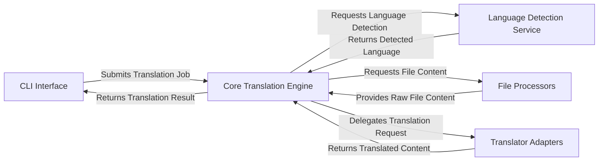

## Details

The `deep-translator` architecture is designed for modularity and extensibility, centered around a `Core Translation Engine` that orchestrates all translation activities. User interaction begins at the `CLI Interface`, which submits translation jobs and receives results from the Core Engine. The Core Engine dynamically interacts with specialized components: `Language Detection Service` for language identification, `File Processors` for content extraction from various document types, and `Translator Adapters` for interfacing with a diverse set of external translation APIs. This clear component separation ensures maintainability and allows for seamless integration of new translation services or file formats, making the system highly adaptable and easy to visualize in a flow diagram.

### CLI Interface
The primary user entry point, responsible for parsing command-line arguments and initiating translation workflows.

**Related Classes/Methods**:

- <a href="https://github.com/nidhaloff/deep-translator/blob/master/deep_translator/cli.py" target="_blank" rel="noopener noreferrer">`deep_translator.cli`</a>

### Core Translation Engine [[Expand]](./Core_Translation_Engine.md)
The central orchestrator and facade for all translation operations, managing the overall process, delegating tasks, and handling batch/file translations.

**Related Classes/Methods**:

- <a href="https://github.com/nidhaloff/deep-translator/blob/master/deep_translator/base.py" target="_blank" rel="noopener noreferrer">`deep_translator.base`</a>

### Language Detection Service
Provides functionalities to identify the language of input text, supporting both single and batch detection.

**Related Classes/Methods**:

- <a href="https://github.com/nidhaloff/deep-translator/blob/master/deep_translator/detection.py" target="_blank" rel="noopener noreferrer">`deep_translator.detection`</a>

### File Processors
Dedicated modules for reading and extracting text content from various document formats (e.g., DOCX, PDF) before translation.

**Related Classes/Methods**:

- <a href="https://github.com/nidhaloff/deep-translator/blob/master/deep_translator/base.py" target="_blank" rel="noopener noreferrer">`deep_translator.base`</a>

### Translator Adapters
A collection of modules, each encapsulating the specific logic for interacting with different external translation APIs (e.g., Google, Linguee, Microsoft, Pons, QCRI, Yandex). This component represents the abstraction layer for various third-party translation services.

**Related Classes/Methods**:

- <a href="https://github.com/nidhaloff/deep-translator/blob/master/deep_translator/google.py" target="_blank" rel="noopener noreferrer">`deep_translator.google`</a>
- <a href="https://github.com/nidhaloff/deep-translator/blob/master/deep_translator/linguee.py" target="_blank" rel="noopener noreferrer">`deep_translator.linguee`</a>
- <a href="https://github.com/nidhaloff/deep-translator/blob/master/deep_translator/microsoft.py" target="_blank" rel="noopener noreferrer">`deep_translator.microsoft`</a>
- <a href="https://github.com/nidhaloff/deep-translator/blob/master/deep_translator/pons.py" target="_blank" rel="noopener noreferrer">`deep_translator.pons`</a>
- <a href="https://github.com/nidhaloff/deep-translator/blob/master/deep_translator/qcri.py" target="_blank" rel="noopener noreferrer">`deep_translator.qcri`</a>
- <a href="https://github.com/nidhaloff/deep-translator/blob/master/deep_translator/yandex.py" target="_blank" rel="noopener noreferrer">`deep_translator.yandex`</a>

### [FAQ](https://github.com/CodeBoarding/GeneratedOnBoardings/tree/main?tab=readme-ov-file#faq)