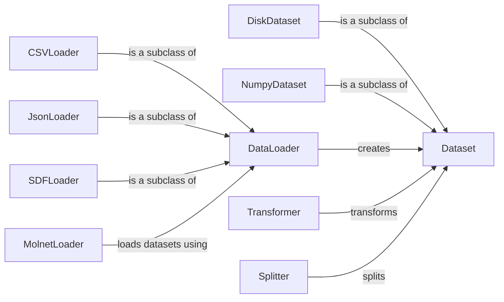

## Component Details

The Data Management component in DeepChem is responsible for handling the loading, preprocessing, and splitting of data for use in machine learning models. It provides a flexible and extensible framework for working with various data formats and performing common data transformations. The core flow involves using a DataLoader to load data from a specific source into a Dataset object. Transformers are then applied to the Dataset to preprocess the data, and finally, a Splitter is used to divide the Dataset into training, validation, and test sets. This component ensures that data is properly prepared and organized for model training and evaluation.

### Dataset
The Dataset class serves as an abstract base class for representing datasets in DeepChem. It provides a unified interface for accessing data, labels, and weights, regardless of the underlying storage format. Concrete subclasses, such as DiskDataset and NumpyDataset, implement specific storage and access methods.
- **Related Classes/Methods**: `deepchem.data.datasets.Dataset`

### DiskDataset
DiskDataset is a Dataset implementation that stores data on disk. It is designed for handling large datasets that cannot fit into memory. It supports sharding, shuffling, and other optimizations for efficient data access and manipulation.
- **Related Classes/Methods**: `deepchem.data.datasets.DiskDataset`

### NumpyDataset
NumpyDataset is a Dataset implementation that stores data in NumPy arrays in memory. It is suitable for smaller datasets that can be loaded entirely into memory for faster access.
- **Related Classes/Methods**: `deepchem.data.datasets.NumpyDataset`

### DataLoader
The DataLoader class is an abstract base class for loading data from various file formats into Dataset objects. It defines a common interface for data loading, and subclasses like CSVLoader, JsonLoader, and SDFLoader provide specific implementations for different file types.
- **Related Classes/Methods**: `deepchem.data.data_loader.DataLoader`

### CSVLoader
CSVLoader is a DataLoader implementation specifically designed for loading data from CSV files. It provides options for specifying column delimiters, headers, and data types.
- **Related Classes/Methods**: `deepchem.data.data_loader.CSVLoader`

### JsonLoader
JsonLoader is a DataLoader implementation for loading data from JSON files. It can handle various JSON structures and data types.
- **Related Classes/Methods**: `deepchem.data.data_loader.JsonLoader`

### SDFLoader
SDFLoader is a DataLoader implementation for loading molecular data from SDF (Structure Data File) files. It is commonly used in cheminformatics for loading molecular structures and properties.
- **Related Classes/Methods**: `deepchem.data.data_loader.SDFLoader`

### MolnetLoader
MolnetLoader simplifies the process of loading datasets from the MoleculeNet benchmark suite. It provides a unified interface for accessing various chemical and biological datasets, making it easier to evaluate and compare machine learning models.
- **Related Classes/Methods**: `deepchem.molnet.load_function.molnet_loader._MolnetLoader`

### Transformer
The Transformer class is an abstract base class for data transformations in DeepChem. It defines the interface for applying transformations to datasets, such as normalization, scaling, and feature engineering. Subclasses implement specific transformation algorithms.
- **Related Classes/Methods**: `deepchem.trans.transformers.Transformer`

### Splitter
The Splitter class is an abstract base class for splitting datasets into training, validation, and test sets. It defines the interface for different splitting strategies, such as random splitting, stratified splitting, and scaffold splitting.
- **Related Classes/Methods**: `deepchem.splits.splitters.Splitter`
