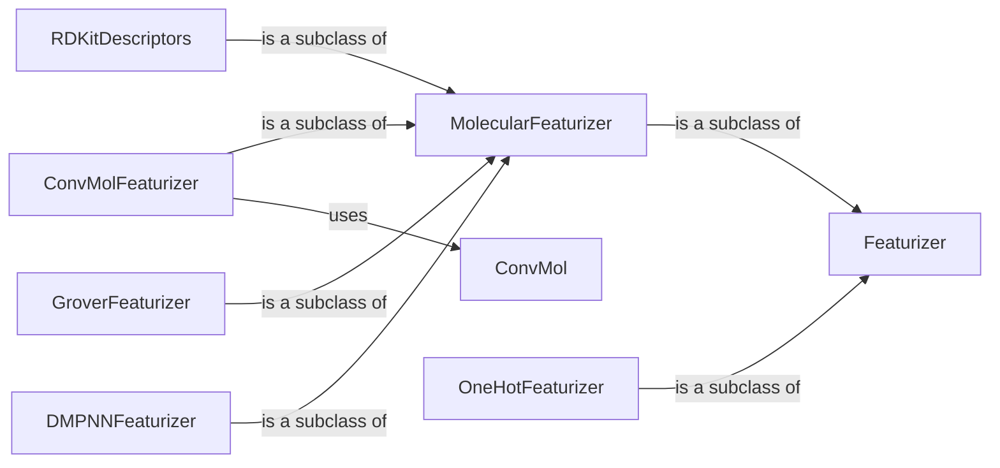

## Component Details

The Feature Engineering component in DeepChem focuses on transforming chemical structures and related data into numerical representations suitable for machine learning models. It employs a variety of featurization techniques to capture essential molecular properties, enabling accurate predictions. The process involves defining featurizers, which inherit from base classes like `Featurizer` and `MolecularFeaturizer`, and implementing specific featurization logic in subclasses. These featurizers convert molecules into various formats, such as molecular fingerprints, graph-based features, and physicochemical descriptors, which are then used as input for machine learning models.

### Featurizer
The abstract base class for all featurizers in DeepChem. It defines the common interface for featurizing data, including the `featurize` method, which takes raw data as input and returns a feature representation. Subclasses implement the `_featurize` method to perform the actual featurization logic.
- **Related Classes/Methods**: `deepchem.feat.base_classes.Featurizer`

### MolecularFeaturizer
A subclass of `Featurizer` specifically designed for featurizing molecules. It provides a common interface for featurizing molecules represented as RDKit Mol objects or SMILES strings. It inherits from `Featurizer` and provides molecule-specific featurization capabilities.
- **Related Classes/Methods**: `deepchem.feat.base_classes.MolecularFeaturizer`

### ConvMolFeaturizer
A featurizer that converts molecules into `ConvMol` graph objects, which are used for graph convolutional neural networks. It computes node and edge features based on atomic and bond properties. It relies on the `ConvMol` class to represent the molecular graph.
- **Related Classes/Methods**: `deepchem.feat.graph_features.ConvMolFeaturizer`

### ConvMol
Represents a molecule as a graph, with nodes representing atoms and edges representing bonds. It stores information about atom and bond features, as well as connectivity information. It is used by `ConvMolFeaturizer` to store the graph representation of a molecule.
- **Related Classes/Methods**: `deepchem.feat.mol_graphs.ConvMol`

### RDKitDescriptors
A featurizer that calculates a variety of molecular descriptors using the RDKit library. These descriptors capture various aspects of molecular structure and properties. It inherits from `MolecularFeaturizer` and utilizes RDKit to compute the descriptors.
- **Related Classes/Methods**: `deepchem.feat.molecule_featurizers.rdkit_descriptors.RDKitDescriptors`

### GroverFeaturizer
A featurizer that prepares molecular data for the Grover model, including atom and bond features, and constructs a molecular graph. It uses `GroverAtomVocabularyBuilder` and `GroverBondVocabularyBuilder` to create vocabularies for atom and bond features.
- **Related Classes/Methods**: `deepchem.feat.molecule_featurizers.grover_featurizer.GroverFeaturizer`

### DMPNNFeaturizer
A featurizer that prepares molecular data for the DMPNN model, including atom and bond features. It inherits from `MolecularFeaturizer` and implements the DMPNN featurization algorithm.
- **Related Classes/Methods**: `deepchem.feat.molecule_featurizers.dmpnn_featurizer.DMPNNFeaturizer`

### OneHotFeaturizer
A featurizer that converts strings or molecules into one-hot encoded vectors. It inherits from `Featurizer` and provides one-hot encoding capabilities.
- **Related Classes/Methods**: `deepchem.feat.molecule_featurizers.one_hot_featurizer.OneHotFeaturizer`
