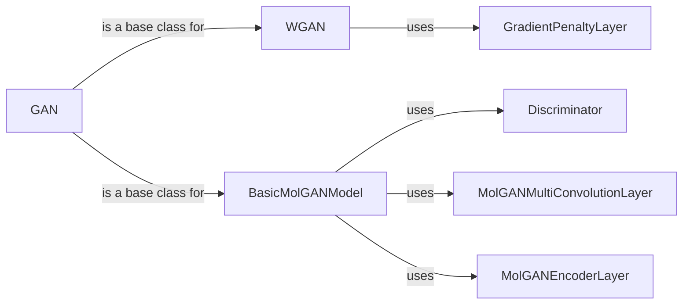

## Component Details

The Generative Modeling component focuses on creating new molecules and materials with desired properties using generative adversarial networks (GANs). It encompasses various GAN architectures, including standard GANs, Wasserstein GANs (WGANs), and Molecular GANs (MolGANs). The process involves training a generator to produce synthetic data that resembles real data and a discriminator to distinguish between real and generated data. MolGANs are specifically designed for generating molecules, incorporating specialized layers for processing molecular graph data.

### GAN
The GAN (Generative Adversarial Network) component serves as the foundational abstract class for building GAN models. It outlines the core structure and methods necessary for training a generator and discriminator pair, which work in tandem to generate synthetic data that mimics a real dataset. The generator aims to create realistic data samples from random noise, while the discriminator learns to distinguish between real and generated instances. This adversarial process drives both networks to improve, resulting in the generator producing increasingly convincing synthetic data.
- **Related Classes/Methods**: `deepchem.models.gan.GAN`

### WGAN
The WGAN (Wasserstein GAN) component is a specific type of GAN that utilizes the Wasserstein distance as a loss function. This approach helps to stabilize the training process, especially when dealing with complex data distributions. WGANs often incorporate a gradient penalty to further enforce the Lipschitz constraint, which is crucial for the Wasserstein distance to be a valid metric. By using the Wasserstein distance, WGANs can provide a more reliable gradient signal during training, leading to better convergence and higher-quality generated samples.
- **Related Classes/Methods**: `deepchem.models.gan.WGAN`, `deepchem.models.torch_models.gan.WGANModel`

### GradientPenaltyLayer
The GradientPenaltyLayer component is a specialized layer used within WGANs to enforce a gradient penalty. This penalty encourages the discriminator's gradients to have a norm close to 1, which is a requirement for the Wasserstein distance to be a valid metric. By adding this penalty to the discriminator's loss function, the training process becomes more stable and the generated samples tend to be of higher quality. The gradient penalty helps to prevent mode collapse and ensures that the discriminator learns a more meaningful representation of the data distribution.
- **Related Classes/Methods**: `deepchem.models.gan.GradientPenaltyLayer`, `deepchem.models.torch_models.gan.GradientPenaltyLayer`

### BasicMolGANModel
The BasicMolGANModel component serves as the base class for Molecular GANs (MolGANs). It provides the fundamental structure and methods for creating generators and discriminators specifically tailored for generating molecules. MolGANs leverage specialized layers, such as convolutional layers and encoder layers, to process molecular graph data effectively. The generator learns to create valid and realistic molecular structures, while the discriminator distinguishes between real and generated molecules. This adversarial training process enables the generation of novel molecules with desired properties.
- **Related Classes/Methods**: `deepchem.models.molgan.BasicMolGANModel`, `deepchem.models.torch_models.molgan.BasicMolGANModel`

### Discriminator
The Discriminator component is a crucial part of GANs, responsible for distinguishing between real and generated data samples. It takes either a real data sample or a generated sample as input and outputs a probability indicating whether the sample is real or fake. The discriminator is trained to maximize its ability to correctly classify real and generated samples, while the generator is trained to fool the discriminator. This adversarial process drives both networks to improve, leading to the generation of increasingly realistic synthetic data.
- **Related Classes/Methods**: `deepchem.models.torch_models.molgan.Discriminator`

### MolGANMultiConvolutionLayer
The MolGANMultiConvolutionLayer component is a specialized convolutional layer designed for processing molecular graph data within MolGANs. It applies multiple convolutional filters to the molecular graph, capturing different features and patterns. This layer helps the generator and discriminator to learn meaningful representations of the molecular structure, enabling the generation of valid and realistic molecules. By using convolutional layers, MolGANs can effectively leverage the graph structure of molecules to improve the quality of generated samples.
- **Related Classes/Methods**: `deepchem.models.torch_models.layers.MolGANMultiConvolutionLayer`, `deepchem.models.layers.MolGANMultiConvolutionLayer`

### MolGANEncoderLayer
The MolGANEncoderLayer component is an encoder layer used in MolGANs to encode molecular graph data into a latent representation. This layer transforms the molecular graph into a lower-dimensional vector, capturing the essential features and properties of the molecule. The encoder layer helps the generator to learn a compressed representation of the molecular structure, enabling the generation of diverse and realistic molecules. By using encoder layers, MolGANs can effectively capture the complex relationships within molecular graphs and generate novel molecules with desired characteristics.
- **Related Classes/Methods**: `deepchem.models.torch_models.layers.MolGANEncoderLayer`, `deepchem.models.layers.MolGANEncoderLayer`
