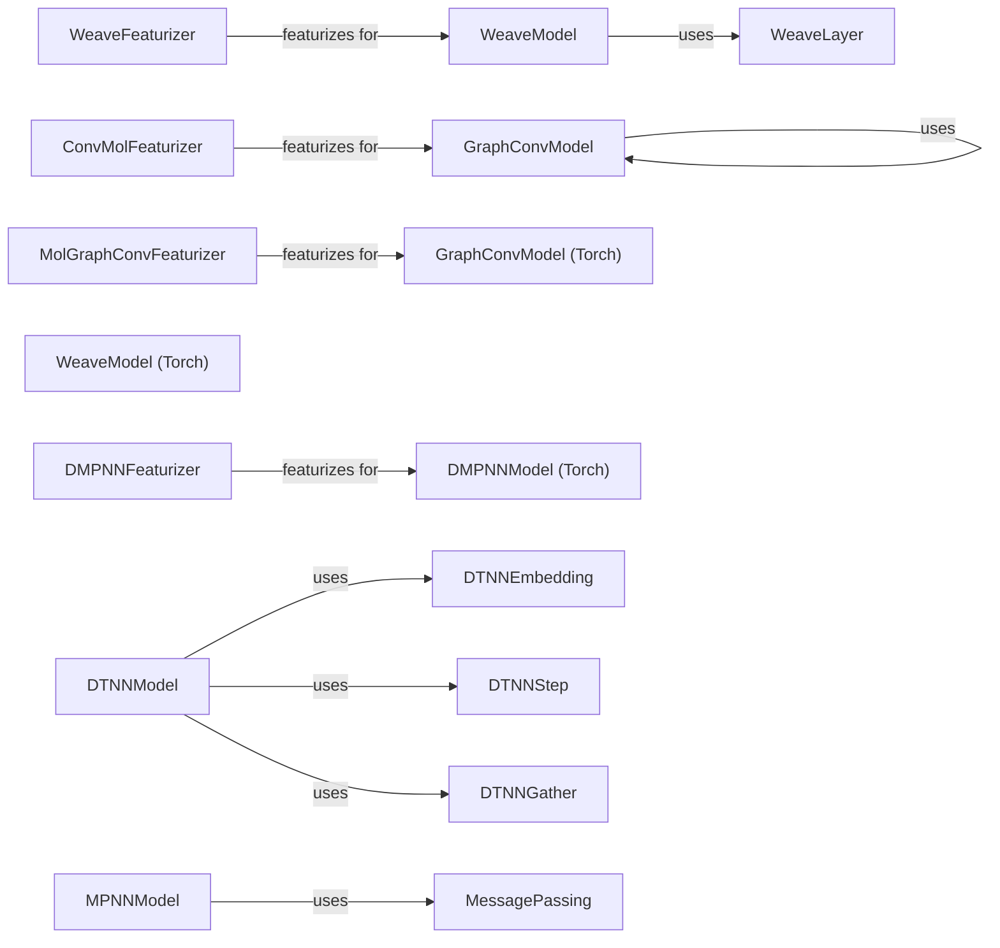

## Component Details

The Graph Neural Networks component in DeepChem provides a suite of tools for building and training GNN models on molecular data. It includes various GNN layer implementations, model classes, and featurization techniques. The main flow involves featurizing molecular data into graph representations, constructing a GNN model using desired layers, and training the model to predict molecular properties. The purpose is to leverage the power of GNNs to learn from the complex relationships between atoms in molecules for tasks such as drug discovery and materials science.

### GraphConvModel
A Keras model that applies graph convolutions to molecular graphs for prediction. It uses `GraphConv` layers to perform the convolutions and can be customized with different activation functions and pooling methods. It inherits from `_GraphConvKerasModel`.
- **Related Classes/Methods**: `deepchem.models.graph_models.GraphConvModel`, `deepchem.models.graph_models._GraphConvKerasModel`, `deepchem.models.layers.GraphConv`

### WeaveModel
A Keras model that uses Weave layers to perform graph convolutions. Weave layers consider both atom and bond features during the convolution process. It uses `WeaveLayer` and `WeaveGather`.
- **Related Classes/Methods**: `deepchem.models.graph_models.WeaveModel`, `deepchem.models.layers.WeaveLayer`, `deepchem.models.layers.WeaveGather`

### DTNNModel
A Keras model that implements Distance Tensor Neural Network (DTNN) for graph-based learning. It uses distance information between atoms to improve the representation of the molecule. It uses `DTNNEmbedding`, `DTNNStep`, and `DTNNGather`.
- **Related Classes/Methods**: `deepchem.models.graph_models.DTNNModel`, `deepchem.models.layers.DTNNEmbedding`, `deepchem.models.layers.DTNNStep`, `deepchem.models.layers.DTNNGather`

### MPNNModel
A Keras model that implements Message Passing Neural Networks (MPNNs). MPNNs define a general framework for message passing on graphs. It uses `MessagePassing` layer.
- **Related Classes/Methods**: `deepchem.models.graph_models.MPNNModel`, `deepchem.models.layers.MessagePassing`

### ConvMolFeaturizer
A featurizer that converts molecules into `ConvMol` objects, which represent the molecular graph with atom and bond features. This is a common featurization used by many graph convolutional models.
- **Related Classes/Methods**: `deepchem.feat.graph_features.ConvMolFeaturizer`, `deepchem.feat.mol_graphs.ConvMol`

### GraphConvModel (Torch)
A PyTorch implementation of the GraphConv model. It uses PyTorch layers for graph convolutions and provides similar functionality to the Keras version. It inherits from `_GraphConvTorchModel`.
- **Related Classes/Methods**: `deepchem.models.torch_models.graphconvmodel.GraphConvModel`, `deepchem.models.torch_models.graphconvmodel._GraphConvTorchModel`

### WeaveModel (Torch)
A PyTorch implementation of the Weave model.
- **Related Classes/Methods**: `deepchem.models.torch_models.weavemodel_pytorch.WeaveModel`, `deepchem.models.torch_models.weavemodel_pytorch.Weave`

### DMPNNModel (Torch)
A PyTorch implementation of the Directed Message Passing Neural Network (DMPNN) model.
- **Related Classes/Methods**: `deepchem.models.torch_models.dmpnn.DMPNNModel`, `deepchem.models.torch_models.dmpnn.DMPNN`

### MolGraphConvFeaturizer
A featurizer that converts molecules into a graph representation suitable for graph convolutional networks. It focuses on molecular graphs and their features.
- **Related Classes/Methods**: `deepchem.feat.molecule_featurizers.mol_graph_conv_featurizer.MolGraphConvFeaturizer`

### DMPNNFeaturizer
A featurizer specifically designed for DMPNN models, generating features that capture bond information and other relevant molecular properties.
- **Related Classes/Methods**: `deepchem.feat.molecule_featurizers.dmpnn_featurizer.DMPNNFeaturizer`
