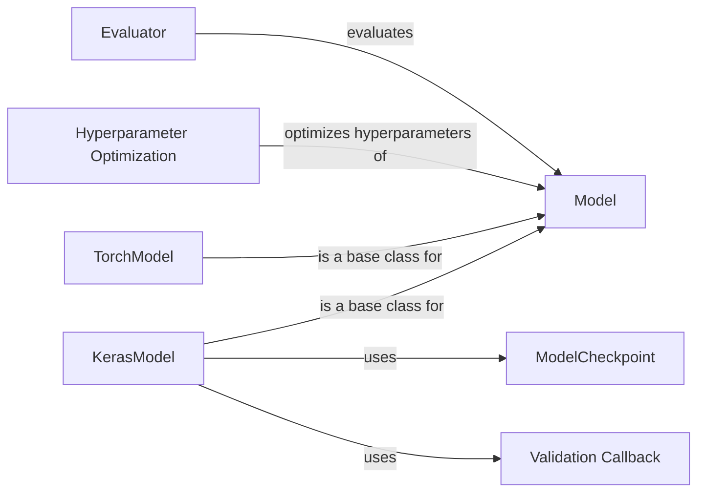

## Component Details

The Model Development component in DeepChem provides a unified framework for building, training, and evaluating machine learning models. It offers abstract base classes for models, such as `Model`, and concrete implementations for Keras and PyTorch models (`KerasModel` and `TorchModel`). Hyperparameter optimization tools are included to find the best model configurations, and evaluation tools are provided to assess model performance. Callbacks are available to monitor and save model progress during training. This component streamlines the model development process, making it easier to build and deploy machine learning models for various chemical and biological applications.

### Model
Abstract base class for all models in DeepChem. It defines the basic interface for training, prediction, and evaluation. All models inherit from this class and implement its abstract methods.
- **Related Classes/Methods**: `deepchem.models.models.Model`

### KerasModel
A DeepChem model that wraps a Keras model. It handles model building, training, prediction, and evaluation using Keras. It inherits from the `Model` class and provides Keras-specific implementations of the abstract methods.
- **Related Classes/Methods**: `deepchem.models.keras_model.KerasModel`

### TorchModel
A DeepChem model that wraps a PyTorch model. It handles model building, training, prediction, and evaluation using PyTorch. It inherits from the `Model` class and provides PyTorch-specific implementations of the abstract methods.
- **Related Classes/Methods**: `deepchem.models.torch_models.torch_model.TorchModel`

### Hyperparameter Optimization
Classes for performing hyperparameter optimization, including random search and grid search. These classes search for the best hyperparameters for a given model to improve its performance.
- **Related Classes/Methods**: `deepchem.hyper.random_search.RandomHyperparamOpt`, `deepchem.hyper.grid_search.GridHyperparamOpt`

### Evaluator
A class for evaluating the performance of a model using specified metrics. It computes metrics on a given dataset and model, providing insights into the model's accuracy and reliability.
- **Related Classes/Methods**: `deepchem.utils.evaluate.Evaluator`, `deepchem.utils.evaluate.GeneratorEvaluator`

### ModelCheckpoint
A Keras callback that saves the model's weights during training at specified intervals. This allows for saving the best performing models and resuming training from a saved state.
- **Related Classes/Methods**: `deepchem.models.keras_model.ModelCheckpoint`

### Validation Callback
A Keras callback that performs validation during training. It evaluates the model on a validation dataset at specified intervals and can be used to monitor the model's performance and prevent overfitting.
- **Related Classes/Methods**: `deepchem.models.keras_model.ValidationCallback`
