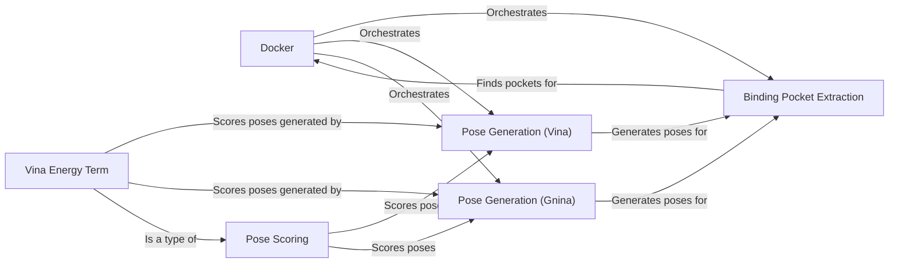

## Component Details

The Molecular Docking Simulation component predicts the preferred orientation of one molecule (ligand) to a second (receptor) when bound to each other to form a stable complex. This process involves identifying potential binding sites on the receptor, generating multiple possible poses of the ligand within these sites, and then scoring these poses to estimate the binding affinity. The component orchestrates the interaction between binding pocket detection, pose generation algorithms (Vina, Gnina), and scoring functions to predict the most favorable binding mode.

### Docker
The Docker class serves as the central orchestrator for performing docking simulations. It manages the overall workflow, including binding pocket detection, pose generation using algorithms like Vina or Gnina, and pose scoring. It defines the entry point and coordinates the interactions between other components to achieve the final docking result.
- **Related Classes/Methods**: `deepchem.dock.docking.Docker`

### Binding Pocket Extraction
This component focuses on identifying potential binding sites on the receptor protein. It employs algorithms like convex hull to locate pockets within the protein structure where ligands can potentially bind. The extracted pockets are then used as the search space for pose generation, guiding the placement of the ligand.
- **Related Classes/Methods**: `deepchem.dock.binding_pocket:extract_active_site`, `deepchem.dock.binding_pocket.ConvexHullPocketFinder:find_all_pockets`, `deepchem.dock.binding_pocket.ConvexHullPocketFinder:find_pockets`

### Pose Generation (Vina)
The VinaPoseGenerator component generates possible 3D arrangements (poses) of the ligand within the identified binding pocket using the Vina algorithm. It explores the conformational space of the ligand to find poses that fit well within the pocket, providing a set of candidate binding modes.
- **Related Classes/Methods**: `deepchem.dock.pose_generation.VinaPoseGenerator:generate_poses`

### Pose Generation (Gnina)
The GninaPoseGenerator component generates possible 3D arrangements (poses) of the ligand within the identified binding pocket using the Gnina algorithm. It serves as an alternative pose generation method to Vina, potentially offering different or improved pose predictions.
- **Related Classes/Methods**: `deepchem.dock.pose_generation.GninaPoseGenerator:__init__`, `deepchem.dock.pose_generation.GninaPoseGenerator:generate_poses`

### Vina Energy Term
This component calculates the binding energy of a given pose using the Vina scoring function. This energy score is used to rank the generated poses and predict the binding affinity of the ligand to the receptor. It provides a quantitative measure of the strength of the interaction between the ligand and the receptor.
- **Related Classes/Methods**: `deepchem.dock.pose_scoring:vina_energy_term`

### Pose Scoring
This abstract component represents different scoring functions. It takes a pose and calculates a score that represents the binding affinity of the ligand to the receptor. Vina Energy Term is one of the implementations.
- **Related Classes/Methods**: `deepchem.dock.pose_scoring`
