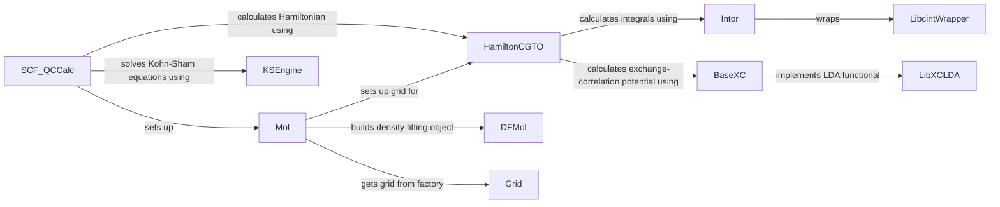

## Component Details

The Quantum Chemistry Integration component provides a set of tools for performing quantum chemistry calculations, primarily Density Functional Theory (DFT), and integrating them into machine learning workflows. The central flow involves setting up a molecular system, calculating the Hamiltonian matrix, solving the Kohn-Sham equations self-consistently, and computing molecular properties. This process leverages various sub-components for integral evaluation, exchange-correlation functional implementation, and grid-based numerical integration, ultimately providing accurate molecular features for training machine learning models.

### Mol
Represents a molecule and stores its properties, such as atomic coordinates, basis set, and number of electrons. It is responsible for setting up the integration grid for DFT calculations and loading basis set information.
- **Related Classes/Methods**: `deepchem.utils.dft_utils.system.mol.Mol`, `deepchem.utils.dft_utils.api.loadbasis`

### HamiltonCGTO
Calculates the Hamiltonian matrix in the contracted Gaussian-type orbital (CGTO) basis. It computes various terms, including kinetic energy, nuclear attraction, electron repulsion, and exchange-correlation potential. It relies on integral calculations and exchange-correlation functional implementations.
- **Related Classes/Methods**: `deepchem.utils.dft_utils.hamilton.hcgto.HamiltonCGTO`

### Intor
Calculates the integrals required for the Hamiltonian matrix, such as overlap, kinetic energy, nuclear attraction, and electron repulsion integrals. It uses the Libcint library for efficient integral evaluation.
- **Related Classes/Methods**: `deepchem.utils.dft_utils.hamilton.intor.molintor.Intor`

### LibcintWrapper
Wraps the Libcint library, providing an interface for calculating integrals over atomic orbitals. It handles the low-level details of calling Libcint functions.
- **Related Classes/Methods**: `deepchem.utils.dft_utils.hamilton.intor.lcintwrap.LibcintWrapper`

### BaseXC
Represents the exchange-correlation functional. It provides methods for calculating the exchange-correlation potential and energy density.
- **Related Classes/Methods**: `deepchem.utils.dft_utils.xc.base_xc.BaseXC`

### LibXCLDA
Implements the Local Density Approximation (LDA) exchange-correlation functional using the LibXC library.
- **Related Classes/Methods**: `deepchem.utils.dft_utils.xc.libxc.LibXCLDA`

### KSEngine
Performs the Kohn-Sham self-consistent field (SCF) calculations. It iteratively solves the Kohn-Sham equations to obtain the electron density and energy.
- **Related Classes/Methods**: `deepchem.utils.dft_utils.qccalc.ks.KSEngine`

### SCF_QCCalc
A quantum chemistry calculator that performs self-consistent field (SCF) calculations. It manages the overall SCF procedure, including setting up the molecular system, calculating the Hamiltonian, and solving the Kohn-Sham equations.
- **Related Classes/Methods**: `deepchem.utils.dft_utils.qccalc.scf_qccalc.SCF_QCCalc`

### DFMol
Density fitting molecule class. Used to compute two-electron repulsion integrals.
- **Related Classes/Methods**: `deepchem.utils.dft_utils.df.dfmol.DFMol`

### Grid
Provides functionality for generating and managing integration grids used in DFT calculations. It includes factory functions for creating different types of grids, such as Lebedev grids.
- **Related Classes/Methods**: `deepchem.utils.dft_utils.grid.factory`, `deepchem.utils.dft_utils.grid.lebedev_grid`
