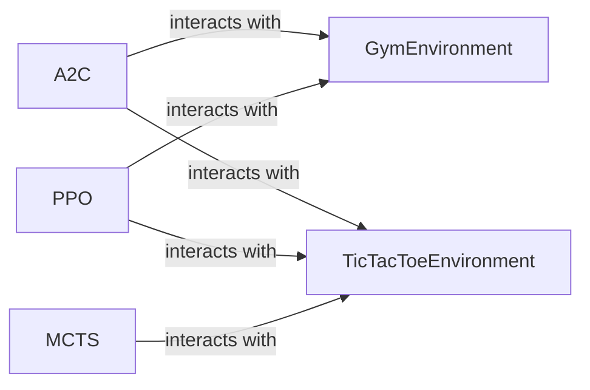

## Component Details

The Reinforcement Learning component in DeepChem provides tools and classes for training agents to make decisions in various environments. It includes implementations of popular RL algorithms like A2C and PPO, as well as interfaces for interacting with different environments, including OpenAI Gym and custom environments like Tic Tac Toe. The core functionality revolves around defining agents (actor and critic models), environments, and the interaction loop where the agent learns to optimize its actions based on rewards received from the environment.

### A2C
The A2C (Advantage Actor-Critic) class implements the A2C reinforcement learning algorithm. It builds a model consisting of an actor and a critic, creates rollouts by interacting with the environment, processes these rollouts to compute advantages and policy gradients, and applies the gradients to update the model.
- **Related Classes/Methods**: `deepchem.rl.a2c.A2C`, `deepchem.rl.torch_rl.torch_a2c.A2C`

### PPO
The PPO (Proximal Policy Optimization) class implements the PPO reinforcement learning algorithm. It builds a model, predicts actions, and optimizes the policy based on collected data. It interacts with the environment to gather experience and updates its policy while ensuring that the updates don't deviate too far from the previous policy.
- **Related Classes/Methods**: `deepchem.rl.ppo.PPO`, `deepchem.rl.torch_rl.torch_ppo.PPO`

### GymEnvironment
The GymEnvironment class provides an interface to OpenAI Gym environments. It allows the RL algorithms to interact with various simulated environments for training and evaluation.
- **Related Classes/Methods**: `deepchem.rl.GymEnvironment`

### TicTacToeEnvironment
The TicTacToeEnvironment class implements the game of Tic Tac Toe as an environment for reinforcement learning. It defines the game rules, state representation, and reward structure, allowing RL agents to learn to play Tic Tac Toe.
- **Related Classes/Methods**: `deepchem.rl.envs.tictactoe.TicTacToeEnvironment`

### MCTS
The MCTS (Monte Carlo Tree Search) class implements a tree search algorithm for decision-making. It builds a search tree, runs episodes to explore possible actions, and optimizes the policy based on the search results. It interacts with an environment to simulate actions and receive rewards.
- **Related Classes/Methods**: `deepchem.contrib.rl.mcts.MCTS`
