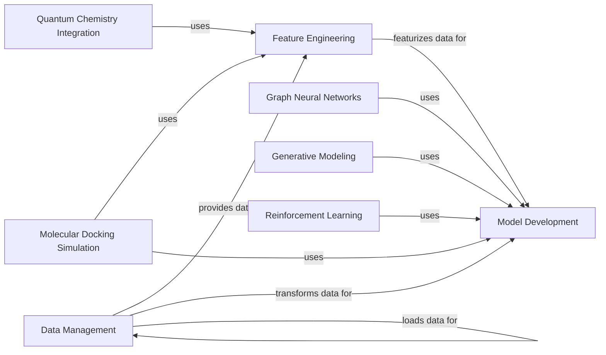

## Component Details

DeepChem is a library designed for applying machine learning to drug discovery, materials science, and other areas of chemistry. The core flow involves loading and featurizing molecular data, training machine learning models, and evaluating their performance. The library provides tools for data handling, featurization, model building, and evaluation, as well as specialized modules for graph neural networks, generative models, reinforcement learning, quantum chemistry, and molecular docking.

### Data Management
This component handles all aspects of data loading, preprocessing, and dataset creation. It supports various data formats and provides functionalities for data transformation, splitting, and sharding. It ensures that data is properly prepared and organized for use in machine learning models.
- **Related Classes/Methods**: `deepchem.data.data_loader`, `deepchem.data.datasets`, `deepchem.molnet.load_function`, `deepchem.trans.transformers`

### Feature Engineering
This component focuses on converting chemical structures and other relevant data into numerical features that can be used by machine learning models. It includes a variety of featurization techniques, such as molecular fingerprints, graph-based features, and physicochemical descriptors. The goal is to represent molecules in a way that captures their essential properties and facilitates accurate predictions.
- **Related Classes/Methods**: `deepchem.feat`, `deepchem.feat.molecule_featurizers`, `deepchem.feat.graph_features`

### Model Development
This component provides a unified interface for building, training, and evaluating machine learning models. It supports a wide range of model types, including deep neural networks, graph convolutional networks, and traditional machine learning algorithms. It also includes tools for hyperparameter optimization and model selection.
- **Related Classes/Methods**: `deepchem.models.models`, `deepchem.models.keras_model`, `deepchem.models.torch_models`, `deepchem.models.sklearn_models`, `deepchem.hyper`, `deepchem.metrics`, `deepchem.utils.evaluate`

### Graph Neural Networks
This component implements graph neural networks (GNNs) for processing molecular graph data. It includes various GNN layers and models, and supports different graph featurization techniques. GNNs are particularly well-suited for learning from the complex relationships between atoms in molecules.
- **Related Classes/Methods**: `deepchem.models.graph_models`, `deepchem.models.layers`, `deepchem.models.torch_models.graphconvmodel`

### Generative Modeling
This component implements generative models, such as generative adversarial networks (GANs), for generating novel molecules and materials. It includes various GAN architectures and training techniques. Generative models can be used to design new compounds with desired properties.
- **Related Classes/Methods**: `deepchem.models.gan`, `deepchem.models.molgan`, `deepchem.models.torch_models.gan`

### Reinforcement Learning
This component provides tools for reinforcement learning (RL), including implementations of A2C and PPO algorithms. It also includes environments for training RL agents. RL can be used to optimize molecular properties or design new molecules with specific characteristics.
- **Related Classes/Methods**: `deepchem.rl`, `deepchem.rl.a2c`, `deepchem.rl.ppo`

### Quantum Chemistry Integration
This component provides tools for integrating quantum chemistry calculations, such as density functional theory (DFT), into machine learning workflows. It includes implementations of various DFT functionals and solvers. Quantum chemistry calculations can provide accurate molecular properties for training machine learning models.
- **Related Classes/Methods**: `deepchem.utils.dft_utils`, `deepchem.models.dft`

### Molecular Docking Simulation
This component provides tools for performing molecular docking simulations. It includes methods for binding pocket detection, pose generation, and pose scoring. Molecular docking can be used to predict the binding affinity of molecules to target proteins.
- **Related Classes/Methods**: `deepchem.dock`, `deepchem.dock.binding_pocket`, `deepchem.dock.pose_generation`, `deepchem.dock.pose_scoring`