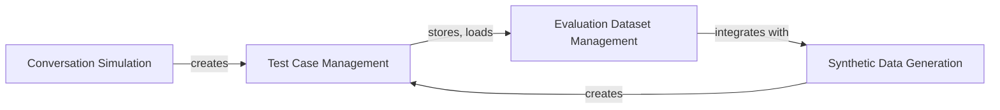

## Details

The `Data Management & Generation` component is crucial for the `deepeval` framework, as it underpins the entire evaluation process by providing the necessary data. This component is designed with a modular and data-driven approach, aligning with the project's architectural bias. It ensures that test cases and datasets are well-defined, easily manageable, and can be generated efficiently, which is fundamental for scalable and robust LLM evaluation.

### Test Case Management
This component defines the core data structures used to represent various types of test cases within the `deepeval` framework. It includes single-turn, multi-turn (conversational), multimodal, and arena-specific test cases, along with their constituent parts such as input, actual output, expected output, context, and individual conversational turns. The `Golden` class, closely related, specifically represents a ground truth data point used for evaluation. This component is fundamental as it establishes the schema for all evaluation data.

**Related Classes/Methods**:

- <a href="https://github.com/confident-ai/deepeval/blob/main/deepeval/test_case/llm_test_case.py#L1-L1" target="_blank" rel="noopener noreferrer">`deepeval/test_case/llm_test_case.py` (1:1)</a>
- <a href="https://github.com/confident-ai/deepeval/blob/main/deepeval/test_case/mllm_test_case.py#L1-L1" target="_blank" rel="noopener noreferrer">`deepeval/test_case/mllm_test_case.py` (1:1)</a>

### Evaluation Dataset Management
This component serves as the central repository for managing evaluation data. It provides functionalities to create, load, and persist test cases and goldens from various sources (e.g., CSV, JSON). It also facilitates interaction with the `Confident` platform, enabling users to push and pull datasets for collaborative evaluation and data management in an MLOps context. This component is fundamental because it provides the means to organize and access the data required for evaluations.

**Related Classes/Methods**:

- <a href="https://github.com/confident-ai/deepeval/blob/main/deepeval/dataset/dataset.py#L1-L1" target="_blank" rel="noopener noreferrer">`deepeval/dataset/dataset.py` (1:1)</a>

### Synthetic Data Generation
This component is responsible for programmatically generating synthetic goldens (ground truth data) and test cases. It supports various strategies for data generation, including evolving existing documents or contexts, or creating data from scratch. It leverages LLMs to generate diverse and realistic inputs and expected outputs, which is crucial for expanding test coverage without manual effort. This component is fundamental for enabling efficient and scalable test case creation.

**Related Classes/Methods**:

- <a href="https://github.com/confident-ai/deepeval/blob/main/deepeval/synthesizer/synthesizer.py#L1-L1" target="_blank" rel="noopener noreferrer">`deepeval/synthesizer/synthesizer.py` (1:1)</a>
- <a href="https://github.com/confident-ai/deepeval/blob/main/deepeval/synthesizer/config.py#L1-L1" target="_blank" rel="noopener noreferrer">`deepeval/synthesizer/config.py` (1:1)</a>

### Conversation Simulation
This component specializes in simulating multi-turn conversations between a user and a chatbot. It generates realistic conversational test cases by defining user profiles, scenarios, and turn-by-turn interactions. By leveraging LLMs, it can dynamically generate conversational content, providing a rich source of data for evaluating chatbot performance in interactive scenarios. This component is fundamental for testing the nuanced behavior of LLMs in conversational settings.

**Related Classes/Methods**:

- <a href="https://github.com/confident-ai/deepeval/blob/main/deepeval/conversation_simulator/conversation_simulator.py#L1-L1" target="_blank" rel="noopener noreferrer">`deepeval/conversation_simulator/conversation_simulator.py` (1:1)</a>

### [FAQ](https://github.com/CodeBoarding/GeneratedOnBoardings/tree/main?tab=readme-ov-file#faq)