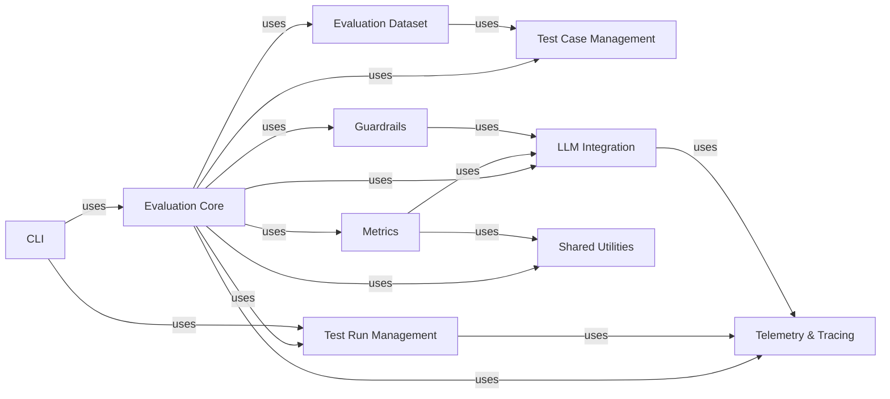

## Details

An overview of the core components within the `deepeval` project, focusing on their structure, purpose, and interactions, aligned with LLM Evaluation Framework patterns.

### Evaluation Core [[Expand]](./Evaluation_Core.md)
The central orchestrator of the evaluation process. It takes test cases, applies configured metrics and guardrails, and manages the overall flow of an evaluation run, including handling synchronous and asynchronous execution and aggregating results. It also integrates with telemetry and tracing for comprehensive observability.

**Related Classes/Methods**:

- <a href="https://github.com/confident-ai/deepeval/blob/main/deepeval/evaluate/evaluate.py#L171-L326" target="_blank" rel="noopener noreferrer">`deepeval.evaluate.evaluate` (171:326)</a>
- <a href="https://github.com/confident-ai/deepeval/blob/main/deepeval/evaluate/execute.py#L1-L1" target="_blank" rel="noopener noreferrer">`deepeval.evaluate.execute` (1:1)</a>

### Test Case Management
Manages the definition and handling of test case objects, such as `LLMTestCase` and `ConversationalTestCase`. These objects encapsulate the inputs, expected outputs, and context necessary for evaluating an LLM's performance.

**Related Classes/Methods**:

- <a href="https://github.com/confident-ai/deepeval/blob/main/deepeval/test_case/llm_test_case.py#L1-L1" target="_blank" rel="noopener noreferrer">`deepeval.test_case.llm_test_case` (1:1)</a>
- <a href="https://github.com/confident-ai/deepeval/blob/main/deepeval/test_case/conversational_test_case.py#L1-L1" target="_blank" rel="noopener noreferrer">`deepeval.test_case.conversational_test_case` (1:1)</a>

### Metrics
Provides a diverse set of evaluation metrics (e.g., `AnswerRelevancyMetric`, `FaithfulnessMetric`, `GEval`) that quantify various aspects of LLM output quality. These metrics often leverage LLMs themselves for their computation, adhering to a plugin-like architecture.

**Related Classes/Methods**:

- <a href="https://github.com/confident-ai/deepeval/blob/main/deepeval/metrics/answer_relevancy/answer_relevancy.py#L1-L1" target="_blank" rel="noopener noreferrer">`deepeval.metrics.answer_relevancy.answer_relevancy` (1:1)</a>
- <a href="https://github.com/confident-ai/deepeval/blob/main/deepeval/metrics/g_eval/g_eval.py#L1-L1" target="_blank" rel="noopener noreferrer">`deepeval.metrics.g_eval.g_eval` (1:1)</a>

### Guardrails
Implements safety and quality checks for LLM outputs, such as `CybersecurityGuard`, `HallucinationGuard`, and `ToxicityGuard`. This component ensures that LLM responses adhere to predefined safety, ethical, and quality guidelines.

**Related Classes/Methods**:

- <a href="https://github.com/confident-ai/deepeval/blob/main/deepeval/guardrails/base_guard.py#L1-L1" target="_blank" rel="noopener noreferrer">`deepeval.guardrails.base_guard` (1:1)</a>
- `deepeval.guardrails.toxicity_guard` (1:1)

### Test Run Management
Manages the recording, storage, and retrieval of evaluation run progress and results. This includes individual test case results, metric scores, and overall run metadata, often incorporating caching mechanisms for efficiency.

**Related Classes/Methods**:

- <a href="https://github.com/confident-ai/deepeval/blob/main/deepeval/test_run/test_run.py#L1-L1" target="_blank" rel="noopener noreferrer">`deepeval.test_run.test_run` (1:1)</a>
- <a href="https://github.com/confident-ai/deepeval/blob/main/deepeval/test_run/cache.py#L1-L1" target="_blank" rel="noopener noreferrer">`deepeval.test_run.cache` (1:1)</a>

### Telemetry & Tracing
Handles the observability aspect of the framework by recording detailed evaluation events and traces. This provides granular insights into the execution flow, LLM calls, and component interactions, crucial for debugging and performance analysis in MLOps.

**Related Classes/Methods**:

- <a href="https://github.com/confident-ai/deepeval/blob/main/deepeval/tracing/tracing.py#L1-L1" target="_blank" rel="noopener noreferrer">`deepeval.tracing.tracing` (1:1)</a>
- <a href="https://github.com/confident-ai/deepeval/blob/main/deepeval/tracing/types.py#L1-L1" target="_blank" rel="noopener noreferrer">`deepeval.tracing.types` (1:1)</a>

### LLM Integration
Provides a standardized and extensible interface for interacting with various LLM providers (e.g., OpenAI, Anthropic, Google Gemini, Ollama). This component abstracts away the specifics of each LLM API, allowing other components to interact with LLMs uniformly.

**Related Classes/Methods**:

- <a href="https://github.com/confident-ai/deepeval/blob/main/deepeval/models/llms/openai_model.py#L1-L1" target="_blank" rel="noopener noreferrer">`deepeval.models.llms.openai_model` (1:1)</a>
- <a href="https://github.com/confident-ai/deepeval/blob/main/deepeval/models/llms/gemini_model.py#L1-L1" target="_blank" rel="noopener noreferrer">`deepeval.models.llms.gemini_model` (1:1)</a>

### Evaluation Dataset
Represents predefined datasets for batch evaluation, enabling users to evaluate their LLMs against a collection of structured test cases. This component facilitates reproducible and scalable evaluations.

**Related Classes/Methods**:

- `deepeval.dataset` (1:1)

### CLI
Provides a robust command-line interface for users to initiate and manage evaluation runs, configure settings, and view results. This is the primary user interaction point for automation and integration into CI/CD pipelines.

**Related Classes/Methods**:

- `deepeval.cli` (1:1)

### Shared Utilities
Contains common helper functions and utilities used across different components, such as asynchronous event loop management, progress bar display, and error handling. This promotes code reusability and maintains a clean separation of concerns.

**Related Classes/Methods**:

- <a href="https://github.com/confident-ai/deepeval/blob/main/deepeval/utils.py#L1-L1" target="_blank" rel="noopener noreferrer">`deepeval.utils` (1:1)</a>

### [FAQ](https://github.com/CodeBoarding/GeneratedOnBoardings/tree/main?tab=readme-ov-file#faq)