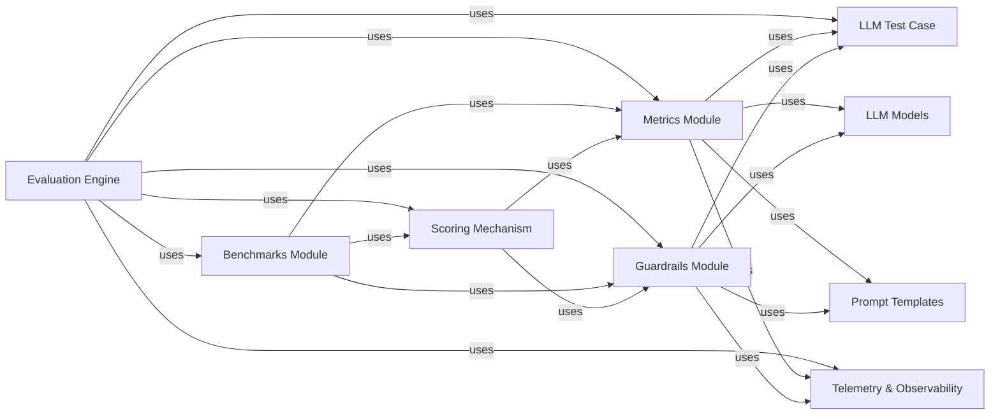

## Details

The `Evaluation Criteria & Scoring` component is a cornerstone of the DeepEval framework, providing the mechanisms to quantitatively assess LLM performance. It encompasses a diverse set of metrics, guardrails, and standardized benchmarks, all culminating in a robust scoring system.

### Metrics Module
This module defines and implements various quantitative evaluation metrics (e.g., Answer Relevancy, Faithfulness, G-Eval, Toxicity) used to measure specific aspects of LLM outputs. It adheres to a `BaseMetric` interface, promoting extensibility and the addition of new evaluation criteria.

**Related Classes/Methods**:

- <a href="https://github.com/confident-ai/deepeval/blob/main/deepeval/metrics/base_metric.py#L1-L1" target="_blank" rel="noopener noreferrer">`deepeval.metrics.base_metric` (1:1)</a>
- <a href="https://github.com/confident-ai/deepeval/blob/main/deepeval/metrics/answer_relevancy/answer_relevancy.py#L1-L1" target="_blank" rel="noopener noreferrer">`deepeval.metrics.answer_relevancy.answer_relevancy` (1:1)</a>
- <a href="https://github.com/confident-ai/deepeval/blob/main/deepeval/metrics/faithfulness/faithfulness.py#L1-L1" target="_blank" rel="noopener noreferrer">`deepeval.metrics.faithfulness.faithfulness` (1:1)</a>
- <a href="https://github.com/confident-ai/deepeval/blob/main/deepeval/metrics/g_eval/g_eval.py#L1-L1" target="_blank" rel="noopener noreferrer">`deepeval.metrics.g_eval.g_eval` (1:1)</a>
- <a href="https://github.com/confident-ai/deepeval/blob/main/deepeval/metrics/toxicity/toxicity.py#L1-L1" target="_blank" rel="noopener noreferrer">`deepeval.metrics.toxicity.toxicity` (1:1)</a>

### Guardrails Module
This module provides a suite of safety and quality checks (guardrails) to identify undesirable LLM behaviors such as hallucination, prompt injection, and harmful content. Similar to metrics, it follows a `BaseGuard` interface for easy expansion.

**Related Classes/Methods**:

- <a href="https://github.com/confident-ai/deepeval/blob/main/deepeval/guardrails/base_guard.py#L1-L1" target="_blank" rel="noopener noreferrer">`deepeval.guardrails.base_guard` (1:1)</a>
- <a href="https://github.com/confident-ai/deepeval/blob/main/deepeval/guardrails/hallucination_guard/hallucination_guard.py#L1-L1" target="_blank" rel="noopener noreferrer">`deepeval.guardrails.hallucination_guard.hallucination_guard` (1:1)</a>
- <a href="https://github.com/confident-ai/deepeval/blob/main/deepeval/guardrails/toxicity_guard/toxicity_guard.py#L1-L1" target="_blank" rel="noopener noreferrer">`deepeval.guardrails.toxicity_guard.toxicity_guard` (1:1)</a>
- <a href="https://github.com/confident-ai/deepeval/blob/main/deepeval/guardrails/prompt_injection_guard/prompt_injection_guard.py#L1-L1" target="_blank" rel="noopener noreferrer">`deepeval.guardrails.prompt_injection_guard.prompt_injection_guard` (1:1)</a>

### Benchmarks Module
This component houses standardized datasets and predefined evaluation tasks (benchmarks) like MMLU, SQuAD, and ARC. These benchmarks orchestrate the application of various metrics and guardrails to provide a comprehensive, comparative assessment of LLMs against established baselines.

**Related Classes/Methods**:

- <a href="https://github.com/confident-ai/deepeval/blob/main/deepeval/benchmarks/base_benchmark.py#L1-L1" target="_blank" rel="noopener noreferrer">`deepeval.benchmarks.base_benchmark` (1:1)</a>
- <a href="https://github.com/confident-ai/deepeval/blob/main/deepeval/benchmarks/mmlu/mmlu.py#L1-L1" target="_blank" rel="noopener noreferrer">`deepeval.benchmarks.mmlu.mmlu` (1:1)</a>
- <a href="https://github.com/confident-ai/deepeval/blob/main/deepeval/benchmarks/squad/squad.py#L1-L1" target="_blank" rel="noopener noreferrer">`deepeval.benchmarks.squad.squad` (1:1)</a>
- <a href="https://github.com/confident-ai/deepeval/blob/main/deepeval/benchmarks/arc/arc.py#L1-L1" target="_blank" rel="noopener noreferrer">`deepeval.benchmarks.arc.arc` (1:1)</a>

### Scoring Mechanism
Represented by the `Scorer` class, this component is responsible for processing the results from individual metrics and guardrails, aggregating them, and producing a final quantitative score or a set of scores. It translates raw evaluation data into actionable performance indicators.

**Related Classes/Methods**:

- <a href="https://github.com/confident-ai/deepeval/blob/main/deepeval/scorer/scorer.py#L1-L1" target="_blank" rel="noopener noreferrer">`deepeval.scorer.scorer` (1:1)</a>

### LLM Models
This component represents the various Large Language Models (LLMs) that DeepEval can interact with and evaluate. Many metrics (e.g., G-Eval) and guardrails internally utilize LLMs to perform their judgments, making this a critical dependency. It includes base classes for different model types (`DeepEvalBaseLLM`, `DeepEvalBaseEmbeddingModel`, `DeepEvalBaseMLLM`).

**Related Classes/Methods**:

- <a href="https://github.com/confident-ai/deepeval/blob/main/deepeval/models/base_model.py#L1-L1" target="_blank" rel="noopener noreferrer">`deepeval.models.base_model` (1:1)</a>
- `deepeval.models.llms` (1:1)
- `deepeval.models.embedding_models` (1:1)
- `deepeval.models.mlllms` (1:1)

### LLM Test Case
This component defines the data structure for individual test cases (`LLMTestCase`, `MLLMTestCase`). Each test case encapsulates the input to the LLM, the LLM's output, and potentially ground truth, context, or conversational history. These test cases serve as the primary input for the evaluation process.

**Related Classes/Methods**:

- <a href="https://github.com/confident-ai/deepeval/blob/main/deepeval/test_case/llm_test_case.py#L1-L1" target="_blank" rel="noopener noreferrer">`deepeval.test_case.llm_test_case` (1:1)</a>
- <a href="https://github.com/confident-ai/deepeval/blob/main/deepeval/test_case/mllm_test_case.py#L1-L1" target="_blank" rel="noopener noreferrer">`deepeval.test_case.mllm_test_case` (1:1)</a>

### Evaluation Engine
While not explicitly part of "Evaluation Criteria & Scoring" in terms of defining the criteria themselves, this is the central component that orchestrates the entire evaluation flow. It takes test cases, applies the selected metrics and guardrails, and utilizes the scoring mechanism to generate comprehensive evaluation results.

**Related Classes/Methods**:

- `deepeval.evaluate` (1:1)

### Prompt Templates
This component manages and provides standardized prompt templates. These templates are crucial for LLM-based metrics (like G-Eval) and guardrails, ensuring consistent and effective communication with the underlying LLM models used for judgment.

**Related Classes/Methods**:

- <a href="https://github.com/confident-ai/deepeval/blob/main/deepeval/prompt/prompt.py#L1-L1" target="_blank" rel="noopener noreferrer">`deepeval.prompt.prompt` (1:1)</a>
- <a href="https://github.com/confident-ai/deepeval/blob/main/deepeval/prompt/api.py#L1-L1" target="_blank" rel="noopener noreferrer">`deepeval.prompt.api` (1:1)</a>

### Telemetry & Observability
This component is responsible for capturing, storing, and reporting detailed evaluation results, including metric scores, guardrail outcomes, and execution traces. It provides the necessary infrastructure for monitoring and analyzing LLM performance over time, crucial for MLOps.

**Related Classes/Methods**:

- <a href="https://github.com/confident-ai/deepeval/blob/main/deepeval/tracing/tracing.py#L1-L1" target="_blank" rel="noopener noreferrer">`deepeval.tracing.tracing` (1:1)</a>
- <a href="https://github.com/confident-ai/deepeval/blob/main/deepeval/tracing/types.py#L1-L1" target="_blank" rel="noopener noreferrer">`deepeval.tracing.types` (1:1)</a>
- <a href="https://github.com/confident-ai/deepeval/blob/main/deepeval/tracing/otel/exporter.py#L1-L1" target="_blank" rel="noopener noreferrer">`deepeval.tracing.otel.exporter` (1:1)</a>

### [FAQ](https://github.com/CodeBoarding/GeneratedOnBoardings/tree/main?tab=readme-ov-file#faq)