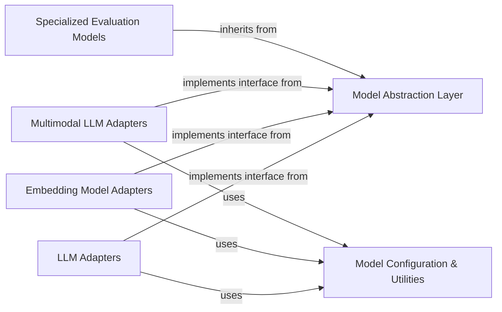

## Details

The `LLM & Model Management` subsystem in DeepEval is designed to provide a flexible and standardized way to interact with various language models, both external and internal. It adheres to the Adapter Pattern and Modular Architecture principles, ensuring extensibility and clear separation of concerns.

### Model Abstraction Layer
This is the foundational component, defining the core abstract interfaces for all types of models within DeepEval. It establishes a common contract for model operations, enabling the system to interact with diverse LLMs, embedding models, and specialized evaluation models uniformly. This layer is crucial for the Adapter Pattern, allowing new model providers to be integrated seamlessly by implementing these base classes.

**Related Classes/Methods**:

- `DeepEvalBaseModel` (1:1)
- `DeepEvalBaseLLM` (1:1)
- `DeepEvalBaseEmbeddingModel` (1:1)
- `DeepEvalBaseMLLM` (1:1)

### LLM Adapters
These are concrete implementations of `DeepEvalBaseLLM`, acting as adapters for various external Large Language Model (LLM) providers. Each adapter encapsulates the specifics of interacting with a particular LLM API (e.g., OpenAI, Anthropic, Google Gemini, LiteLLM, local models, Ollama, Amazon Bedrock), handling API calls, authentication, and response parsing.

**Related Classes/Methods**:

- <a href="https://github.com/confident-ai/deepeval/blob/main/deepeval/models/llms/amazon_bedrock_model.py#L1-L1" target="_blank" rel="noopener noreferrer">`amazon_bedrock_model` (1:1)</a>
- <a href="https://github.com/confident-ai/deepeval/blob/main/deepeval/models/llms/anthropic_model.py#L1-L1" target="_blank" rel="noopener noreferrer">`anthropic_model` (1:1)</a>
- <a href="https://github.com/confident-ai/deepeval/blob/main/deepeval/models/llms/azure_model.py#L1-L1" target="_blank" rel="noopener noreferrer">`azure_model` (1:1)</a>
- <a href="https://github.com/confident-ai/deepeval/blob/main/deepeval/models/llms/gemini_model.py#L1-L1" target="_blank" rel="noopener noreferrer">`gemini_model` (1:1)</a>
- <a href="https://github.com/confident-ai/deepeval/blob/main/deepeval/models/llms/litellm_model.py#L1-L1" target="_blank" rel="noopener noreferrer">`litellm_model` (1:1)</a>
- <a href="https://github.com/confident-ai/deepeval/blob/main/deepeval/models/llms/local_model.py#L1-L1" target="_blank" rel="noopener noreferrer">`local_model` (1:1)</a>
- <a href="https://github.com/confident-ai/deepeval/blob/main/deepeval/models/llms/ollama_model.py#L1-L1" target="_blank" rel="noopener noreferrer">`ollama_model` (1:1)</a>
- <a href="https://github.com/confident-ai/deepeval/blob/main/deepeval/models/llms/openai_model.py#L1-L1" target="_blank" rel="noopener noreferrer">`openai_model` (1:1)</a>

### Embedding Model Adapters
Similar to LLM Adapters, these classes implement `DeepEvalBaseEmbeddingModel` to provide a standardized way to interact with various embedding model providers (e.g., OpenAI, Azure OpenAI, local models, Ollama). They handle the specifics of generating text embeddings, which are crucial for metrics like contextual relevancy and recall.

**Related Classes/Methods**:

- <a href="https://github.com/confident-ai/deepeval/blob/main/deepeval/models/embedding_models/openai_embedding_model.py#L1-L1" target="_blank" rel="noopener noreferrer">`openai_embedding_model` (1:1)</a>
- <a href="https://github.com/confident-ai/deepeval/blob/main/deepeval/models/embedding_models/azure_embedding_model.py#L1-L1" target="_blank" rel="noopener noreferrer">`azure_embedding_model` (1:1)</a>
- <a href="https://github.com/confident-ai/deepeval/blob/main/deepeval/models/embedding_models/local_embedding_model.py#L1-L1" target="_blank" rel="noopener noreferrer">`local_embedding_model` (1:1)</a>
- <a href="https://github.com/confident-ai/deepeval/blob/main/deepeval/models/embedding_models/ollama_embedding_model.py#L1-L1" target="_blank" rel="noopener noreferrer">`ollama_embedding_model` (1:1)</a>

### Multimodal LLM Adapters
These components extend the model capabilities to handle multimodal inputs and outputs, inheriting from `DeepEvalBaseMLLM`. They are specifically designed for metrics that involve images or other non-textual data, providing the necessary interfaces for multimodal interactions with models like Gemini or multimodal Ollama/OpenAI.

**Related Classes/Methods**:

- <a href="https://github.com/confident-ai/deepeval/blob/main/deepeval/models/llms/gemini_model.py#L1-L1" target="_blank" rel="noopener noreferrer">`gemini_model` (1:1)</a>
- <a href="https://github.com/confident-ai/deepeval/blob/main/deepeval/models/llms/ollama_model.py#L1-L1" target="_blank" rel="noopener noreferrer">`ollama_model` (1:1)</a>
- <a href="https://github.com/confident-ai/deepeval/blob/main/deepeval/models/llms/openai_model.py#L1-L1" target="_blank" rel="noopener noreferrer">`openai_model` (1:1)</a>

### Specialized Evaluation Models
This component comprises internal models specifically designed for various evaluation tasks beyond general text generation or embedding. These models, often pre-trained or fine-tuned for specific purposes (e.g., answer relevancy, toxicity detection, summarization quality, bias detection), are crucial for DeepEval's ability to perform nuanced assessments. They inherit from `DeepEvalBaseModel`.

**Related Classes/Methods**:

- <a href="https://github.com/confident-ai/deepeval/blob/main/deepeval/models/answer_relevancy_model.py#L1-L1" target="_blank" rel="noopener noreferrer">`answer_relevancy_model` (1:1)</a>
- <a href="https://github.com/confident-ai/deepeval/blob/main/deepeval/models/detoxify_model.py#L1-L1" target="_blank" rel="noopener noreferrer">`detoxify_model` (1:1)</a>
- <a href="https://github.com/confident-ai/deepeval/blob/main/deepeval/models/summac_model.py#L1-L1" target="_blank" rel="noopener noreferrer">`summac_model` (1:1)</a>
- <a href="https://github.com/confident-ai/deepeval/blob/main/deepeval/models/unbias_model.py#L1-L1" target="_blank" rel="noopener noreferrer">`unbias_model` (1:1)</a>

### Model Configuration & Utilities
This component provides essential helper functions and a centralized mechanism for managing API keys and other configuration data required by the various LLM, embedding, and multimodal models. It ensures secure and efficient access to credentials and offers common utilities for model-related operations like parsing responses.

**Related Classes/Methods**:

- <a href="https://github.com/confident-ai/deepeval/blob/main/deepeval/key_handler.py#L1-L1" target="_blank" rel="noopener noreferrer">`key_handler` (1:1)</a>
- <a href="https://github.com/confident-ai/deepeval/blob/main/deepeval/utils.py#L1-L1" target="_blank" rel="noopener noreferrer">`utils` (1:1)</a>

### [FAQ](https://github.com/CodeBoarding/GeneratedOnBoardings/tree/main?tab=readme-ov-file#faq)