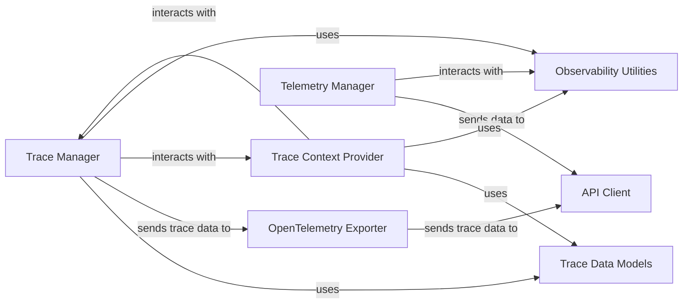

## Details

The Observability & Telemetry subsystem in DeepEval is crucial for understanding the behavior and performance of LLM interactions. It provides mechanisms for detailed execution tracing and anonymous usage data collection, which are vital for debugging, performance monitoring, and continuous improvement of the framework.

### Trace Manager
The central orchestrator for capturing and managing detailed execution traces of LLM interactions. It initiates new traces, adds individual operations (spans) like LLM calls, tool usage, or chain steps, and manages the asynchronous flushing of these completed traces.

**Related Classes/Methods**:

- <a href="https://github.com/confident-ai/deepeval/blob/main/deepeval/tracing/tracing.py#L63-L660" target="_blank" rel="noopener noreferrer">`deepeval.tracing.tracing.TraceManager` (63:660)</a>

### Trace Context Provider
Provides a user-friendly context manager (Observer) that simplifies the instrumentation of code for tracing. It automatically handles the creation, start, and end of spans, ensuring that operations are correctly nested within the active trace context.

**Related Classes/Methods**:

- <a href="https://github.com/confident-ai/deepeval/blob/main/deepeval/tracing/tracing.py#L670-L923" target="_blank" rel="noopener noreferrer">`deepeval.tracing.tracing.Observer` (670:923)</a>

### Trace Data Models
Defines the structured data models for representing traces, spans, and their associated attributes (e.g., Trace, BaseSpan, LlmSpan, ToolSpan). These models ensure data consistency, type safety, and facilitate serialization for internal processing and external communication.

**Related Classes/Methods**:

- <a href="https://github.com/confident-ai/deepeval/blob/main/deepeval/tracing/types.py#L102-L123" target="_blank" rel="noopener noreferrer">`deepeval.tracing.types.Trace` (102:123)</a>
- <a href="https://github.com/confident-ai/deepeval/blob/main/deepeval/tracing/types.py#L35-L58" target="_blank" rel="noopener noreferrer">`deepeval.tracing.types.BaseSpan` (35:58)</a>
- <a href="https://github.com/confident-ai/deepeval/blob/main/deepeval/tracing/types.py#L71-L82" target="_blank" rel="noopener noreferrer">`deepeval.tracing.types.LlmSpan` (71:82)</a>
- <a href="https://github.com/confident-ai/deepeval/blob/main/deepeval/tracing/types.py#L93-L99" target="_blank" rel="noopener noreferrer">`deepeval.tracing.types.ToolSpan` (93:99)</a>
- <a href="https://github.com/confident-ai/deepeval/blob/main/deepeval/tracing/types.py#L61-L68" target="_blank" rel="noopener noreferrer">`deepeval.tracing.types.AgentSpan` (61:68)</a>
- <a href="https://github.com/confident-ai/deepeval/blob/main/deepeval/tracing/types.py#L85-L90" target="_blank" rel="noopener noreferrer">`deepeval.tracing.types.RetrieverSpan` (85:90)</a>

### Telemetry Manager
Responsible for collecting and managing anonymous usage data and feature status within the DeepEval framework. It handles the persistence of unique identifiers and user login information, and tracks various events such as evaluation runs and metric recommendations.

**Related Classes/Methods**:

- <a href="https://github.com/confident-ai/deepeval/blob/main/deepeval/telemetry.py#L592-L602" target="_blank" rel="noopener noreferrer">`deepeval.telemetry.read_telemetry_file` (592:602)</a>
- <a href="https://github.com/confident-ai/deepeval/blob/main/deepeval/telemetry.py#L605-L609" target="_blank" rel="noopener noreferrer">`deepeval.telemetry.write_telemetry_file` (605:609)</a>
- <a href="https://github.com/confident-ai/deepeval/blob/main/deepeval/telemetry.py#L535-L558" target="_blank" rel="noopener noreferrer">`deepeval.telemetry.capture_send_trace` (535:558)</a>

### API Client
Manages secure and reliable communication with the external DeepEval API. It is responsible for sending both anonymous telemetry data and detailed trace information to the backend for centralized storage, analysis, and visualization.

**Related Classes/Methods**:

- <a href="https://github.com/confident-ai/deepeval/blob/main/deepeval/confident/api.py#L68-L195" target="_blank" rel="noopener noreferrer">`deepeval.confident.api.Api` (68:195)</a>

### OpenTelemetry Exporter
Provides the integration layer for OpenTelemetry, translating DeepEval's internal trace representation into the standard OpenTelemetry format. It then uses the API Client to export these standardized traces to a configured OpenTelemetry collector or backend.

**Related Classes/Methods**:

- <a href="https://github.com/confident-ai/deepeval/blob/main/deepeval/tracing/otel/exporter.py#L19-L365" target="_blank" rel="noopener noreferrer">`deepeval.tracing.otel.exporter.ConfidentSpanExporter` (19:365)</a>

### Observability Utilities
A collection of helper functions and modules that support both tracing and telemetry mechanisms. This includes functionalities for validating environment configurations, ensuring data is JSON serializable, and handling attribute conversions for tracing.

**Related Classes/Methods**:

- <a href="https://github.com/confident-ai/deepeval/blob/main/deepeval/tracing/utils.py" target="_blank" rel="noopener noreferrer">`deepeval.tracing.utils`</a>
- <a href="https://github.com/confident-ai/deepeval/blob/main/deepeval/tracing/attributes.py" target="_blank" rel="noopener noreferrer">`deepeval.tracing.attributes`</a>

### [FAQ](https://github.com/CodeBoarding/GeneratedOnBoardings/tree/main?tab=readme-ov-file#faq)