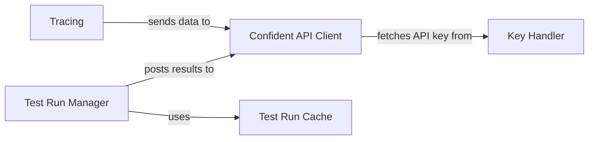

## Details

The Reporting & Platform Integration subsystem is critical for managing the lifecycle of evaluation results within DeepEval. It encompasses the mechanisms for local caching of test run data, persistent storage, and secure communication with the DeepEval cloud platform (Confident AI) for centralized reporting and asset management. This component ensures data integrity, availability, and seamless integration with external MLOps workflows.

### Test Run Manager
This component serves as the primary orchestrator for all evaluation test runs. Its responsibilities include initiating, updating, and finalizing test runs, as well as coordinating the local saving of results and their subsequent transmission to the Confident AI platform. It acts as the central control point for the flow of evaluation data.

**Related Classes/Methods**:

- <a href="https://github.com/confident-ai/deepeval/blob/main/deepeval/test_run/test_run.py#L1-L9999" target="_blank" rel="noopener noreferrer">`deepeval/test_run/test_run.py` (1:9999)</a>

### Confident API Client
This component is dedicated to handling all external API communications with the DeepEval cloud platform (Confident AI). It manages the serialization of evaluation results into the appropriate format, handles secure authentication, and facilitates the sending of various data types (e.g., test run results, traces, feedback) to the cloud. It also supports fetching configuration data or platform-managed assets.

**Related Classes/Methods**:

- <a href="https://github.com/confident-ai/deepeval/blob/main/deepeval/confident/api.py#L1-L9999" target="_blank" rel="noopener noreferrer">`deepeval/confident/api.py` (1:9999)</a>

### Test Run Cache
This component is responsible for the local persistence and retrieval of test run data and metric configurations. It ensures that evaluation results are efficiently stored on the local machine, providing resilience against network interruptions and enabling offline operations. It also plays a role in maintaining consistent metric configurations across evaluations.

**Related Classes/Methods**:

- <a href="https://github.com/confident-ai/deepeval/blob/main/deepeval/test_run/cache.py#L1-L9999" target="_blank" rel="noopener noreferrer">`deepeval/test_run/cache.py` (1:9999)</a>

### Key Handler
Handles the secure retrieval and management of API keys.

**Related Classes/Methods**: _None_

### Tracing
Component responsible for capturing observability data and traces.

**Related Classes/Methods**: _None_

### [FAQ](https://github.com/CodeBoarding/GeneratedOnBoardings/tree/main?tab=readme-ov-file#faq)