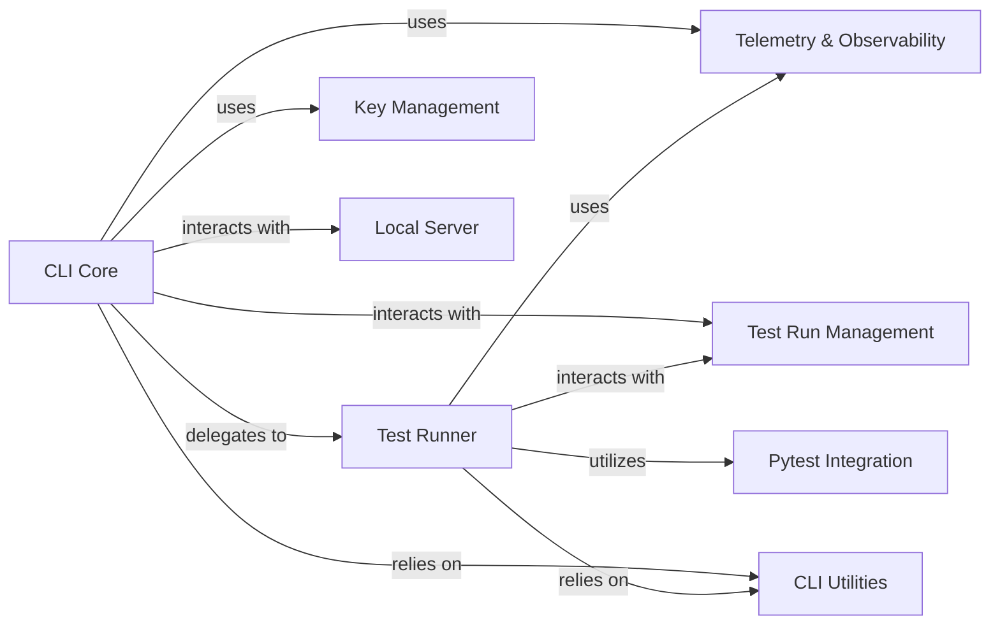

## Details

The `User Interface (CLI)` subsystem in DeepEval serves as the primary interaction point for users, enabling them to initiate evaluation runs, manage configurations, and view results. It adheres to a modular and CLI-driven architectural pattern, leveraging external libraries like `typer` for command-line parsing and `pytest` for test execution.

### CLI Core
The main entry point for the DeepEval command-line interface. It handles top-level commands such as `login`, `logout`, `view`, and `set-confident-region`. It orchestrates the overall CLI experience and delegates specific tasks to other components.

**Related Classes/Methods**:

- <a href="https://github.com/confident-ai/deepeval/blob/main/deepeval/cli/main.py#L1-L1" target="_blank" rel="noopener noreferrer">`deepeval/cli/main.py` (1:1)</a>

### Test Runner
Responsible for executing DeepEval tests. It integrates with `pytest` to run test files or directories, supporting various options like caching, error handling, verbosity, and parallel execution. It manages the lifecycle of a test run from initiation to completion.

**Related Classes/Methods**:

- <a href="https://github.com/confident-ai/deepeval/blob/main/deepeval/cli/test.py#L1-L1" target="_blank" rel="noopener noreferrer">`deepeval/cli/test.py` (1:1)</a>

### CLI Utilities
Provides a collection of helper functions and common utilities used across different CLI commands. This includes functionalities like rendering messages, handling file operations (e.g., deleting temporary files), and setting global configuration flags.

**Related Classes/Methods**:

- <a href="https://github.com/confident-ai/deepeval/blob/main/deepeval/cli/utils.py#L1-L1" target="_blank" rel="noopener noreferrer">`deepeval/cli/utils.py` (1:1)</a>

### Key Management
Manages the secure storage, retrieval, and removal of sensitive user information, primarily API keys for DeepEval and Confident AI. It ensures that user credentials are handled appropriately.

**Related Classes/Methods**:

- <a href="https://github.com/confident-ai/deepeval/blob/main/deepeval/key_handler.py#L1-L1" target="_blank" rel="noopener noreferrer">`deepeval/key_handler.py` (1:1)</a>

### Telemetry & Observability
Handles the capturing and reporting of telemetry data related to user interactions and evaluation runs. This data is crucial for monitoring usage, performance, and providing insights into the DeepEval framework's operation.

**Related Classes/Methods**:

- <a href="https://github.com/confident-ai/deepeval/blob/main/deepeval/telemetry.py#L1-L1" target="_blank" rel="noopener noreferrer">`deepeval/telemetry.py` (1:1)</a>

### Test Run Management
Manages the state and data associated with individual DeepEval test runs. This includes handling test run caching, storing links to the latest test results, and orchestrating the final display of evaluation outcomes.

**Related Classes/Methods**:

- <a href="https://github.com/confident-ai/deepeval/blob/main/deepeval/test_run/test_run.py#L1-L1" target="_blank" rel="noopener noreferrer">`deepeval/test_run/test_run.py` (1:1)</a>
- <a href="https://github.com/confident-ai/deepeval/blob/main/deepeval/test_run/cache.py#L1-L1" target="_blank" rel="noopener noreferrer">`deepeval/test_run/cache.py` (1:1)</a>

### Local Server
A lightweight, temporary local server that is initiated during the CLI login process. Its primary purpose is to facilitate a secure pairing mechanism between the user's local CLI and the Confident AI platform for authentication.

**Related Classes/Methods**:

- <a href="https://github.com/confident-ai/deepeval/blob/main/deepeval/cli/server.py#L1-L1" target="_blank" rel="noopener noreferrer">`deepeval/cli/server.py` (1:1)</a>

### Pytest Integration
Represents the integration with the `pytest` testing framework. DeepEval leverages `pytest` as its underlying engine for test discovery, execution, and reporting, allowing users to write standard Python tests that are then enhanced by DeepEval's evaluation capabilities.

**Related Classes/Methods**:

- `pytest.main` (1:1)

### [FAQ](https://github.com/CodeBoarding/GeneratedOnBoardings/tree/main?tab=readme-ov-file#faq)