```mermaid
graph LR
    User_Interface_CLI_["User Interface (CLI)"]
    Configuration_Utilities["Configuration & Utilities"]
    LLM_Model_Management["LLM & Model Management"]
    Data_Management_Generation["Data Management & Generation"]
    Evaluation_Core["Evaluation Core"]
    Evaluation_Criteria_Scoring["Evaluation Criteria & Scoring"]
    Reporting_Platform_Integration["Reporting & Platform Integration"]
    Observability_Telemetry["Observability & Telemetry"]
    User_Interface_CLI_ -- "Initiates" --> Evaluation_Core
    User_Interface_CLI_ -- "Displays" --> Reporting_Platform_Integration
    User_Interface_CLI_ -- "Configures" --> Configuration_Utilities
    Configuration_Utilities -- "Provides" --> LLM_Model_Management
    Configuration_Utilities -- "Provides" --> Evaluation_Criteria_Scoring
    Configuration_Utilities -- "Provides" --> Reporting_Platform_Integration
    LLM_Model_Management -- "Performs Inference for" --> Evaluation_Criteria_Scoring
    LLM_Model_Management -- "Performs Inference for" --> Data_Management_Generation
    LLM_Model_Management -- "Emits Traces to" --> Observability_Telemetry
    Data_Management_Generation -- "Supplies" --> Evaluation_Core
    Data_Management_Generation -- "Exchanges Data with" --> Reporting_Platform_Integration
    Evaluation_Core -- "Applies" --> Evaluation_Criteria_Scoring
    Evaluation_Core -- "Sends Results to" --> Reporting_Platform_Integration
    Evaluation_Core -- "Emits Traces to" --> Observability_Telemetry
    Evaluation_Criteria_Scoring -- "Requests LLM Calls from" --> LLM_Model_Management
    Evaluation_Criteria_Scoring -- "Provides Scores to" --> Evaluation_Core
    Reporting_Platform_Integration -- "Receives Results from" --> Evaluation_Core
    Reporting_Platform_Integration -- "Receives Traces from" --> Observability_Telemetry
    Observability_Telemetry -- "Collects Traces from" --> LLM_Model_Management
    Observability_Telemetry -- "Collects Traces from" --> Evaluation_Core
    Observability_Telemetry -- "Sends Traces to" --> Reporting_Platform_Integration
    click User_Interface_CLI_ href "https://github.com/CodeBoarding/GeneratedOnBoardings/blob/main/deepeval/User_Interface_CLI_.md" "Details"
    click LLM_Model_Management href "https://github.com/CodeBoarding/GeneratedOnBoardings/blob/main/deepeval/LLM_Model_Management.md" "Details"
    click Data_Management_Generation href "https://github.com/CodeBoarding/GeneratedOnBoardings/blob/main/deepeval/Data_Management_Generation.md" "Details"
    click Evaluation_Core href "https://github.com/CodeBoarding/GeneratedOnBoardings/blob/main/deepeval/Evaluation_Core.md" "Details"
    click Evaluation_Criteria_Scoring href "https://github.com/CodeBoarding/GeneratedOnBoardings/blob/main/deepeval/Evaluation_Criteria_Scoring.md" "Details"
    click Reporting_Platform_Integration href "https://github.com/CodeBoarding/GeneratedOnBoardings/blob/main/deepeval/Reporting_Platform_Integration.md" "Details"
    click Observability_Telemetry href "https://github.com/CodeBoarding/GeneratedOnBoardings/blob/main/deepeval/Observability_Telemetry.md" "Details"
```

## Details

The `deepeval` framework is designed with a modular and extensible architecture, centralizing around an **Evaluation Core** that orchestrates the assessment of LLM outputs. It leverages a **LLM & Model Management** layer for interacting with various language models, and a robust **Data Management & Generation** component for preparing test cases. **Evaluation Criteria & Scoring** provides the diverse metrics and guardrails, while **Reporting & Platform Integration** handles result persistence and cloud synchronization. **Observability & Telemetry** ensures insights into execution, and **Configuration & Utilities** provides foundational services. The entire system is driven by a **User Interface (CLI)**.

### User Interface (CLI) [[Expand]](./User_Interface_CLI_.md)
The primary command-line interface for users to interact with DeepEval. It enables initiating evaluation runs, managing configurations, and viewing test results.

**Related Classes/Methods**:

- <a href="https://github.com/confident-ai/deepeval/blob/main/deepeval/cli/main.py#L1-L1" target="_blank" rel="noopener noreferrer">`deepeval.cli.main` (1:1)</a>
- <a href="https://github.com/confident-ai/deepeval/blob/main/deepeval/cli/test.py#L1-L1" target="_blank" rel="noopener noreferrer">`deepeval.cli.test` (1:1)</a>
- <a href="https://github.com/confident-ai/deepeval/blob/main/deepeval/cli/utils.py#L1-L1" target="_blank" rel="noopener noreferrer">`deepeval.cli.utils` (1:1)</a>

### Configuration & Utilities
A foundational component responsible for managing global configurations, securely storing API keys, handling prompt templates, and providing general-purpose helper functions used across the framework.

**Related Classes/Methods**:

- <a href="https://github.com/confident-ai/deepeval/blob/main/deepeval/key_handler.py#L1-L1" target="_blank" rel="noopener noreferrer">`deepeval.key_handler` (1:1)</a>
- <a href="https://github.com/confident-ai/deepeval/blob/main/deepeval/prompt/prompt.py#L1-L1" target="_blank" rel="noopener noreferrer">`deepeval.prompt.prompt` (1:1)</a>
- <a href="https://github.com/confident-ai/deepeval/blob/main/deepeval/utils.py#L1-L1" target="_blank" rel="noopener noreferrer">`deepeval.utils` (1:1)</a>

### LLM & Model Management [[Expand]](./LLM_Model_Management.md)
Provides a standardized and abstracted interface for interacting with various external Large Language Model (LLM) providers (e.g., OpenAI, Anthropic, Google Gemini) and manages internal specialized models used for specific evaluation tasks (e.g., hallucination detection, toxicity analysis).

**Related Classes/Methods**:

- `deepeval.models.llms` (1:1)
- `deepeval.models.embedding_models` (1:1)
- <a href="https://github.com/confident-ai/deepeval/blob/main/deepeval/models/answer_relevancy_model.py#L1-L1" target="_blank" rel="noopener noreferrer">`deepeval.models.answer_relevancy_model` (1:1)</a>

### Data Management & Generation [[Expand]](./Data_Management_Generation.md)
Manages the creation, loading, and structuring of test cases and golden datasets. This includes defining data schemas, loading data from various sources (CSV, JSON), generating synthetic data, and simulating conversational turns.

**Related Classes/Methods**:

- `deepeval.test_case` (1:1)
- <a href="https://github.com/confident-ai/deepeval/blob/main/deepeval/dataset/dataset.py#L1-L1" target="_blank" rel="noopener noreferrer">`deepeval.dataset.dataset` (1:1)</a>
- <a href="https://github.com/confident-ai/deepeval/blob/main/deepeval/synthesizer/synthesizer.py#L1-L1" target="_blank" rel="noopener noreferrer">`deepeval.synthesizer.synthesizer` (1:1)</a>
- <a href="https://github.com/confident-ai/deepeval/blob/main/deepeval/conversation_simulator/conversation_simulator.py#L1-L1" target="_blank" rel="noopener noreferrer">`deepeval.conversation_simulator.conversation_simulator` (1:1)</a>

### Evaluation Core [[Expand]](./Evaluation_Core.md)
The central orchestrator of the evaluation process. It takes test cases, applies the configured metrics and guardrails, and manages the overall flow of an evaluation run, including handling synchronous and asynchronous execution and aggregating results.

**Related Classes/Methods**:

- <a href="https://github.com/confident-ai/deepeval/blob/main/deepeval/evaluate/evaluate.py#L171-L326" target="_blank" rel="noopener noreferrer">`deepeval.evaluate.evaluate` (171:326)</a>
- <a href="https://github.com/confident-ai/deepeval/blob/main/deepeval/evaluate/execute.py#L1-L1" target="_blank" rel="noopener noreferrer">`deepeval.evaluate.execute` (1:1)</a>

### Evaluation Criteria & Scoring [[Expand]](./Evaluation_Criteria_Scoring.md)
A comprehensive suite of evaluation criteria, including various metrics (e.g., Answer Relevancy, Faithfulness, G-Eval), guardrails (e.g., toxicity, hallucination), and standardized benchmarks. It also encapsulates the scoring mechanisms used to produce quantitative results.

**Related Classes/Methods**:

- <a href="https://github.com/confident-ai/deepeval/blob/main/deepeval/metrics/base_metric.py#L1-L1" target="_blank" rel="noopener noreferrer">`deepeval.metrics.base_metric` (1:1)</a>
- <a href="https://github.com/confident-ai/deepeval/blob/main/deepeval/guardrails/base_guard.py#L1-L1" target="_blank" rel="noopener noreferrer">`deepeval.guardrails.base_guard` (1:1)</a>
- `deepeval.benchmarks` (1:1)
- <a href="https://github.com/confident-ai/deepeval/blob/main/deepeval/scorer/scorer.py#L1-L1" target="_blank" rel="noopener noreferrer">`deepeval.scorer.scorer` (1:1)</a>

### Reporting & Platform Integration [[Expand]](./Reporting_Platform_Integration.md)
Manages the lifecycle of evaluation results, including local caching, saving, and posting results to the DeepEval cloud platform (Confident AI). It handles data serialization and API communication for reporting and potentially retrieving platform-managed assets.

**Related Classes/Methods**:

- <a href="https://github.com/confident-ai/deepeval/blob/main/deepeval/test_run/test_run.py#L1-L1" target="_blank" rel="noopener noreferrer">`deepeval.test_run.test_run` (1:1)</a>
- <a href="https://github.com/confident-ai/deepeval/blob/main/deepeval/test_run/api.py#L1-L1" target="_blank" rel="noopener noreferrer">`deepeval.test_run.api` (1:1)</a>
- <a href="https://github.com/confident-ai/deepeval/blob/main/deepeval/confident/api.py#L1-L1" target="_blank" rel="noopener noreferrer">`deepeval.confident.api` (1:1)</a>

### Observability & Telemetry [[Expand]](./Observability_Telemetry.md)
Provides mechanisms for capturing detailed execution traces of LLM interactions (spans for LLM calls, tool usage, chains) and collecting anonymous usage data. This component is vital for debugging, performance monitoring, and improving the DeepEval framework.

**Related Classes/Methods**:

- <a href="https://github.com/confident-ai/deepeval/blob/main/deepeval/tracing/tracing.py#L1-L1" target="_blank" rel="noopener noreferrer">`deepeval.tracing.tracing` (1:1)</a>
- <a href="https://github.com/confident-ai/deepeval/blob/main/deepeval/telemetry.py#L1-L1" target="_blank" rel="noopener noreferrer">`deepeval.telemetry` (1:1)</a>

### [FAQ](https://github.com/CodeBoarding/GeneratedOnBoardings/tree/main?tab=readme-ov-file#faq)