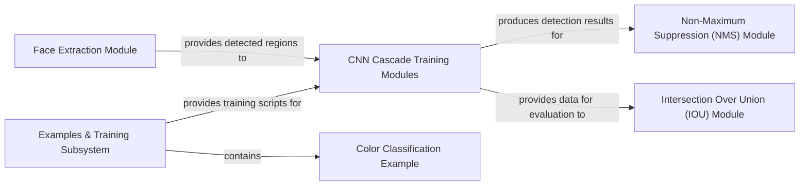

## Details

One paragraph explaining the functionality which is represented by this graph. What the main flow is and what is its purpose.

### CNN Cascade Training Modules
Manages the end-to-end training and inference process for the CNN stages responsible for head pose estimation (yaw and pitch). This includes defining model architectures, loading pre-trained weights, and executing inference. It represents the core CNN-based processing logic.

**Related Classes/Methods**:

- <a href="https://github.com/mpatacchiola/deepgaze/blob/master/deepgaze/cnn_head_pose_estimator.py#L11-L317" target="_blank" rel="noopener noreferrer">`deepgaze.cnn_head_pose_estimator.CnnHeadPoseEstimator`:11-317</a>

### Face Extraction Module
Responsible for detecting and localizing faces within images using Haar cascades. It prepares and standardizes face patterns, making them suitable for further processing by other modules.

**Related Classes/Methods**:

- <a href="https://github.com/mpatacchiola/deepgaze/blob/master/deepgaze/face_detection.py#L17-L374" target="_blank" rel="noopener noreferrer">`deepgaze.face_detection.HaarFaceDetector`:17-374</a>

### Non-Maximum Suppression (NMS) Module
Conceptually implements the Non-Maximum Suppression algorithm. Its primary role is to filter out redundant and overlapping bounding boxes generated by detection models, thereby refining and improving the accuracy of the final object detection results. While not a standalone file, its logic is applied to the outputs of detection processes, such as those from the `Face Extraction Module`.

**Related Classes/Methods**:

- <a href="https://github.com/mpatacchiola/deepgaze/blob/master/deepgaze/face_detection.py" target="_blank" rel="noopener noreferrer">`deepgaze.face_detection`</a>

### Intersection Over Union (IOU) Module
Conceptually calculates the Intersection Over Union (IoU) metric. This module is crucial for quantitatively evaluating the accuracy of object detection bounding boxes by comparing them against ground truth annotations, typically used within training and evaluation scripts.

**Related Classes/Methods**:

- <a href="https://github.com/mpatacchiola/deepgaze/blob/master/examples/" target="_blank" rel="noopener noreferrer">`examples`</a>

### Examples & Training Subsystem
This component encapsulates various scripts and utilities designed to demonstrate the capabilities of the `deepgaze` library and to facilitate the training and evaluation of its deep learning models. It serves as a practical guide and showcase for the library's features.

**Related Classes/Methods**:

- <a href="https://github.com/mpatacchiola/deepgaze/blob/master/examples/" target="_blank" rel="noopener noreferrer">`examples`</a>

### Color Classification Example
A self-contained demonstration script that showcases color classification using histogram intersection. It illustrates a specific utility or algorithm within the `deepgaze` library, serving as a concrete example of the library's functionality.

**Related Classes/Methods**:

### [FAQ](https://github.com/CodeBoarding/GeneratedOnBoardings/tree/main?tab=readme-ov-file#faq)