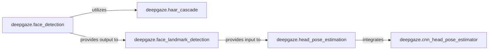

## Details

The Human-Centric Vision Core subsystem is a specialized part of the deepgaze project, focusing on the analysis of human-related visual information. It encapsulates functionalities for face detection, facial landmark identification, and head pose estimation, leveraging both traditional computer vision and deep learning techniques.

### deepgaze.face_detection
Provides a high-level, abstracted API for detecting human faces, capable of handling both frontal and profile views and multiple face instances. It serves as the initial entry point for face-related analysis.

**Related Classes/Methods**:

- <a href="https://github.com/mpatacchiola/deepgaze/blob/master/deepgaze/face_detection.py" target="_blank" rel="noopener noreferrer">`deepgaze.face_detection`</a>

### deepgaze.haar_cascade
Implements the traditional, rule-based face detection mechanism using Haar Cascade classifiers. It is a foundational, low-level component, providing a specific implementation detail for face detection.

**Related Classes/Methods**:

- <a href="https://github.com/mpatacchiola/deepgaze/blob/master/deepgaze/haar_cascade.py" target="_blank" rel="noopener noreferrer">`deepgaze.haar_cascade`</a>

### deepgaze.face_landmark_detection
Specializes in identifying and localizing key fiducial points (landmarks) on detected faces. These landmarks are crucial for subsequent geometric analysis, acting as a data preparation step for pose estimation.

**Related Classes/Methods**:

- <a href="https://github.com/mpatacchiola/deepgaze/blob/master/deepgaze/face_landmark_detection.py" target="_blank" rel="noopener noreferrer">`deepgaze.face_landmark_detection`</a>

### deepgaze.cnn_head_pose_estimator
Focuses on deep learning-based head pose estimation, specifically for yaw and pitch angles, by loading and utilizing pre-trained Convolutional Neural Network (CNN) models. It represents the modern, model-driven approach within the subsystem.

**Related Classes/Methods**:

- <a href="https://github.com/mpatacchiola/deepgaze/blob/master/deepgaze/cnn_head_pose_estimator.py" target="_blank" rel="noopener noreferrer">`deepgaze.cnn_head_pose_estimator`</a>

### deepgaze.head_pose_estimation
Orchestrates the complete head pose estimation process. It integrates landmark detection results and performs geometric calculations to determine the roll, pitch, and yaw of the head. It serves as the primary interface for comprehensive head pose analysis, combining outputs from other components.

**Related Classes/Methods**:

- <a href="https://github.com/mpatacchiola/deepgaze/blob/master/deepgaze/head_pose_estimation.py" target="_blank" rel="noopener noreferrer">`deepgaze.head_pose_estimation`</a>

### [FAQ](https://github.com/CodeBoarding/GeneratedOnBoardings/tree/main?tab=readme-ov-file#faq)