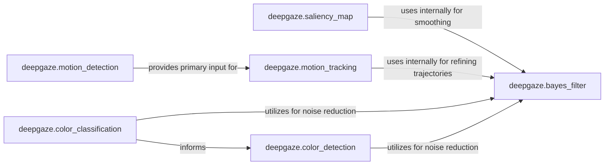

## Details

The `Image Preprocessing & Feature Extraction` subsystem is a foundational part of the `deepgaze` project, focusing on the initial stages of visual data processing. It encompasses modules responsible for transforming raw image data into meaningful features that can be used by higher-level computer vision algorithms.

### deepgaze.color_classification
Performs quantitative analysis of image colors, including histogram generation and comparison, to identify dominant colors or classify regions based on color properties. This component is crucial for understanding the overall color distribution within an image.

**Related Classes/Methods**:

- <a href="https://github.com/mpatacchiola/deepgaze/blob/master/deepgaze/color_classification.py" target="_blank" rel="noopener noreferrer">`deepgaze.color_classification`</a>

### deepgaze.color_detection
Identifies and isolates specific color ranges within an image, generating masks or segmented regions. It builds upon the insights from color classification to pinpoint areas of interest based on predefined or learned color characteristics.

**Related Classes/Methods**:

- <a href="https://github.com/mpatacchiola/deepgaze/blob/master/deepgaze/color_detection.py" target="_blank" rel="noopener noreferrer">`deepgaze.color_detection`</a>

### deepgaze.saliency_map
Computes and generates visual saliency maps, highlighting areas of an image that are most visually prominent or attention-grabbing. This component is vital for directing attention to relevant parts of an image, mimicking human visual perception.

**Related Classes/Methods**:

- <a href="https://github.com/mpatacchiola/deepgaze/blob/master/deepgaze/saliency_map.py" target="_blank" rel="noopener noreferrer">`deepgaze.saliency_map`</a>

### deepgaze.motion_detection
Detects and isolates moving objects or regions across a sequence of frames, providing raw motion cues (e.g., optical flow, frame differences). This is the initial step in analyzing dynamic scenes.

**Related Classes/Methods**:

- <a href="https://github.com/mpatacchiola/deepgaze/blob/master/deepgaze/motion_detection.py" target="_blank" rel="noopener noreferrer">`deepgaze.motion_detection`</a>

### deepgaze.motion_tracking
Tracks the trajectory, state, and behavior of detected moving entities over time, building upon the outputs of `motion_detection`. It refines raw motion cues into coherent object trajectories.

**Related Classes/Methods**:

- <a href="https://github.com/mpatacchiola/deepgaze/blob/master/deepgaze/motion_tracking.py" target="_blank" rel="noopener noreferrer">`deepgaze.motion_tracking`</a>

### deepgaze.bayes_filter
Applies probabilistic filtering techniques for tasks such as state estimation, noise reduction, or prediction within various image processing contexts. This component serves as a utility for improving the robustness and accuracy of other feature extraction processes.

**Related Classes/Methods**:

- <a href="https://github.com/mpatacchiola/deepgaze/blob/master/deepgaze/bayes_filter.py" target="_blank" rel="noopener noreferrer">`deepgaze.bayes_filter`</a>

### [FAQ](https://github.com/CodeBoarding/GeneratedOnBoardings/tree/main?tab=readme-ov-file#faq)