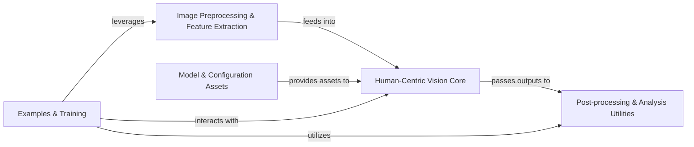

## Details

The `deepgaze` architecture is designed as a modular, pipeline-driven computer vision library, specializing in human-centric analysis. It initiates with an Image Preprocessing & Feature Extraction stage, which prepares visual data by generating saliency maps and performing color analysis. This preprocessed data then flows into the Human-Centric Vision Core, the central processing unit for face detection, landmark identification, and head pose estimation. The outputs from this core are subsequently refined and analyzed by Post-processing & Analysis Utilities, which handle tasks like mask manipulation and contour analysis. Supporting these operational components are the Model & Configuration Assets, providing essential pre-trained models and configuration files, and the Examples & Training module, which facilitates model development and showcases the library's functionalities. This clear separation of concerns and sequential data flow makes `deepgaze` highly suitable for visual diagram representation, highlighting the progression of data through distinct processing stages.

### Image Preprocessing & Feature Extraction [[Expand]](./Image_Preprocessing_Feature_Extraction.md)
Responsible for initial image transformations, color-based analysis, and the extraction of fundamental visual features like saliency maps and motion cues. It acts as the first stage in many computer vision pipelines.

**Related Classes/Methods**:

- <a href="https://github.com/mpatacchiola/deepgaze/blob/master/deepgaze/color_classification.py" target="_blank" rel="noopener noreferrer">`deepgaze.color_classification`</a>
- <a href="https://github.com/mpatacchiola/deepgaze/blob/master/deepgaze/color_detection.py" target="_blank" rel="noopener noreferrer">`deepgaze.color_detection`</a>
- <a href="https://github.com/mpatacchiola/deepgaze/blob/master/deepgaze/saliency_map.py" target="_blank" rel="noopener noreferrer">`deepgaze.saliency_map`</a>
- <a href="https://github.com/mpatacchiola/deepgaze/blob/master/deepgaze/motion_detection.py" target="_blank" rel="noopener noreferrer">`deepgaze.motion_detection`</a>
- <a href="https://github.com/mpatacchiola/deepgaze/blob/master/deepgaze/motion_tracking.py" target="_blank" rel="noopener noreferrer">`deepgaze.motion_tracking`</a>
- <a href="https://github.com/mpatacchiola/deepgaze/blob/master/deepgaze/bayes_filter.py" target="_blank" rel="noopener noreferrer">`deepgaze.bayes_filter`</a>

### Human-Centric Vision Core [[Expand]](./Human_Centric_Vision_Core.md)
The central component for analyzing human-related visual information, encompassing functionalities for detecting faces, identifying facial landmarks, and estimating head orientation using both traditional computer vision techniques and deep learning models.

**Related Classes/Methods**:

- <a href="https://github.com/mpatacchiola/deepgaze/blob/master/deepgaze/face_detection.py" target="_blank" rel="noopener noreferrer">`deepgaze.face_detection`</a>
- <a href="https://github.com/mpatacchiola/deepgaze/blob/master/deepgaze/haar_cascade.py" target="_blank" rel="noopener noreferrer">`deepgaze.haar_cascade`</a>
- <a href="https://github.com/mpatacchiola/deepgaze/blob/master/deepgaze/cnn_head_pose_estimator.py" target="_blank" rel="noopener noreferrer">`deepgaze.cnn_head_pose_estimator`</a>
- <a href="https://github.com/mpatacchiola/deepgaze/blob/master/deepgaze/head_pose_estimation.py" target="_blank" rel="noopener noreferrer">`deepgaze.head_pose_estimation`</a>
- <a href="https://github.com/mpatacchiola/deepgaze/blob/master/deepgaze/face_landmark_detection.py" target="_blank" rel="noopener noreferrer">`deepgaze.face_landmark_detection`</a>

### Post-processing & Analysis Utilities
Provides a suite of tools for the post-processing and analysis of processed image data, particularly binary masks and contours generated by other modules. It focuses on extracting geometric properties and visualizing results.

**Related Classes/Methods**:

- <a href="https://github.com/mpatacchiola/deepgaze/blob/master/deepgaze/mask_analysis.py" target="_blank" rel="noopener noreferrer">`deepgaze.mask_analysis`</a>

### Model & Configuration Assets
Serves as the repository for all pre-trained models (TensorFlow checkpoints for CNNs) and configuration files (XML files for Haar cascades) essential for the operation of the vision modules.

**Related Classes/Methods**:

- <a href="https://github.com/mpatacchiola/deepgaze/blob/master/etc/tensorflow/head_pose/" target="_blank" rel="noopener noreferrer">`etc.tensorflow.head_pose`</a>
- <a href="https://github.com/mpatacchiola/deepgaze/blob/master/etc/xml/" target="_blank" rel="noopener noreferrer">`etc.xml`</a>

### Examples & Training [[Expand]](./Examples_Training.md)
Contains various scripts and utilities primarily for demonstrating the capabilities of the `deepgaze` library and for training the deep learning models used within the Human-Centric Vision Core.

**Related Classes/Methods**:

- <a href="https://github.com/mpatacchiola/deepgaze/blob/master/examples/" target="_blank" rel="noopener noreferrer">`examples`</a>

### [FAQ](https://github.com/CodeBoarding/GeneratedOnBoardings/tree/main?tab=readme-ov-file#faq)