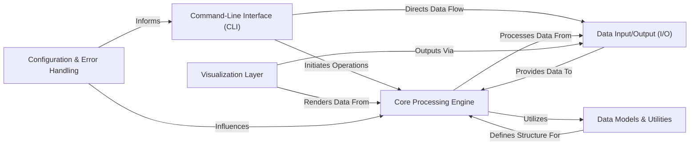

## Details

One paragraph explaining the functionality which is represented by this graph. What the main flow is and what is its purpose.

### Command-Line Interface (CLI) [[Expand]](./Command_Line_Interface_CLI_.md)
The user-facing layer that interprets commands, validates parameters, and orchestrates the execution of specific deeptools functionalities. It's the gateway for users to interact with the entire suite.

**Related Classes/Methods**:

- <a href="https://github.com/deeptools/deeptools/blob/master/deeptools/parserCommon.py#L1-L1" target="_blank" rel="noopener noreferrer">`deeptools.parserCommon` (1:1)</a>
- <a href="https://github.com/deeptools/deeptools/blob/master/deeptools/bamCompare.py#L233-L309" target="_blank" rel="noopener noreferrer">`deeptools.bamCompare.main` (233:309)</a>
- <a href="https://github.com/deeptools/deeptools/blob/master/deeptools/plotHeatmap.py#L807-L892" target="_blank" rel="noopener noreferrer">`deeptools.plotHeatmap.main` (807:892)</a>

### Data Input/Output (I/O)
Manages the reading and writing of various bioinformatics file formats (e.g., BAM, BigWig, BED, GTF). It abstracts the complexities of file handling and ensures data can be ingested and exported correctly.

**Related Classes/Methods**:

- <a href="https://github.com/deeptools/deeptools/blob/master/deeptools/bamHandler.py#L46-L102" target="_blank" rel="noopener noreferrer">`deeptools.bamHandler.openBam` (46:102)</a>
- <a href="https://github.com/deeptools/deeptools/blob/master/deeptools/writeBedGraph_bam_and_bw.py#L1-L1" target="_blank" rel="noopener noreferrer">`deeptools.writeBedGraph_bam_and_bw.writeBedGraph_bam_and_bw` (1:1)</a>

### Core Processing Engine
Contains the primary algorithms and computational logic for performing bioinformatics analyses, such as read counting, coverage calculation, data normalization, and statistical comparisons. This is where the core scientific computations occur.

**Related Classes/Methods**:

- <a href="https://github.com/deeptools/deeptools/blob/master/deeptools/countReadsPerBin.py#L1-L1" target="_blank" rel="noopener noreferrer">`deeptools.countReadsPerBin` (1:1)</a>
- <a href="https://github.com/deeptools/deeptools/blob/master/deeptools/bamCoverage.py#L1-L1" target="_blank" rel="noopener noreferrer">`deeptools.bamCoverage` (1:1)</a>
- <a href="https://github.com/deeptools/deeptools/blob/master/deeptools/bamCompare.py#L1-L1" target="_blank" rel="noopener noreferrer">`deeptools.bamCompare` (1:1)</a>
- <a href="https://github.com/deeptools/deeptools/blob/master/deeptools/computeMatrix.py#L1-L1" target="_blank" rel="noopener noreferrer">`deeptools.computeMatrix` (1:1)</a>

### Data Models & Utilities
Defines standardized data structures for genomic intervals, read alignments, and coverage profiles, and provides a collection of general-purpose helper functions for common genomic operations, data manipulation, and statistical calculations.

**Related Classes/Methods**:

- <a href="https://github.com/deeptools/deeptools/blob/master/deeptools/utilities.py#L1-L1" target="_blank" rel="noopener noreferrer">`deeptools.utilities` (1:1)</a>

### Visualization Layer
Responsible for generating high-quality plots and visual representations of processed genomic data, such as heatmaps, profile plots, and coverage tracks. It transforms numerical results into interpretable graphical insights.

**Related Classes/Methods**:

- <a href="https://github.com/deeptools/deeptools/blob/master/deeptools/plotHeatmap.py#L1-L1" target="_blank" rel="noopener noreferrer">`deeptools.plotHeatmap` (1:1)</a>
- <a href="https://github.com/deeptools/deeptools/blob/master/deeptools/plotProfile.py#L1-L1" target="_blank" rel="noopener noreferrer">`deeptools.plotProfile` (1:1)</a>
- <a href="https://github.com/deeptools/deeptools/blob/master/deeptools/heatmapper.py#L176-L1058" target="_blank" rel="noopener noreferrer">`deeptools.heatmapper` (176:1058)</a>

### Configuration & Error Handling
Manages application-wide settings, default parameters, and user-defined preferences, ensuring consistent behavior. It also centralizes error and exception handling to provide robust and informative feedback.

**Related Classes/Methods**:

- <a href="https://github.com/deeptools/deeptools/blob/master/deeptools/utilities.py#L1-L1" target="_blank" rel="noopener noreferrer">`deeptools.utilities.get_config_args` (1:1)</a>
- <a href="https://github.com/deeptools/deeptools/blob/master/deeptools/utilities.py#L1-L1" target="_blank" rel="noopener noreferrer">`deeptools.utilities.SmartException` (1:1)</a>

### [FAQ](https://github.com/CodeBoarding/GeneratedOnBoardings/tree/main?tab=readme-ov-file#faq)