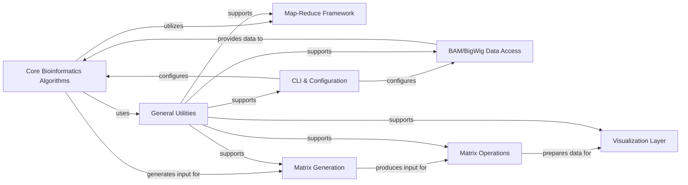

## Details

Analysis of the `deeptools` package, focusing on its core components and their relationships. The `Core Bioinformatics Algorithms` component is central to `deeptools` as it encapsulates the fundamental computational logic for genomic data processing.

### Core Bioinformatics Algorithms [[Expand]](./Core_Bioinformatics_Algorithms.md)
This component is the computational engine, housing the fundamental algorithms for processing raw genomic data. It includes critical tasks such as counting reads per genomic bin, estimating fragment sizes, calculating coverage profiles, and applying essential normalization methods (e.g., GC content bias correction, scaling factors). These algorithms form the bedrock for all quantitative analyses performed by the suite.

**Related Classes/Methods**:

- <a href="https://github.com/deeptools/deeptools/blob/master/deeptools/countReadsPerBin.py#L1-L1" target="_blank" rel="noopener noreferrer">`deeptools.countReadsPerBin` (1:1)</a>
- <a href="https://github.com/deeptools/deeptools/blob/master/deeptools/getFragmentAndReadSize.py#L1-L1" target="_blank" rel="noopener noreferrer">`deeptools.getFragmentAndReadSize` (1:1)</a>
- <a href="https://github.com/deeptools/deeptools/blob/master/deeptools/sumCoveragePerBin.py#L1-L1" target="_blank" rel="noopener noreferrer">`deeptools.sumCoveragePerBin` (1:1)</a>
- <a href="https://github.com/deeptools/deeptools/blob/master/deeptools/computeGCBias.py#L1-L1" target="_blank" rel="noopener noreferrer">`deeptools.computeGCBias` (1:1)</a>
- <a href="https://github.com/deeptools/deeptools/blob/master/deeptools/correctGCBias.py#L1-L1" target="_blank" rel="noopener noreferrer">`deeptools.correctGCBias` (1:1)</a>
- <a href="https://github.com/deeptools/deeptools/blob/master/deeptools/getScaleFactor.py#L1-L1" target="_blank" rel="noopener noreferrer">`deeptools.getScaleFactor` (1:1)</a>
- <a href="https://github.com/deeptools/deeptools/blob/master/deeptools/writeBedGraph.py#L1-L1" target="_blank" rel="noopener noreferrer">`deeptools.writeBedGraph` (1:1)</a>
- <a href="https://github.com/deeptools/deeptools/blob/master/deeptools/getRatio.py#L21-L81" target="_blank" rel="noopener noreferrer">`deeptools.getRatio` (21:81)</a>

### BAM/BigWig Data Access
Responsible for efficient reading and parsing of genomic data from standard bioinformatics file formats like BAM (for aligned reads) and BigWig (for pre-computed coverage tracks). This component handles the low-level I/O operations, ensuring data can be accessed quickly and reliably for downstream processing.

**Related Classes/Methods**:

- `pysam` (1:1)
- `pyBigWig` (1:1)
- `py2bit` (1:1)
- <a href="https://github.com/deeptools/deeptools/blob/master/deeptools/utilities.py#L1-L1" target="_blank" rel="noopener noreferrer">`deeptools.utilities` (1:1)</a>
- `deeptools.io` (1:1)

### Map-Reduce Framework
Provides a scalable framework for distributing computational tasks across multiple cores or nodes, particularly for large genomic datasets. This enables parallel processing of genomic bins or regions, significantly speeding up analysis.

**Related Classes/Methods**:

- `multiprocessing` (1:1)
- <a href="https://github.com/deeptools/deeptools/blob/master/deeptools/utilities.py#L1-L1" target="_blank" rel="noopener noreferrer">`deeptools.utilities` (1:1)</a>

### General Utilities
A collection of helper functions and common utilities used across various components. This includes error handling, logging, file path manipulation, and other general-purpose functionalities that support the main algorithms and data processing pipelines.

**Related Classes/Methods**:

- <a href="https://github.com/deeptools/deeptools/blob/master/deeptools/utilities.py#L1-L1" target="_blank" rel="noopener noreferrer">`deeptools.utilities` (1:1)</a>

### CLI & Configuration
Manages command-line argument parsing, user input validation, and configuration file handling. This component provides the user interface for interacting with the `deeptools` suite, allowing users to specify parameters and control the execution of analyses.

**Related Classes/Methods**:

- `deeptools.cli` (1:1)

### Matrix Generation
Responsible for taking processed genomic data (e.g., coverage profiles, read counts) and transforming it into a structured matrix format suitable for downstream analysis and visualization. This often involves creating heatmaps or profile plots.

**Related Classes/Methods**:

- <a href="https://github.com/deeptools/deeptools/blob/master/deeptools/heatmapper.py#L1078-L1371" target="_blank" rel="noopener noreferrer">`deeptools.heatmapper._matrix` (1078:1371)</a>

### Matrix Operations
Provides functionalities for manipulating and operating on the generated matrices. This could include normalization, aggregation, clustering, or other statistical transformations applied to the data matrices before visualization or further analysis.

**Related Classes/Methods**:

- <a href="https://github.com/deeptools/deeptools/blob/master/deeptools/heatmapper.py#L176-L1058" target="_blank" rel="noopener noreferrer">`deeptools.heatmapper` (176:1058)</a>

### Visualization Layer
Handles the generation of various plots and visualizations (e.g., heatmaps, profile plots, scatter plots) from the processed and transformed data. This component leverages libraries like `matplotlib` and `plotly` to create informative graphical representations of the genomic data.

**Related Classes/Methods**:

- `matplotlib` (1:1)
- `plotly` (1:1)
- <a href="https://github.com/deeptools/deeptools/blob/master/deeptools/plotProfile.py#L1-L1" target="_blank" rel="noopener noreferrer">`deeptools.plotProfile` (1:1)</a>
- <a href="https://github.com/deeptools/deeptools/blob/master/deeptools/plotHeatmap.py#L1-L1" target="_blank" rel="noopener noreferrer">`deeptools.plotHeatmap` (1:1)</a>

### [FAQ](https://github.com/CodeBoarding/GeneratedOnBoardings/tree/main?tab=readme-ov-file#faq)