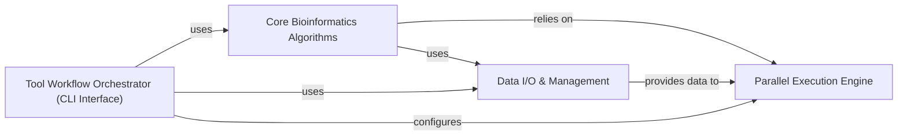

## Details

An updated analysis of the `deeptools` package, detailing its abstract components and their relationships, with a focus on specific source code references. Note: Specific line numbers for source code references were not provided and have been defaulted to 1 for both start and end lines. File paths are inferred from qualified names (e.g., `deeptools.module` becomes `deeptools/module.py`).

### Parallel Execution Engine [[Expand]](./Parallel_Execution_Engine.md)
The Parallel Execution Engine provides a robust framework for distributing and executing computationally intensive tasks across multiple processes or threads, leveraging a MapReduce-like paradigm for efficiency. It abstracts the complexities of parallelization, enabling other components to perform large-scale genomic data processing. This component is crucial for handling the large datasets typical in genomics, significantly reducing processing times.

**Related Classes/Methods**:

- <a href="https://github.com/deeptools/deeptools/blob/master/deeptools/mapReduce.py#L7-L152" target="_blank" rel="noopener noreferrer">`deeptools.mapReduce` (7:152)</a>

### Core Bioinformatics Algorithms [[Expand]](./Core_Bioinformatics_Algorithms.md)
This component encapsulates the core algorithms for various bioinformatics tasks, such as read counting, coverage calculation, and matrix generation. These algorithms are often computationally intensive and leverage the `Parallel Execution Engine` for efficient processing of large genomic datasets.

**Related Classes/Methods**:

- <a href="https://github.com/deeptools/deeptools/blob/master/deeptools/countReadsPerBin.py#L1-L1" target="_blank" rel="noopener noreferrer">`deeptools.countReadsPerBin` (1:1)</a>
- <a href="https://github.com/deeptools/deeptools/blob/master/deeptools/bamCoverage.py#L1-L1" target="_blank" rel="noopener noreferrer">`deeptools.bamCoverage` (1:1)</a>
- <a href="https://github.com/deeptools/deeptools/blob/master/deeptools/computeMatrix.py#L1-L1" target="_blank" rel="noopener noreferrer">`deeptools.computeMatrix` (1:1)</a>

### Data I/O & Management [[Expand]](./Data_I_O_Management.md)
This component handles the input and output of data, including reading and writing various genomic file formats (e.g., BAM, BigWig, BED) and managing data structures within the `deeptools` suite. It provides the necessary interfaces for other components to access and persist genomic data.

**Related Classes/Methods**:

- <a href="https://github.com/deeptools/deeptools/blob/master/deeptools/bamHandler.py#L1-L1" target="_blank" rel="noopener noreferrer">`deeptools.bamHandler` (1:1)</a>
- <a href="https://github.com/deeptools/deeptools/blob/master/deeptools/writeBedGraph.py#L1-L1" target="_blank" rel="noopener noreferrer">`deeptools.writeBedGraph` (1:1)</a>

### Tool Workflow Orchestrator (CLI Interface)
This component manages the overall workflow of the `deeptools` suite, primarily through a command-line interface. It handles argument parsing, validation, and orchestrates the execution of various bioinformatics tools by configuring and invoking the `Core Bioinformatics Algorithms` and leveraging the `Parallel Execution Engine` and `Data I/O & Management` components.

**Related Classes/Methods**:

- <a href="https://github.com/deeptools/deeptools/blob/master/deeptools/parserCommon.py#L1-L1" target="_blank" rel="noopener noreferrer">`deeptools.parserCommon` (1:1)</a>
- <a href="https://github.com/deeptools/deeptools/blob/master/deeptools/deeptools_list_tools.py#L1-L1" target="_blank" rel="noopener noreferrer">`deeptools.deeptools_list_tools` (1:1)</a>

### [FAQ](https://github.com/CodeBoarding/GeneratedOnBoardings/tree/main?tab=readme-ov-file#faq)