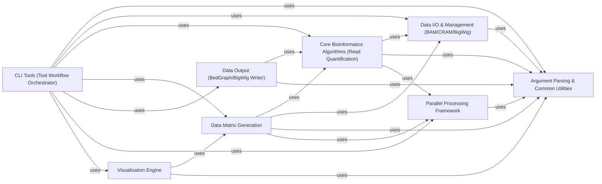

## Details

The Tool Workflow Orchestrator component in deeptools serves as the high-level control layer for each specific command-line tool. It acts as the central coordinator, integrating various core functionalities to execute a complete bioinformatics workflow from start to finish.

### CLI Tools (Tool Workflow Orchestrator)
These are the user-facing entry points for each deeptools command. They orchestrate the entire workflow by parsing arguments, calling core bioinformatics algorithms, managing data I/O, and initiating visualization or output. They are fundamental as they provide the high-level logic and integration necessary for users to execute complex bioinformatics tasks.

**Related Classes/Methods**:

- <a href="https://github.com/deeptools/deeptools/blob/master/deeptools/alignmentSieve.py#L1-L1" target="_blank" rel="noopener noreferrer">`deeptools.alignmentSieve` (1:1)</a>
- <a href="https://github.com/deeptools/deeptools/blob/master/deeptools/bamCompare.py#L1-L1" target="_blank" rel="noopener noreferrer">`deeptools.bamCompare` (1:1)</a>
- <a href="https://github.com/deeptools/deeptools/blob/master/deeptools/bamCoverage.py#L1-L1" target="_blank" rel="noopener noreferrer">`deeptools.bamCoverage` (1:1)</a>
- <a href="https://github.com/deeptools/deeptools/blob/master/deeptools/multiBamSummary.py#L1-L1" target="_blank" rel="noopener noreferrer">`deeptools.multiBamSummary` (1:1)</a>
- <a href="https://github.com/deeptools/deeptools/blob/master/deeptools/bigwigCompare.py#L1-L1" target="_blank" rel="noopener noreferrer">`deeptools.bigwigCompare` (1:1)</a>
- <a href="https://github.com/deeptools/deeptools/blob/master/deeptools/bamPEFragmentSize.py#L1-L1" target="_blank" rel="noopener noreferrer">`deeptools.bamPEFragmentSize` (1:1)</a>
- <a href="https://github.com/deeptools/deeptools/blob/master/deeptools/computeGCBias.py#L1-L1" target="_blank" rel="noopener noreferrer">`deeptools.computeGCBias` (1:1)</a>
- <a href="https://github.com/deeptools/deeptools/blob/master/deeptools/computeMatrix.py#L1-L1" target="_blank" rel="noopener noreferrer">`deeptools.computeMatrix` (1:1)</a>
- <a href="https://github.com/deeptools/deeptools/blob/master/deeptools/correctGCBias.py#L1-L1" target="_blank" rel="noopener noreferrer">`deeptools.correctGCBias` (1:1)</a>
- <a href="https://github.com/deeptools/deeptools/blob/master/deeptools/estimateReadFiltering.py#L1-L1" target="_blank" rel="noopener noreferrer">`deeptools.estimateReadFiltering` (1:1)</a>
- <a href="https://github.com/deeptools/deeptools/blob/master/deeptools/estimateScaleFactor.py#L1-L1" target="_blank" rel="noopener noreferrer">`deeptools.estimateScaleFactor` (1:1)</a>
- <a href="https://github.com/deeptools/deeptools/blob/master/deeptools/plotCorrelation.py#L1-L1" target="_blank" rel="noopener noreferrer">`deeptools.plotCorrelation` (1:1)</a>
- <a href="https://github.com/deeptools/deeptools/blob/master/deeptools/plotCoverage.py#L1-L1" target="_blank" rel="noopener noreferrer">`deeptools.plotCoverage` (1:1)</a>
- <a href="https://github.com/deeptools/deeptools/blob/master/deeptools/plotEnrichment.py#L358-L451" target="_blank" rel="noopener noreferrer">`deeptools.plotEnrichment` (358:451)</a>
- <a href="https://github.com/deeptools/deeptools/blob/master/deeptools/plotFingerprint.py#L1-L1" target="_blank" rel="noopener noreferrer">`deeptools.plotFingerprint` (1:1)</a>
- <a href="https://github.com/deeptools/deeptools/blob/master/deeptools/plotHeatmap.py#L1-L1" target="_blank" rel="noopener noreferrer">`deeptools.plotHeatmap` (1:1)</a>
- <a href="https://github.com/deeptools/deeptools/blob/master/deeptools/plotPCA.py#L1-L1" target="_blank" rel="noopener noreferrer">`deeptools.plotPCA` (1:1)</a>
- <a href="https://github.com/deeptools/deeptools/blob/master/deeptools/plotProfile.py#L1-L1" target="_blank" rel="noopener noreferrer">`deeptools.plotProfile` (1:1)</a>
- <a href="https://github.com/deeptools/deeptools/blob/master/deeptools/bigwigAverage.py#L1-L1" target="_blank" rel="noopener noreferrer">`deeptools.bigwigAverage` (1:1)</a>
- <a href="https://github.com/deeptools/deeptools/blob/master/deeptools/multiBigwigSummary.py#L1-L1" target="_blank" rel="noopener noreferrer">`deeptools.multiBigwigSummary` (1:1)</a>

### Argument Parsing & Common Utilities
Centralizes the definition and parsing of command-line arguments, ensuring consistency across tools. It also includes general-purpose helper functions for tasks like temporary file management, label generation, and common data structures, promoting code reusability. This is fundamental for a robust and user-friendly interface and maintaining a clean codebase.

**Related Classes/Methods**:

- <a href="https://github.com/deeptools/deeptools/blob/master/deeptools/parserCommon.py#L1-L1" target="_blank" rel="noopener noreferrer">`deeptools.parserCommon` (1:1)</a>
- <a href="https://github.com/deeptools/deeptools/blob/master/deeptools/utilities.py#L1-L1" target="_blank" rel="noopener noreferrer">`deeptools.utilities` (1:1)</a>
- <a href="https://github.com/deeptools/deeptools/blob/master/deeptools/cm.py#L1-L1" target="_blank" rel="noopener noreferrer">`deeptools.cm` (1:1)</a>
- <a href="https://github.com/deeptools/deeptools/blob/master/deeptools/misc.py#L1-L1" target="_blank" rel="noopener noreferrer">`deeptools.misc` (1:1)</a>

### Data I/O & Management (BAM/CRAM/BigWig)
Handles the reading and management of primary genomic data formats (BAM/CRAM alignment files, BigWig/BedGraph coverage files). It acts as an abstraction layer for pysam and pyBigWig, crucial for efficient and standardized data access. This is fundamental for handling the diverse input data formats in genomics.

**Related Classes/Methods**:

- <a href="https://github.com/deeptools/deeptools/blob/master/deeptools/bamHandler.py#L1-L1" target="_blank" rel="noopener noreferrer">`deeptools.bamHandler` (1:1)</a>
- <a href="https://github.com/deeptools/deeptools/blob/master/deeptools/getScorePerBigWigBin.py#L1-L1" target="_blank" rel="noopener noreferrer">`deeptools.getScorePerBigWigBin` (1:1)</a>

### Core Bioinformatics Algorithms (Read Quantification)
Implements the core logic for quantifying sequencing reads within genomic regions or bins, including various counting strategies and normalization methods. This forms the analytical foundation for coverage, summary, and differential analyses. It's fundamental as it provides the basic quantitative measures for most bioinformatics analyses.

**Related Classes/Methods**:

- <a href="https://github.com/deeptools/deeptools/blob/master/deeptools/countReadsPerBin.py#L1-L1" target="_blank" rel="noopener noreferrer">`deeptools.countReadsPerBin` (1:1)</a>
- <a href="https://github.com/deeptools/deeptools/blob/master/deeptools/sumCoveragePerBin.py#L1-L1" target="_blank" rel="noopener noreferrer">`deeptools.sumCoveragePerBin` (1:1)</a>
- <a href="https://github.com/deeptools/deeptools/blob/master/deeptools/getScaleFactor.py#L1-L1" target="_blank" rel="noopener noreferrer">`deeptools.getScaleFactor` (1:1)</a>
- <a href="https://github.com/deeptools/deeptools/blob/master/deeptools/SES_scaleFactor.py#L1-L1" target="_blank" rel="noopener noreferrer">`deeptools.SES_scaleFactor` (1:1)</a>
- <a href="https://github.com/deeptools/deeptools/blob/master/deeptools/getRatio.py#L21-L81" target="_blank" rel="noopener noreferrer">`deeptools.getRatio` (21:81)</a>
- <a href="https://github.com/deeptools/deeptools/blob/master/deeptools/getFragmentAndReadSize.py#L1-L1" target="_blank" rel="noopener noreferrer">`deeptools.getFragmentAndReadSize` (1:1)</a>

### Data Matrix Generation
Focuses on processing genomic data (e.g., read counts, coverage) into structured matrices suitable for downstream analysis and visualization, particularly for heatmaps and profiles. This component often involves complex aggregation and transformation logic. It's fundamental for preparing data for advanced visualization and comparative analysis.

**Related Classes/Methods**:

- <a href="https://github.com/deeptools/deeptools/blob/master/deeptools/computeMatrix.py#L1-L1" target="_blank" rel="noopener noreferrer">`deeptools.computeMatrix` (1:1)</a>
- <a href="https://github.com/deeptools/deeptools/blob/master/deeptools/computeMatrixOperations.py#L1-L1" target="_blank" rel="noopener noreferrer">`deeptools.computeMatrixOperations` (1:1)</a>

### Data Output (BedGraph/BigWig Writer)
Responsible for writing processed genomic data into standard BedGraph and BigWig file formats, ensuring interoperability with other bioinformatics tools and visualization platforms. This is fundamental for persisting results and enabling further analysis.

**Related Classes/Methods**:

- <a href="https://github.com/deeptools/deeptools/blob/master/deeptools/writeBedGraph.py#L1-L1" target="_blank" rel="noopener noreferrer">`deeptools.writeBedGraph` (1:1)</a>
- <a href="https://github.com/deeptools/deeptools/blob/master/deeptools/writeBedGraph_bam_and_bw.py#L1-L1" target="_blank" rel="noopener noreferrer">`deeptools.writeBedGraph_bam_and_bw` (1:1)</a>

### Parallel Processing Framework
Provides a generic MapReduce-like framework for parallelizing computationally intensive data processing tasks, essential for efficiently handling large genomic datasets. This is fundamental for performance and scalability in scientific computing.

**Related Classes/Methods**:

- <a href="https://github.com/deeptools/deeptools/blob/master/deeptools/mapReduce.py#L7-L152" target="_blank" rel="noopener noreferrer">`deeptools.mapReduce` (7:152)</a>

### Visualization Engine [[Expand]](./Visualization_Engine.md)
Generates various plots and visualizations (e.g., heatmaps, profiles, correlations, PCA) from processed genomic data, leveraging libraries like matplotlib and plotly. This is fundamental for data interpretation, quality control, and presenting results.

**Related Classes/Methods**:

- <a href="https://github.com/deeptools/deeptools/blob/master/deeptools/heatmapper.py#L176-L1058" target="_blank" rel="noopener noreferrer">`deeptools.heatmapper` (176:1058)</a>
- <a href="https://github.com/deeptools/deeptools/blob/master/deeptools/heatmapper_utilities.py#L1-L1" target="_blank" rel="noopener noreferrer">`deeptools.heatmapper_utilities` (1:1)</a>
- <a href="https://github.com/deeptools/deeptools/blob/master/deeptools/plotCorrelation.py#L1-L1" target="_blank" rel="noopener noreferrer">`deeptools.plotCorrelation` (1:1)</a>
- <a href="https://github.com/deeptools/deeptools/blob/master/deeptools/plotCoverage.py#L1-L1" target="_blank" rel="noopener noreferrer">`deeptools.plotCoverage` (1:1)</a>
- <a href="https://github.com/deeptools/deeptools/blob/master/deeptools/plotEnrichment.py#L358-L451" target="_blank" rel="noopener noreferrer">`deeptools.plotEnrichment` (358:451)</a>
- <a href="https://github.com/deeptools/deeptools/blob/master/deeptools/plotFingerprint.py#L1-L1" target="_blank" rel="noopener noreferrer">`deeptools.plotFingerprint` (1:1)</a>
- <a href="https://github.com/deeptools/deeptools/blob/master/deeptools/plotHeatmap.py#L1-L1" target="_blank" rel="noopener noreferrer">`deeptools.plotHeatmap` (1:1)</a>
- <a href="https://github.com/deeptools/deeptools/blob/master/deeptools/plotPCA.py#L1-L1" target="_blank" rel="noopener noreferrer">`deeptools.plotPCA` (1:1)</a>
- <a href="https://github.com/deeptools/deeptools/blob/master/deeptools/plotProfile.py#L1-L1" target="_blank" rel="noopener noreferrer">`deeptools.plotProfile` (1:1)</a>
- <a href="https://github.com/deeptools/deeptools/blob/master/deeptools/correlation.py#L1-L1" target="_blank" rel="noopener noreferrer">`deeptools.correlation` (1:1)</a>
- <a href="https://github.com/deeptools/deeptools/blob/master/deeptools/correlation_heatmap.py#L1-L1" target="_blank" rel="noopener noreferrer">`deeptools.correlation_heatmap` (1:1)</a>

### [FAQ](https://github.com/CodeBoarding/GeneratedOnBoardings/tree/main?tab=readme-ov-file#faq)