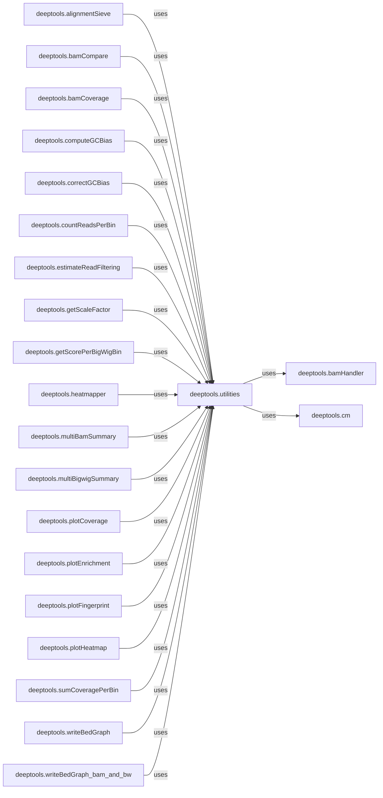

## Details

The `deeptools.utilities` component is fundamental because it embodies the principles of modular design and reusability, which are critical for a Scientific Computing/Bioinformatics Tool Suite. By centralizing common helper functions, it: 1. Reduces Code Duplication: Prevents the same logic from being rewritten across multiple modules, leading to a more concise and maintainable codebase. 2. Ensures Consistency: Standardizes operations like chromosome naming and data type conversions, which is crucial for data integrity and interoperability in bioinformatics. 3. Simplifies Development: Provides a readily available set of tools for developers, allowing them to focus on the core logic of new features rather than reimplementing basic functionalities. 4. Improves Maintainability: Changes or bug fixes to a utility function only need to be applied in one place, benefiting all components that use it. 5. Enhances Readability: Code that leverages well-named utility functions is generally easier to understand and follow. In essence, `deeptools.utilities` acts as the backbone for many operations within the `deeptools` project, making it an indispensable component for the overall architecture and functionality of the tool suite.

### deeptools.utilities
This component provides a comprehensive set of utility functions essential for various operations within `deeptools`. These utilities range from basic file I/O and string/byte conversions to more specialized bioinformatics tasks like chromosome name standardization and handling blacklisted reads in sequencing data. It acts as a support layer, ensuring common functionalities are centralized and consistently applied throughout the project.

**Related Classes/Methods**:

- <a href="https://github.com/deeptools/deeptools/blob/master/deeptools/utilities.py#L281-L293" target="_blank" rel="noopener noreferrer">`deeptools.utilities:toString` (281:293)</a>
- <a href="https://github.com/deeptools/deeptools/blob/master/deeptools/utilities.py#L296-L308" target="_blank" rel="noopener noreferrer">`deeptools.utilities:toBytes` (296:308)</a>
- <a href="https://github.com/deeptools/deeptools/blob/master/deeptools/utilities.py#L231-L246" target="_blank" rel="noopener noreferrer">`deeptools.utilities:copyFileInMemory` (231:246)</a>
- <a href="https://github.com/deeptools/deeptools/blob/master/deeptools/utilities.py#L160-L228" target="_blank" rel="noopener noreferrer">`deeptools.utilities:getCommonChrNames` (160:228)</a>
- <a href="https://github.com/deeptools/deeptools/blob/master/deeptools/utilities.py#L345-L355" target="_blank" rel="noopener noreferrer">`deeptools.utilities:bam_blacklisted_worker` (345:355)</a>
- <a href="https://github.com/deeptools/deeptools/blob/master/deeptools/utilities.py#L27-L28" target="_blank" rel="noopener noreferrer">`deeptools.utilities:smartLabels` (27:28)</a>

### deeptools.bamHandler
Handles core BAM file operations.

**Related Classes/Methods**: _None_

### deeptools.cm
Provides functionalities related to colormaps or visual elements.

**Related Classes/Methods**: _None_

### deeptools.alignmentSieve
A component within the deeptools project.

**Related Classes/Methods**: _None_

### deeptools.bamCompare
A component within the deeptools project.

**Related Classes/Methods**: _None_

### deeptools.bamCoverage
A component within the deeptools project.

**Related Classes/Methods**: _None_

### deeptools.computeGCBias
A component within the deeptools project.

**Related Classes/Methods**: _None_

### deeptools.correctGCBias
A component within the deeptools project.

**Related Classes/Methods**: _None_

### deeptools.countReadsPerBin
A component within the deeptools project.

**Related Classes/Methods**: _None_

### deeptools.estimateReadFiltering
A component within the deeptools project.

**Related Classes/Methods**: _None_

### deeptools.getScaleFactor
A component within the deeptools project.

**Related Classes/Methods**: _None_

### deeptools.getScorePerBigWigBin
A component within the deeptools project.

**Related Classes/Methods**: _None_

### deeptools.heatmapper
A component within the deeptools project.

**Related Classes/Methods**: _None_

### deeptools.multiBamSummary
A component within the deeptools project.

**Related Classes/Methods**: _None_

### deeptools.multiBigwigSummary
A component within the deeptools project.

**Related Classes/Methods**: _None_

### deeptools.plotCoverage
A component within the deeptools project.

**Related Classes/Methods**: _None_

### deeptools.plotEnrichment
A component within the deeptools project.

**Related Classes/Methods**: _None_

### deeptools.plotFingerprint
A component within the deeptools project.

**Related Classes/Methods**: _None_

### deeptools.plotHeatmap
A component within the deeptools project.

**Related Classes/Methods**: _None_

### deeptools.sumCoveragePerBin
A component within the deeptools project.

**Related Classes/Methods**: _None_

### deeptools.writeBedGraph
A component within the deeptools project.

**Related Classes/Methods**: _None_

### deeptools.writeBedGraph_bam_and_bw
A component within the deeptools project.

**Related Classes/Methods**: _None_

### [FAQ](https://github.com/CodeBoarding/GeneratedOnBoardings/tree/main?tab=readme-ov-file#faq)