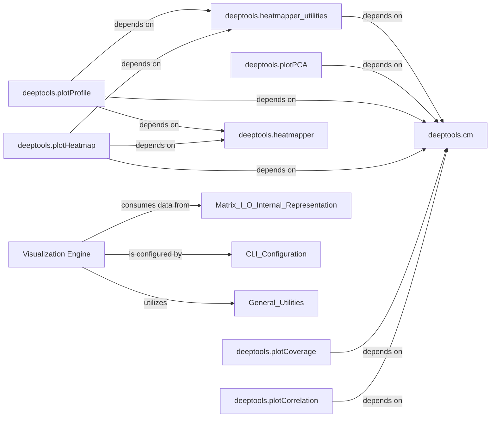

## Details

Analysis of the 'Visualization Engine' in 'deeptools', detailing its structure, core modules, and inter-component relationships for generating diverse graphical representations from processed genomic data.

### Visualization Engine [[Expand]](./Visualization_Engine.md)
This component is dedicated to the generation of diverse graphical representations from processed genomic data and analysis results. It encompasses functionalities for creating heatmaps, profile plots, scatter plots, and PCA plots. It acts as the primary interface for transforming numerical data into insightful visual outputs, relying on internal data structures (matrices) and external plotting libraries like Matplotlib and Plotly.

**Related Classes/Methods**: _None_

### deeptools.plotCorrelation
Handles the generation of correlation plots, visualizing the relationships between different genomic datasets.

**Related Classes/Methods**:

- <a href="https://github.com/deeptools/deeptools/blob/master/deeptools/plotCorrelation.py#L1-L1" target="_blank" rel="noopener noreferrer">`deeptools.plotCorrelation` (1:1)</a>

### deeptools.plotCoverage
Manages the creation of coverage plots, illustrating the sequencing depth across genomic regions.

**Related Classes/Methods**:

- <a href="https://github.com/deeptools/deeptools/blob/master/deeptools/plotCoverage.py#L1-L1" target="_blank" rel="noopener noreferrer">`deeptools.plotCoverage` (1:1)</a>

### deeptools.plotHeatmap
Responsible for rendering heatmaps, which are essential for visualizing patterns in large-scale genomic data, such as gene expression or histone modification profiles.

**Related Classes/Methods**:

- <a href="https://github.com/deeptools/deeptools/blob/master/deeptools/plotHeatmap.py#L1-L1" target="_blank" rel="noopener noreferrer">`deeptools.plotHeatmap` (1:1)</a>

### deeptools.plotProfile
Generates profile plots, showing the average signal intensity across defined genomic regions.

**Related Classes/Methods**:

- <a href="https://github.com/deeptools/deeptools/blob/master/deeptools/plotProfile.py#L1-L1" target="_blank" rel="noopener noreferrer">`deeptools.plotProfile` (1:1)</a>

### deeptools.plotPCA
Creates PCA (Principal Component Analysis) plots, used for dimensionality reduction and visualizing sample relationships based on genomic features.

**Related Classes/Methods**:

- <a href="https://github.com/deeptools/deeptools/blob/master/deeptools/plotPCA.py#L1-L1" target="_blank" rel="noopener noreferrer">`deeptools.plotPCA` (1:1)</a>

### deeptools.heatmapper
A core module that manages the internal representation and processing of matrix data specifically for heatmap and profile plot generation. It includes functionalities for reading and saving matrix files and potentially the underlying plotting logic.

**Related Classes/Methods**:

- <a href="https://github.com/deeptools/deeptools/blob/master/deeptools/heatmapper.py#L176-L1058" target="_blank" rel="noopener noreferrer">`deeptools.heatmapper` (176:1058)</a>

### deeptools.heatmapper_utilities
Provides utility functions that support the `heatmapper` module, likely for data manipulation or preparation specific to heatmap visualization.

**Related Classes/Methods**:

- <a href="https://github.com/deeptools/deeptools/blob/master/deeptools/heatmapper_utilities.py#L1-L1" target="_blank" rel="noopener noreferrer">`deeptools.heatmapper_utilities` (1:1)</a>

### deeptools.cm
This module appears to handle colormap definitions and related utilities, which are essential for the visual aesthetics and interpretability of plots.

**Related Classes/Methods**:

- <a href="https://github.com/deeptools/deeptools/blob/master/deeptools/cm.py#L1-L1" target="_blank" rel="noopener noreferrer">`deeptools.cm` (1:1)</a>

### [FAQ](https://github.com/CodeBoarding/GeneratedOnBoardings/tree/main?tab=readme-ov-file#faq)