```mermaid
graph LR
    Command_Line_Interface_CLI_["Command-Line Interface (CLI)"]
    Data_I_O_Management["Data I/O & Management"]
    Core_Bioinformatics_Algorithms["Core Bioinformatics Algorithms"]
    Visualization_Engine["Visualization Engine"]
    Tool_Workflow_Orchestrator["Tool Workflow Orchestrator"]
    Parallel_Execution_Engine["Parallel Execution Engine"]
    Utilities["Utilities"]
    Command_Line_Interface_CLI_ -- "initiates workflows in" --> Tool_Workflow_Orchestrator
    Data_I_O_Management -- "provides raw data to" --> Core_Bioinformatics_Algorithms
    Core_Bioinformatics_Algorithms -- "sends processed data to" --> Data_I_O_Management
    Data_I_O_Management -- "provides matrices/data to" --> Visualization_Engine
    Tool_Workflow_Orchestrator -- "calls functions in" --> Data_I_O_Management
    Core_Bioinformatics_Algorithms -- "receives raw data from" --> Data_I_O_Management
    Core_Bioinformatics_Algorithms -- "provides processed data to" --> Visualization_Engine
    Tool_Workflow_Orchestrator -- "receives data/matrices from" --> Data_I_O_Management
    Command_Line_Interface_CLI_ -- "is initiated by" --> Tool_Workflow_Orchestrator
    Tool_Workflow_Orchestrator -- "calls functions in" --> Data_I_O_Management
    Tool_Workflow_Orchestrator -- "calls functions in" --> Core_Bioinformatics_Algorithms
    Tool_Workflow_Orchestrator -- "calls functions in" --> Visualization_Engine
    Parallel_Execution_Engine -- "is utilized by" --> Core_Bioinformatics_Algorithms
    Parallel_Execution_Engine -- "is utilized by" --> Data_I_O_Management
    Parallel_Execution_Engine -- "is utilized by" --> Tool_Workflow_Orchestrator
    Utilities -- "supports" --> Command_Line_Interface_CLI_
    Utilities -- "supports" --> Data_I_O_Management
    Utilities -- "supports" --> Core_Bioinformatics_Algorithms
    Utilities -- "supports" --> Visualization_Engine
    Utilities -- "supports" --> Tool_Workflow_Orchestrator
    Utilities -- "supports" --> Parallel_Execution_Engine
    click Command_Line_Interface_CLI_ href "https://github.com/CodeBoarding/GeneratedOnBoardings/blob/main/deeptools/Command_Line_Interface_CLI_.md" "Details"
    click Data_I_O_Management href "https://github.com/CodeBoarding/GeneratedOnBoardings/blob/main/deeptools/Data_I_O_Management.md" "Details"
    click Core_Bioinformatics_Algorithms href "https://github.com/CodeBoarding/GeneratedOnBoardings/blob/main/deeptools/Core_Bioinformatics_Algorithms.md" "Details"
    click Visualization_Engine href "https://github.com/CodeBoarding/GeneratedOnBoardings/blob/main/deeptools/Visualization_Engine.md" "Details"
    click Tool_Workflow_Orchestrator href "https://github.com/CodeBoarding/GeneratedOnBoardings/blob/main/deeptools/Tool_Workflow_Orchestrator.md" "Details"
    click Parallel_Execution_Engine href "https://github.com/CodeBoarding/GeneratedOnBoardings/blob/main/deeptools/Parallel_Execution_Engine.md" "Details"
    click Utilities href "https://github.com/CodeBoarding/GeneratedOnBoardings/blob/main/deeptools/Utilities.md" "Details"
```

## Details

The `deeptools` project is architected as a modular Scientific Computing / Bioinformatics Tool Suite, designed to process and visualize genomic data. Its architecture emphasizes a clear separation of concerns, enabling efficient data flow from command-line input through core processing to final visualization.

### Command-Line Interface (CLI) [[Expand]](./Command_Line_Interface_CLI_.md)
Serves as the primary entry point for users, responsible for parsing command-line arguments, validating inputs, and initiating the execution of specific `deeptools` tools. It translates user commands into internal workflow orchestrations.

**Related Classes/Methods**:

- <a href="https://github.com/deeptools/deeptools/blob/master/deeptools/parserCommon.py#L1-L10" target="_blank" rel="noopener noreferrer">`deeptools.parserCommon` (1:10)</a>
- <a href="https://github.com/deeptools/deeptools/blob/master/deeptools/bamCompare.py#L233-L309" target="_blank" rel="noopener noreferrer">`deeptools.bamCompare.main` (233:309)</a>
- <a href="https://github.com/deeptools/deeptools/blob/master/deeptools/plotHeatmap.py#L807-L892" target="_blank" rel="noopener noreferrer">`deeptools.plotHeatmap.main` (807:892)</a>

### Data I/O & Management [[Expand]](./Data_I_O_Management.md)
Handles all aspects of data ingress and egress, including reading from and writing to various bioinformatics file formats (BAM, BigWig, BedGraph, BED, GTF). It also manages the creation, manipulation, and storage of structured data matrices derived from genomic signals, which are central to many `deeptools` analyses.

**Related Classes/Methods**:

- <a href="https://github.com/deeptools/deeptools/blob/master/deeptools/bamHandler.py#L1-L10" target="_blank" rel="noopener noreferrer">`deeptools.bamHandler` (1:10)</a>
- <a href="https://github.com/deeptools/deeptools/blob/master/deeptools/writeBedGraph.py#L1-L10" target="_blank" rel="noopener noreferrer">`deeptools.writeBedGraph` (1:10)</a>
- <a href="https://github.com/deeptools/deeptools/blob/master/deeptools/heatmapper.py#L751-L811" target="_blank" rel="noopener noreferrer">`deeptools.heatmapper.heatmapper.read_matrix_file` (751:811)</a>
- <a href="https://github.com/deeptools/deeptools/blob/master/deeptools/heatmapper.py#L813-L871" target="_blank" rel="noopener noreferrer">`deeptools.heatmapper.heatmapper.save_matrix` (813:871)</a>
- <a href="https://github.com/deeptools/deeptools/blob/master/deeptools/computeMatrix.py#L1-L10" target="_blank" rel="noopener noreferrer">`deeptools.computeMatrix` (1:10)</a>
- <a href="https://github.com/deeptools/deeptools/blob/master/deeptools/computeMatrixOperations.py#L1-L10" target="_blank" rel="noopener noreferrer">`deeptools.computeMatrixOperations` (1:10)</a>
- <a href="https://github.com/deeptools/deeptools/blob/master/deeptools/heatmapper.py#L1078-L1371" target="_blank" rel="noopener noreferrer">`deeptools.heatmapper._matrix` (1078:1371)</a>

### Core Bioinformatics Algorithms [[Expand]](./Core_Bioinformatics_Algorithms.md)
Encapsulates the fundamental algorithms for processing raw genomic data. This includes tasks such as counting reads per genomic bin, estimating fragment sizes, calculating coverage, and applying normalization methods (e.g., GC content bias correction, scaling factors). It performs the heavy computational lifting.

**Related Classes/Methods**:

- <a href="https://github.com/deeptools/deeptools/blob/master/deeptools/countReadsPerBin.py#L30-L960" target="_blank" rel="noopener noreferrer">`deeptools.countReadsPerBin.CountReadsPerBin` (30:960)</a>
- <a href="https://github.com/deeptools/deeptools/blob/master/deeptools/getFragmentAndReadSize.py#L1-L10" target="_blank" rel="noopener noreferrer">`deeptools.getFragmentAndReadSize` (1:10)</a>
- <a href="https://github.com/deeptools/deeptools/blob/master/deeptools/sumCoveragePerBin.py#L9-L213" target="_blank" rel="noopener noreferrer">`deeptools.sumCoveragePerBin.SumCoveragePerBin` (9:213)</a>
- <a href="https://github.com/deeptools/deeptools/blob/master/deeptools/computeGCBias.py#L1-L10" target="_blank" rel="noopener noreferrer">`deeptools.computeGCBias` (1:10)</a>
- <a href="https://github.com/deeptools/deeptools/blob/master/deeptools/correctGCBias.py#L1-L10" target="_blank" rel="noopener noreferrer">`deeptools.correctGCBias` (1:10)</a>
- <a href="https://github.com/deeptools/deeptools/blob/master/deeptools/getScaleFactor.py#L1-L10" target="_blank" rel="noopener noreferrer">`deeptools.getScaleFactor` (1:10)</a>

### Visualization Engine [[Expand]](./Visualization_Engine.md)
Responsible for rendering various plots and graphical representations of genomic data and analysis results. This includes heatmaps, profile plots, scatter plots, and PCA plots, leveraging libraries like Matplotlib and Plotly to create informative visual outputs.

**Related Classes/Methods**:

- <a href="https://github.com/deeptools/deeptools/blob/master/deeptools/plotCorrelation.py#L1-L10" target="_blank" rel="noopener noreferrer">`deeptools.plotCorrelation` (1:10)</a>
- <a href="https://github.com/deeptools/deeptools/blob/master/deeptools/plotCoverage.py#L1-L10" target="_blank" rel="noopener noreferrer">`deeptools.plotCoverage` (1:10)</a>
- <a href="https://github.com/deeptools/deeptools/blob/master/deeptools/plotHeatmap.py#L1-L10" target="_blank" rel="noopener noreferrer">`deeptools.plotHeatmap` (1:10)</a>
- <a href="https://github.com/deeptools/deeptools/blob/master/deeptools/plotProfile.py#L1-L10" target="_blank" rel="noopener noreferrer">`deeptools.plotProfile` (1:10)</a>
- <a href="https://github.com/deeptools/deeptools/blob/master/deeptools/plotPCA.py#L1-L10" target="_blank" rel="noopener noreferrer">`deeptools.plotPCA` (1:10)</a>
- <a href="https://github.com/deeptools/deeptools/blob/master/deeptools/heatmapper_utilities.py#L1-L10" target="_blank" rel="noopener noreferrer">`deeptools.heatmapper_utilities` (1:10)</a>

### Tool Workflow Orchestrator [[Expand]](./Tool_Workflow_Orchestrator.md)
This layer defines the specific high-level logic for each `deeptools` command-line tool. It acts as the central coordinator, orchestrating calls between the `CLI` and the core functional components (`Data I/O & Management`, `Core Bioinformatics Algorithms`, `Visualization Engine`) to execute a complete bioinformatics workflow from start to finish.

**Related Classes/Methods**:

- <a href="https://github.com/deeptools/deeptools/blob/master/deeptools/alignmentSieve.py#L1-L10" target="_blank" rel="noopener noreferrer">`deeptools.alignmentSieve` (1:10)</a>
- <a href="https://github.com/deeptools/deeptools/blob/master/deeptools/bamCompare.py#L1-L10" target="_blank" rel="noopener noreferrer">`deeptools.bamCompare` (1:10)</a>
- <a href="https://github.com/deeptools/deeptools/blob/master/deeptools/bamCoverage.py#L1-L10" target="_blank" rel="noopener noreferrer">`deeptools.bamCoverage` (1:10)</a>
- <a href="https://github.com/deeptools/deeptools/blob/master/deeptools/multiBamSummary.py#L1-L10" target="_blank" rel="noopener noreferrer">`deeptools.multiBamSummary` (1:10)</a>
- <a href="https://github.com/deeptools/deeptools/blob/master/deeptools/bigwigCompare.py#L1-L10" target="_blank" rel="noopener noreferrer">`deeptools.bigwigCompare` (1:10)</a>

### Parallel Execution Engine [[Expand]](./Parallel_Execution_Engine.md)
Provides a framework (`deeptools.mapReduce`) for distributing and executing computationally intensive tasks across multiple processes or threads, leveraging a MapReduce paradigm for efficiency. This service is utilized by the **Core Bioinformatics Algorithms**, **Data I/O & Management**, and **Tool Workflow Orchestrator** for performance optimization.

**Related Classes/Methods**:

- <a href="https://github.com/deeptools/deeptools/blob/master/deeptools/mapReduce.py#L7-L152" target="_blank" rel="noopener noreferrer">`deeptools.mapReduce` (7:152)</a>

### Utilities [[Expand]](./Utilities.md)
A collection of general-purpose helper functions (`deeptools.utilities`) used across various modules, including string conversions, file path handling, chromosome name standardization, and temporary file management. These utilities support almost all other components.

**Related Classes/Methods**:

- <a href="https://github.com/deeptools/deeptools/blob/master/deeptools/utilities.py#L1-L10" target="_blank" rel="noopener noreferrer">`deeptools.utilities` (1:10)</a>

### [FAQ](https://github.com/CodeBoarding/GeneratedOnBoardings/tree/main?tab=readme-ov-file#faq)