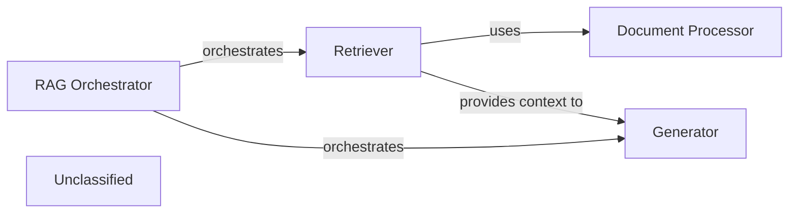

## Details

This graph represents the core functionality of a Retrieval Augmented Generation (RAG) system. The main flow involves an orchestrator that manages the interaction between a retriever, which fetches relevant documents, and a generator, which synthesizes a response based on the retrieved information and the user's query. The purpose is to provide accurate and contextually rich answers by leveraging external knowledge bases.

### RAG Orchestrator
Manages the overall RAG process, coordinating between the retriever and generator.

**Related Classes/Methods**:

- <a href="https://github.com/AsyncFuncAI/deepwiki-open/blob/mainapi/rag.py" target="_blank" rel="noopener noreferrer">`api.rag.RAGOrchestrator`</a>

### Retriever
Fetches relevant documents or information based on the input query.

**Related Classes/Methods**:

- <a href="https://github.com/AsyncFuncAI/deepwiki-open/blob/mainapi/rag.py#L153-L300" target="_blank" rel="noopener noreferrer">`api.retriever.Retriever`:153-300</a>

### Generator
Generates a coherent and informative response using the retrieved context and the original query.

**Related Classes/Methods**:

- `api.generator.Generator`

### Document Processor
Handles the processing and indexing of documents for the retriever.

**Related Classes/Methods**:

- <a href="https://github.com/AsyncFuncAI/deepwiki-open/blob/mainapi/ollama_patch.py#L62-L105" target="_blank" rel="noopener noreferrer">`api.document_processor.DocumentProcessor`:62-105</a>

### Unclassified
Component for all unclassified files and utility functions (Utility functions/External Libraries/Dependencies)

**Related Classes/Methods**: _None_

### [FAQ](https://github.com/CodeBoarding/GeneratedOnBoardings/tree/main?tab=readme-ov-file#faq)