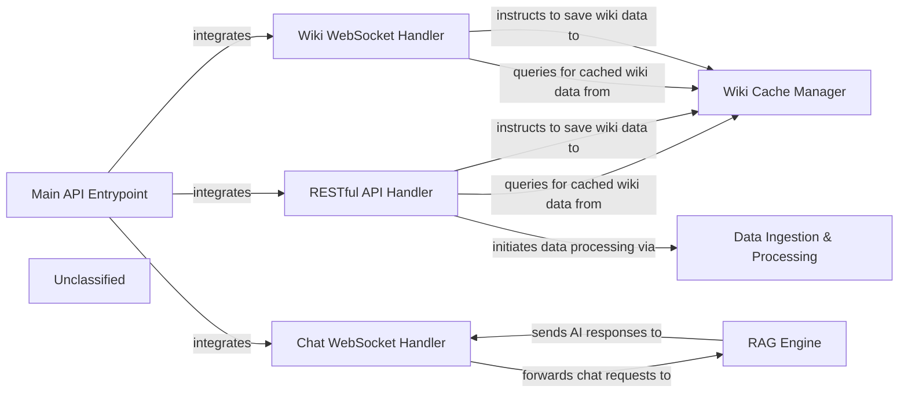

## Details

The system is built around a FastAPI application, with the `Main API Entrypoint` (`api.api:app`) serving as the central hub for all incoming requests. This entry point integrates various specialized handlers: the `RESTful API Handler` (`api.api.router`) for managing standard HTTP API interactions, the `Wiki WebSocket Handler` (`api.websocket_wiki.router`) for real-time wiki functionalities, and the `Chat WebSocket Handler` (`api.simple_chat.router`) for interactive chat. The `RESTful API Handler` and `Wiki WebSocket Handler` interact with a `Wiki Cache Manager` for efficient data handling and can initiate processes within the `Data Ingestion & Processing` component. The `Chat WebSocket Handler` is responsible for forwarding chat requests to the `RAG Engine`, which in turn provides AI-driven responses back to the chat handler. This architecture ensures a clear separation of concerns, allowing for scalable and maintainable development of both traditional API services and real-time interactive features.

### Main API Entrypoint
Initializes and configures the FastAPI application, serving as the primary entry point for all incoming HTTP and WebSocket requests. It integrates various API routers and middleware.

**Related Classes/Methods**:

- <a href="https://github.com/AsyncFuncAI/deepwiki-open/blob/mainapi/api.py" target="_blank" rel="noopener noreferrer">`api.api:app`</a>

### RESTful API Handler
Manages and exposes the core RESTful endpoints for functionalities such as project management, wiki export, and configuration. It handles request parsing, validation, and delegates business logic to other backend services.

**Related Classes/Methods**:

- <a href="https://github.com/AsyncFuncAI/deepwiki-open/blob/mainapi/api.py" target="_blank" rel="noopener noreferrer">`api.api.router`</a>

### Wiki WebSocket Handler
Specializes in managing real-time, bidirectional communication for interactive wiki functionalities. It handles WebSocket connections, processes wiki-related real-time events, and interacts with wiki data management components.

**Related Classes/Methods**:

- <a href="https://github.com/AsyncFuncAI/deepwiki-open/blob/mainapi/websocket_wiki.py" target="_blank" rel="noopener noreferrer">`api.websocket_wiki.router`</a>

### Chat WebSocket Handler
Dedicated to managing real-time chat functionalities via WebSocket connections. It handles chat message routing, user presence, and interactions with the RAG Engine for AI-driven responses.

**Related Classes/Methods**:

- <a href="https://github.com/AsyncFuncAI/deepwiki-open/blob/mainapi/simple_chat.py" target="_blank" rel="noopener noreferrer">`api.simple_chat.router`</a>

### Wiki Cache Manager
Manages caching mechanisms for wiki data, optimizing retrieval and storage operations to enhance performance and reduce redundant data processing.

**Related Classes/Methods**:

### Data Ingestion & Processing [[Expand]](./Data_Ingestion_Processing.md)
Handles the intake, transformation, and preparation of raw data for use within the application, including parsing, cleaning, and structuring information.

**Related Classes/Methods**:

### RAG Engine
Implements Retrieval-Augmented Generation (RAG) capabilities, combining information retrieval with generative AI models to provide contextually relevant and accurate responses, particularly for chat functionalities.

**Related Classes/Methods**:

### Unclassified
Component for all unclassified files and utility functions (Utility functions/External Libraries/Dependencies)

**Related Classes/Methods**: _None_

### [FAQ](https://github.com/CodeBoarding/GeneratedOnBoardings/tree/main?tab=readme-ov-file#faq)