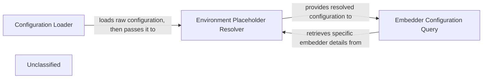

## Details

The configuration subsystem is responsible for loading, processing, and providing access to various application settings. It centralizes the management of dynamic configurations, including those for language models and embedding services, by integrating environment variables and structured JSON files. The subsystem is initiated by the Configuration Loader, which reads various JSON configuration files. These raw configurations are then passed to the Environment Placeholder Resolver to substitute environment variables, ensuring dynamic and secure settings. Finally, the Embedder Configuration Query component provides a specialized interface to access and interpret embedder-specific settings from the processed configuration, enabling other parts of the system to adapt to the active embedding model.

### Configuration Loader
Responsible for reading and parsing various configuration files (application, LLM provider, embedder, repository, language) from JSON sources. It serves as the initial point for gathering all raw configuration data.

**Related Classes/Methods**:

- <a href="https://github.com/AsyncFuncAI/deepwiki-open/blob/mainapi/config.py#L92-L113" target="_blank" rel="noopener noreferrer">`load_json_config`:92-113</a>
- <a href="https://github.com/AsyncFuncAI/deepwiki-open/blob/mainapi/config.py#L116-L140" target="_blank" rel="noopener noreferrer">`load_generator_config`:116-140</a>
- <a href="https://github.com/AsyncFuncAI/deepwiki-open/blob/mainapi/config.py#L143-L153" target="_blank" rel="noopener noreferrer">`load_embedder_config`:143-153</a>
- <a href="https://github.com/AsyncFuncAI/deepwiki-open/blob/mainapi/config.py#L185-L186" target="_blank" rel="noopener noreferrer">`load_repo_config`:185-186</a>
- <a href="https://github.com/AsyncFuncAI/deepwiki-open/blob/mainapi/config.py#L189-L215" target="_blank" rel="noopener noreferrer">`load_lang_config`:189-215</a>

### Environment Placeholder Resolver
Dynamically processes loaded configurations to identify and replace placeholders (e.g., `${ENV_VAR}`) with their corresponding values from environment variables. This ensures secure injection of sensitive data and environment-specific settings.

**Related Classes/Methods**:

- <a href="https://github.com/AsyncFuncAI/deepwiki-open/blob/mainapi/config.py#L61-L89" target="_blank" rel="noopener noreferrer">`replace_env_placeholders`:61-89</a>

### Embedder Configuration Query
Offers specialized functions to query and retrieve specific details about the currently configured embedding model. This allows other parts of the system, particularly the Embedding Service, to adapt their operations based on the active embedder's properties.

**Related Classes/Methods**:

- <a href="https://github.com/AsyncFuncAI/deepwiki-open/blob/mainapi/rag.py" target="_blank" rel="noopener noreferrer">`is_ollama_embedder`</a>
- <a href="https://github.com/AsyncFuncAI/deepwiki-open/blob/mainapi/config.py#L155-L162" target="_blank" rel="noopener noreferrer">`get_embedder_config`:155-162</a>

### Unclassified
Component for all unclassified files and utility functions (Utility functions/External Libraries/Dependencies)

**Related Classes/Methods**: _None_

### [FAQ](https://github.com/CodeBoarding/GeneratedOnBoardings/tree/main?tab=readme-ov-file#faq)