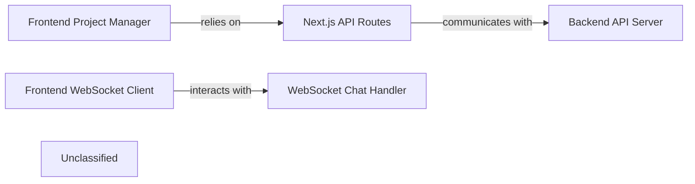

## Details

The system is structured around a client-side Frontend Project Manager responsible for user interface interactions related to wiki projects, which relies on Next.js API Routes for data fetching. Real-time communication, such as chat, is handled by the Frontend WebSocket Client interacting directly with the WebSocket Chat Handler on the backend. The Next.js API Routes serve as an intermediary, potentially communicating with a Backend API Server (a FastAPI application) for more complex data processing, configuration, and export functionalities. The Backend API Server also exposes various endpoints for system configuration and data management. The WebSocket Chat Handler is a dedicated component for managing real-time chat completions, including RAG retrieval and streaming responses. This architecture separates concerns between client-side presentation, Next.js API routing, and core backend services, enabling a scalable and maintainable application.

### Frontend Project Manager
Manages the client-side state and logic for displaying, interacting with, and managing processed wiki projects. It orchestrates data fetching and updates related to project listings and details, providing the core project management interface.

**Related Classes/Methods**:

- <a href="https://github.com/AsyncFuncAI/deepwiki-open/blob/mainsrc/hooks/useProcessedProjects.ts" target="_blank" rel="noopener noreferrer">`useProcessedProjects`</a>

### Frontend WebSocket Client
Establishes and maintains real-time communication channels for interactive features, primarily the chat interface. It handles sending user messages and receiving real-time updates from the backend, enabling dynamic user interaction.

**Related Classes/Methods**:

- <a href="https://github.com/AsyncFuncAI/deepwiki-open/blob/mainsrc/utils/websocketClient.ts" target="_blank" rel="noopener noreferrer">`createChatWebSocket`</a>

### Next.js API Routes
Provides server-side API endpoints within the Next.js application to handle data requests from the client-side. These routes act as an intermediary, processing requests for wiki projects and other data.

**Related Classes/Methods**:

- <a href="https://github.com/AsyncFuncAI/deepwiki-open/blob/mainsrc/app/api/wiki/projects/route.ts" target="_blank" rel="noopener noreferrer">`src/app/api/wiki/projects/route.ts`</a>
- <a href="https://github.com/AsyncFuncAI/deepwiki-open/blob/mainsrc/app/api/chat/stream/route.ts" target="_blank" rel="noopener noreferrer">`src/app/api/chat/stream/route.ts`</a>

### Backend API Server [[Expand]](./Backend_API_Server.md)
A FastAPI application that provides core backend services, including language configuration, authentication status, model configuration, wiki export functionality, and local repository structure retrieval.

**Related Classes/Methods**:

- <a href="https://github.com/AsyncFuncAI/deepwiki-open/blob/mainapi/api.py" target="_blank" rel="noopener noreferrer">`app`</a>

### WebSocket Chat Handler
Manages real-time chat communication via WebSocket, processing incoming chat completion requests, preparing RAG retrievers, and streaming responses back to the client.

**Related Classes/Methods**:

- <a href="https://github.com/AsyncFuncAI/deepwiki-open/blob/mainapi/websocket_wiki.py#L52-L769" target="_blank" rel="noopener noreferrer">`handle_websocket_chat`:52-769</a>

### Unclassified
Component for all unclassified files and utility functions (Utility functions/External Libraries/Dependencies)

**Related Classes/Methods**: _None_

### [FAQ](https://github.com/CodeBoarding/GeneratedOnBoardings/tree/main?tab=readme-ov-file#faq)