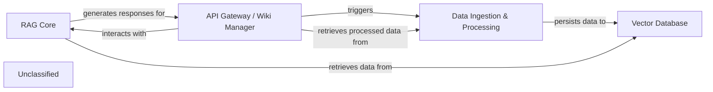

## Details

The system's architecture is centered around processing code repositories to create an intelligent, queryable wiki. The API Gateway / Wiki Manager acts as the primary interface, handling external requests for wiki management, project metadata, and model configurations. It orchestrates the Data Ingestion & Processing component to download, parse, and embed repository content, which is then stored in a Vector Database. The RAG Core leverages this stored data, retrieving relevant information and employing a Language Model to generate AI-driven answers to user queries, which are then exposed back through the API Gateway / Wiki Manager. This design ensures a clear separation of concerns, with dedicated components for data handling, intelligent retrieval, and external interaction.

### Data Ingestion & Processing [[Expand]](./Data_Ingestion_Processing.md)
Manages the entire lifecycle of data ingestion. This involves downloading repositories, reading and transforming source documents, persisting them into the vector database for efficient retrieval, and indexing generated wiki content and project metadata. It also handles file content retrieval from various source control systems. This component is responsible for the *persistence* and *initial indexing* of data relevant to the wiki.

**Related Classes/Methods**:

- <a href="https://github.com/AsyncFuncAI/deepwiki-open/blob/mainapi/data_pipeline.py#L58-L127" target="_blank" rel="noopener noreferrer">`api.data_pipeline.download_repo`:58-127</a>
- <a href="https://github.com/AsyncFuncAI/deepwiki-open/blob/mainapi/data_pipeline.py#L132-L353" target="_blank" rel="noopener noreferrer">`api.data_pipeline.read_all_documents`:132-353</a>
- <a href="https://github.com/AsyncFuncAI/deepwiki-open/blob/mainapi/data_pipeline.py#L28-L56" target="_blank" rel="noopener noreferrer">`api.data_pipeline.count_tokens`:28-56</a>

### RAG Core
Orchestrates the core Retrieval Augmented Generation (RAG) process. This includes managing conversational context, initializing the database manager, and retrieving relevant information from the vector database, then generating AI-driven answers by combining this retrieved information with LLM capabilities. This component is primarily responsible for the *retrieval* of vector embeddings and relevant data from the underlying storage.

**Related Classes/Methods**:

- <a href="https://github.com/AsyncFuncAI/deepwiki-open/blob/mainapi/rag.py#L153-L444" target="_blank" rel="noopener noreferrer">`api.rag.RAG`:153-444</a>
- <a href="https://github.com/AsyncFuncAI/deepwiki-open/blob/mainapi/rag.py" target="_blank" rel="noopener noreferrer">`api.rag.Memory`</a>
- <a href="https://github.com/AsyncFuncAI/deepwiki-open/blob/mainapi/rag.py#L28-L38" target="_blank" rel="noopener noreferrer">`api.rag.CustomConversation`:28-38</a>

### API Gateway / Wiki Manager
Serves as the primary interface for external clients to interact with the wiki system. It exposes RESTful endpoints for operations such as exporting wiki content, managing wiki caches (reading, saving, deleting), retrieving generated wiki content, and accessing project metadata. It also lists processed projects and retrieves model configurations. This component handles the *retrieval* of generated wiki content and project metadata, as well as *managing the persistence* of wiki caches.

**Related Classes/Methods**:

- <a href="https://github.com/AsyncFuncAI/deepwiki-open/blob/mainapi/api.py" target="_blank" rel="noopener noreferrer">`api.api.app`</a>
- <a href="https://github.com/AsyncFuncAI/deepwiki-open/blob/mainapi/api.py#L167-L225" target="_blank" rel="noopener noreferrer">`api.api.get_model_config`:167-225</a>
- <a href="https://github.com/AsyncFuncAI/deepwiki-open/blob/mainapi/api.py#L227-L273" target="_blank" rel="noopener noreferrer">`api.api.export_wiki`:227-273</a>
- <a href="https://github.com/AsyncFuncAI/deepwiki-open/blob/mainapi/api.py#L275-L320" target="_blank" rel="noopener noreferrer">`api.api.get_local_repo_structure`:275-320</a>

### Vector Database
Stores and manages the vector embeddings and associated metadata of the processed documents. It provides efficient retrieval mechanisms for the RAG Core to fetch relevant information based on semantic similarity.

**Related Classes/Methods**:

- <a href="https://github.com/AsyncFuncAI/deepwiki-open/blob/mainapi/data_pipeline.py#L675-L841" target="_blank" rel="noopener noreferrer">`api.data_pipeline.DatabaseManager`:675-841</a>
- <a href="https://github.com/AsyncFuncAI/deepwiki-open/blob/mainapi/rag.py" target="_blank" rel="noopener noreferrer">`api.rag.FAISSRetriever`</a>

### Unclassified
Component for all unclassified files and utility functions (Utility functions/External Libraries/Dependencies)

**Related Classes/Methods**: _None_

### [FAQ](https://github.com/CodeBoarding/GeneratedOnBoardings/tree/main?tab=readme-ov-file#faq)