```mermaid
graph LR
    Frontend_Application["Frontend Application"]
    Backend_API_Server["Backend API Server"]
    Configuration_Management["Configuration Management"]
    Data_Ingestion_Processing["Data Ingestion & Processing"]
    AI_Core_Services["AI Core Services"]
    Wiki_Persistence_Retrieval["Wiki Persistence & Retrieval"]
    Unclassified["Unclassified"]
    Frontend_Application -- "sends project management requests (REST) to" --> Backend_API_Server
    Frontend_Application -- "sends chat messages (WebSocket) to" --> Backend_API_Server
    Backend_API_Server -- "loads configurations from" --> Configuration_Management
    Backend_API_Server -- "initiates project processing by triggering" --> Data_Ingestion_Processing
    Backend_API_Server -- "forwards chat requests to" --> AI_Core_Services
    Backend_API_Server -- "requests wiki data or export operations from" --> Wiki_Persistence_Retrieval
    Configuration_Management -- "provides embedder settings to" --> Data_Ingestion_Processing
    Data_Ingestion_Processing -- "stores processed document metadata and embeddings into" --> Wiki_Persistence_Retrieval
    Configuration_Management -- "provides LLM client settings to" --> AI_Core_Services
    AI_Core_Services -- "retrieves contextual information from" --> Wiki_Persistence_Retrieval
    Wiki_Persistence_Retrieval -- "provides retrieved document chunks to" --> AI_Core_Services
    Wiki_Persistence_Retrieval -- "returns wiki data or status to" --> Backend_API_Server
    click Frontend_Application href "https://github.com/CodeBoarding/GeneratedOnBoardings/blob/main/deepwiki-open/Frontend_Application.md" "Details"
    click Backend_API_Server href "https://github.com/CodeBoarding/GeneratedOnBoardings/blob/main/deepwiki-open/Backend_API_Server.md" "Details"
    click Configuration_Management href "https://github.com/CodeBoarding/GeneratedOnBoardings/blob/main/deepwiki-open/Configuration_Management.md" "Details"
    click Data_Ingestion_Processing href "https://github.com/CodeBoarding/GeneratedOnBoardings/blob/main/deepwiki-open/Data_Ingestion_Processing.md" "Details"
    click AI_Core_Services href "https://github.com/CodeBoarding/GeneratedOnBoardings/blob/main/deepwiki-open/AI_Core_Services.md" "Details"
    click Wiki_Persistence_Retrieval href "https://github.com/CodeBoarding/GeneratedOnBoardings/blob/main/deepwiki-open/Wiki_Persistence_Retrieval.md" "Details"
```

## Details

The DeepWiki project is structured around a client-server architecture, with a Next.js/React frontend interacting with a FastAPI backend. The frontend provides the user interface for managing projects, viewing generated wikis, and engaging in chat. The backend serves as the central hub, handling API requests, orchestrating data processing, and integrating with various AI services for content generation and retrieval. Configuration is managed centrally, ensuring consistent settings across the application. Data ingestion involves cloning repositories, processing documents, and generating embeddings, which are then stored and retrieved by the wiki persistence layer. The AI Core Services component leverages multiple LLM providers for RAG and conversational AI, providing intelligent responses to user queries.

### Frontend Application [[Expand]](./Frontend_Application.md)
The user-facing web interface, built with Next.js and React, enabling users to view processed wikis, manage projects, and interact via chat. It handles user input and displays generated content.

**Related Classes/Methods**:

- <a href="https://github.com/AsyncFuncAI/deepwiki-open/blob/mainsrc/hooks/useProcessedProjects.ts" target="_blank" rel="noopener noreferrer">`src/hooks/useProcessedProjects.ts`</a>
- <a href="https://github.com/AsyncFuncAI/deepwiki-open/blob/mainsrc/utils/websocketClient.ts" target="_blank" rel="noopener noreferrer">`src/utils/websocketClient.ts`</a>
- <a href="https://github.com/AsyncFuncAI/deepwiki-open/blob/mainsrc/app/api/wiki/projects/route.ts" target="_blank" rel="noopener noreferrer">`src/app/api/wiki/projects/route.ts`</a>

### Backend API Server [[Expand]](./Backend_API_Server.md)
The core FastAPI backend, exposing RESTful endpoints for project management, wiki export, and configuration, alongside WebSocket endpoints for real-time chat. It acts as the central orchestrator for backend operations.

**Related Classes/Methods**:

- <a href="https://github.com/AsyncFuncAI/deepwiki-open/blob/mainapi/main.py" target="_blank" rel="noopener noreferrer">`api/main.py`</a>
- <a href="https://github.com/AsyncFuncAI/deepwiki-open/blob/mainapi/api.py" target="_blank" rel="noopener noreferrer">`api/api.py`</a>
- <a href="https://github.com/AsyncFuncAI/deepwiki-open/blob/mainapi/websocket_wiki.py" target="_blank" rel="noopener noreferrer">`api/websocket_wiki.py`</a>
- <a href="https://github.com/AsyncFuncAI/deepwiki-open/blob/mainapi/simple_chat.py" target="_blank" rel="noopener noreferrer">`api/simple_chat.py`</a>

### Configuration Management [[Expand]](./Configuration_Management.md)
Manages the loading and resolution of application, LLM provider, embedder, repository, and language configurations from JSON files and environment variables, ensuring consistent settings across the system.

**Related Classes/Methods**:

- <a href="https://github.com/AsyncFuncAI/deepwiki-open/blob/mainapi/config.py" target="_blank" rel="noopener noreferrer">`api/config.py`</a>
- <a href="https://github.com/AsyncFuncAI/deepwiki-open/blob/mainapi/config" target="_blank" rel="noopener noreferrer">`api/config/`</a>

### Data Ingestion & Processing [[Expand]](./Data_Ingestion_Processing.md)
Orchestrates the entire data ingestion and processing workflow, including cloning repositories, parsing and chunking documents, and generating vector embeddings for semantic search.

**Related Classes/Methods**:

- <a href="https://github.com/AsyncFuncAI/deepwiki-open/blob/mainapi/data_pipeline.py" target="_blank" rel="noopener noreferrer">`api/data_pipeline.py`</a>
- <a href="https://github.com/AsyncFuncAI/deepwiki-open/blob/mainapi/tools/embedder.py" target="_blank" rel="noopener noreferrer">`api/tools/embedder.py`</a>
- <a href="https://github.com/AsyncFuncAI/deepwiki-open/blob/mainapi/dashscope_client.py" target="_blank" rel="noopener noreferrer">`api/dashscope_client.py`</a>

### AI Core Services [[Expand]](./AI_Core_Services.md)
Provides a standardized, pluggable interface for interacting with various Large Language Models and orchestrates the Retrieval Augmented Generation (RAG) process, managing conversational memory, and synthesizing context-aware responses.

**Related Classes/Methods**:

- <a href="https://github.com/AsyncFuncAI/deepwiki-open/blob/mainapi/rag.py" target="_blank" rel="noopener noreferrer">`api/rag.py`</a>
- <a href="https://github.com/AsyncFuncAI/deepwiki-open/blob/mainapi/prompts.py" target="_blank" rel="noopener noreferrer">`api/prompts.py`</a>
- <a href="https://github.com/AsyncFuncAI/deepwiki-open/blob/mainapi/openrouter_client.py" target="_blank" rel="noopener noreferrer">`api/openrouter_client.py`</a>
- <a href="https://github.com/AsyncFuncAI/deepwiki-open/blob/mainapi/azureai_client.py" target="_blank" rel="noopener noreferrer">`api/azureai_client.py`</a>
- <a href="https://github.com/AsyncFuncAI/deepwiki-open/blob/mainapi/bedrock_client.py" target="_blank" rel="noopener noreferrer">`api/bedrock_client.py`</a>
- <a href="https://github.com/AsyncFuncAI/deepwiki-open/blob/mainapi/openai_client.py" target="_blank" rel="noopener noreferrer">`api/openai_client.py`</a>
- <a href="https://github.com/AsyncFuncAI/deepwiki-open/blob/mainapi/dashscope_client.py" target="_blank" rel="noopener noreferrer">`api/dashscope_client.py`</a>

### Wiki Persistence & Retrieval [[Expand]](./Wiki_Persistence_Retrieval.md)
Manages the persistence, indexing, and retrieval of the generated wiki content, project metadata, and vector embeddings, implicitly handling interactions with the underlying vector database and other storage mechanisms.

**Related Classes/Methods**:

- <a href="https://github.com/AsyncFuncAI/deepwiki-open/blob/mainapi/data_pipeline.py" target="_blank" rel="noopener noreferrer">`api/data_pipeline.py`</a>
- <a href="https://github.com/AsyncFuncAI/deepwiki-open/blob/mainapi/rag.py" target="_blank" rel="noopener noreferrer">`api/rag.py`</a>
- <a href="https://github.com/AsyncFuncAI/deepwiki-open/blob/mainapi/api.py" target="_blank" rel="noopener noreferrer">`api/api.py`</a>

### Unclassified
Component for all unclassified files and utility functions (Utility functions/External Libraries/Dependencies)

**Related Classes/Methods**: _None_

### [FAQ](https://github.com/CodeBoarding/GeneratedOnBoardings/tree/main?tab=readme-ov-file#faq)