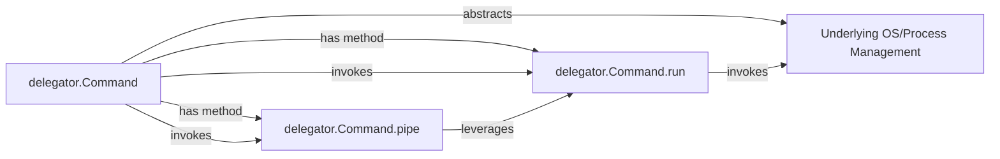

## Details

The `delegator` library provides a high-level, simplified interface for executing and managing external commands, abstracting the complexities of underlying operating system processes. At its core, the `delegator.Command` class encapsulates command details and orchestrates their execution. It leverages internal methods like `run` for execution initiation and `pipe` for command chaining. The library interacts with the `Underlying OS/Process Management` (typically via Python's `subprocess` module) to perform the actual low-level process operations, while utility functions such as `block`, `send`, and `out` manage command lifecycle, input, and output, respectively. This design allows for robust and flexible command execution and piping within Python applications.

### delegator.Command
The central component of the `Command Execution Core`. It represents an external command, encapsulating its command string, arguments, and execution state. This class provides the primary API for users to initiate command execution and orchestrate command chaining, abstracting the complexities of underlying process management.

**Related Classes/Methods**: _None_

### delegator.Command.run
A key method of the `delegator.Command` class responsible for initiating the actual execution of a command. It handles the choice between blocking and non-blocking modes and manages the command's lifecycle from start to completion.

**Related Classes/Methods**: _None_

### delegator.Command.pipe
A method of the `delegator.Command` class that orchestrates the chaining of multiple `Command` objects. It manages the redirection of standard output from one command to serve as standard input for a subsequent command, enabling complex command pipelines.

**Related Classes/Methods**: _None_

### Underlying OS/Process Management
Represents the operating system's native capabilities for process creation, management, and inter-process communication (e.g., via Python's `subprocess` module). The `delegator` library abstracts these low-level details, providing a simplified interface. This is an external abstraction, not a component with source code within the `delegator` project.

**Related Classes/Methods**: _None_

### [FAQ](https://github.com/CodeBoarding/GeneratedOnBoardings/tree/main?tab=readme-ov-file#faq)