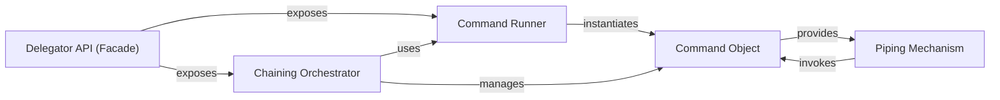

## Details

The `delegator` library's architecture is centered around the **Delegator API (Facade)**, which serves as the primary user interface. This Facade exposes two key functionalities: the **Command Runner** (`delegator.run`) for executing single commands, and the **Chaining Orchestrator** (`delegator.chain`) for managing sequences of commands. The **Command Runner** is responsible for instantiating the fundamental **Command Object**, which encapsulates the details of an external process. Each **Command Object** provides a **Piping Mechanism** (`Command.pipe`) that allows its output to be directed as input to another `Command Object`, facilitating shell-like piping. The **Chaining Orchestrator** orchestrates the execution of multiple **Command Objects**, often utilizing the **Command Runner** to create them, to achieve complex command workflows.

### Delegator API (Facade)
The central, user-facing facade that provides a simplified API for running, interacting with, and managing external commands. It serves as the primary entry point for users, exposing core functionalities like direct command execution and command chaining.

**Related Classes/Methods**:

### Command Runner
Responsible for initiating new command executions by creating and managing individual `Command` instances. It handles the direct execution of a single external command, returning a `Command Object` for further interaction.

**Related Classes/Methods**:

- <a href="https://github.com/amitt001/delegator.py/blob/master/delegator.py#L332-L339" target="_blank" rel="noopener noreferrer">`delegator.run`:332-339</a>

### Command Object
The core abstraction representing an executed external command. It encapsulates the subprocess, its state (e.g., return code, running status), and I/O streams (stdout, stderr, stdin). This object provides methods for managing and interacting with the command, including piping its output.

**Related Classes/Methods**:

- <a href="https://github.com/amitt001/delegator.py/blob/master/delegator.py" target="_blank" rel="noopener noreferrer">`delegator.Command`</a>

### Piping Mechanism
A method of the `Command Object` that enables the chaining of commands by directing the standard output of one command to the standard input of another. It manages the data flow between sequentially executed commands, effectively simulating shell pipes.

**Related Classes/Methods**:

### Chaining Orchestrator
A top-level function exposed by the `Delegator API (Facade)` that manages the sequential execution of multiple commands. It handles their overall flow and potential inter-command data transfer, ensuring commands are run in a specified order and their outcomes are managed.

**Related Classes/Methods**:

- <a href="https://github.com/amitt001/delegator.py/blob/master/delegator.py#L315-L329" target="_blank" rel="noopener noreferrer">`delegator.chain`:315-329</a>

### [FAQ](https://github.com/CodeBoarding/GeneratedOnBoardings/tree/main?tab=readme-ov-file#faq)