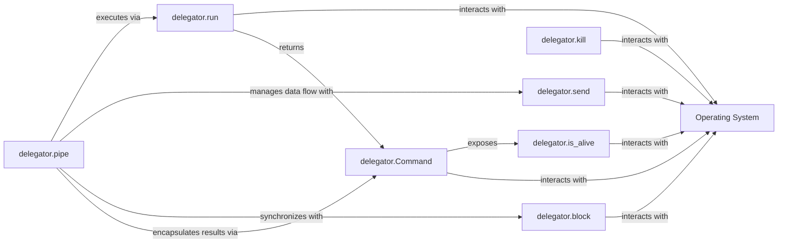

## Details

The `delegator` subsystem provides a high-level interface for executing and managing external commands and processes on the underlying Operating System. Its core functionality revolves around `delegator.run` for single command execution and `delegator.pipe` for orchestrating command pipelines. The `delegator.Command` object serves as a central abstraction, encapsulating the state and output of an executed process, and exposing methods like `delegator.is_alive` to query process status. Auxiliary components such as `delegator.send`, `delegator.kill`, and `delegator.block` facilitate fine-grained control over process input, termination, and synchronization, all interacting directly with the Operating System to achieve their objectives.

### delegator.run
The primary entry point for executing single external commands on the Operating System. It acts as a facade over `subprocess.Popen`, initiating new OS processes.

**Related Classes/Methods**:

- <a href="https://github.com/amitt001/delegator.py/blob/master/delegator.py#L332-L339" target="_blank" rel="noopener noreferrer">`delegator.run`:332-339</a>

### delegator.pipe
Orchestrates the execution of multiple commands in a pipeline, managing inter-process communication (IPC) by connecting the output of one OS process to the input of another.

**Related Classes/Methods**:

- <a href="https://github.com/amitt001/delegator.py/blob/master/delegator.py#L264-L285" target="_blank" rel="noopener noreferrer">`delegator.pipe`:264-285</a>

### delegator.Command
An object that encapsulates the output (stdout, stderr), return code, and process status of executed OS commands. It provides methods for querying and interacting with the underlying OS process.

**Related Classes/Methods**: _None_

### delegator.send
Manages sending data or signals to active OS processes, primarily leveraging `subprocess` functionalities to interact with the process's standard input.

**Related Classes/Methods**:

- <a href="https://github.com/amitt001/delegator.py/blob/master/delegator.py#L217-L229" target="_blank" rel="noopener noreferrer">`delegator.send`:217-229</a>

### delegator.kill
Handles the termination of running OS processes, utilizing `pexpect` for more robust process control and signal handling.

**Related Classes/Methods**:

- <a href="https://github.com/amitt001/delegator.py/blob/master/delegator.py#L234-L238" target="_blank" rel="noopener noreferrer">`delegator.kill`:234-238</a>

### delegator.block
Provides mechanisms to wait for an OS process to complete its execution, ensuring sequential command flow or resource synchronization.

**Related Classes/Methods**: _None_

### delegator.is_alive
Determines the current operational status of an OS process, checking if it's still running by querying its Process ID (PID).

**Related Classes/Methods**:

- <a href="https://github.com/amitt001/delegator.py/blob/master/delegator.py#L160-L163" target="_blank" rel="noopener noreferrer">`delegator.is_alive`:160-163</a>

### Operating System [[Expand]](./Operating_System.md)
External dependency that the `delegator` library interacts with to manage subprocesses. This component represents the underlying operating system and does not have source code within the `delegator` project.

**Related Classes/Methods**: _None_

### [FAQ](https://github.com/CodeBoarding/GeneratedOnBoardings/tree/main?tab=readme-ov-file#faq)