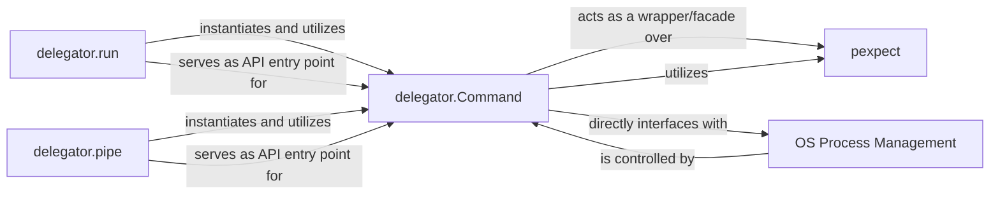

## Details

The `delegator` subsystem is centered around the `delegator.Command` component, which encapsulates the logic for interacting with external processes. This central component directly interfaces with underlying `OS Process Management` capabilities (via Python's `subprocess` module) and acts as a facade over the `pexpect` library to provide advanced interactive features. High-level functions like `delegator.run` and `delegator.pipe` serve as primary API entry points, simplifying common use cases by instantiating and orchestrating `delegator.Command` instances. This design effectively abstracts complex process management, offering a user-friendly interface while maintaining robust control over subprocess execution and interaction.

### delegator.Command
This is the core component responsible for managing the lifecycle of a single external subprocess. It provides methods for sending input to the subprocess, expecting specific output patterns, and controlling its execution (termination, killing, blocking). It acts as a facade over lower-level process management mechanisms and leverages the `pexpect` library for interactive features.

**Related Classes/Methods**:

- <a href="https://github.com/amitt001/delegator.py/blob/master/delegator.py" target="_blank" rel="noopener noreferrer">`delegator.Command`</a>
- <a href="https://github.com/amitt001/delegator.py/blob/master/delegator.py" target="_blank" rel="noopener noreferrer">`delegator.Command:send`</a>
- <a href="https://github.com/amitt001/delegator.py/blob/master/delegator.py" target="_blank" rel="noopener noreferrer">`delegator.Command:expect`</a>
- <a href="https://github.com/amitt001/delegator.py/blob/master/delegator.py" target="_blank" rel="noopener noreferrer">`delegator.Command:terminate`</a>
- <a href="https://github.com/amitt001/delegator.py/blob/master/delegator.py" target="_blank" rel="noopener noreferrer">`delegator.Command:kill`</a>
- <a href="https://github.com/amitt001/delegator.py/blob/master/delegator.py" target="_blank" rel="noopener noreferrer">`delegator.Command:block`</a>

### OS Process Management
Represents the fundamental capabilities provided by the operating system for creating, managing, and terminating processes. While external to the `delegator` library, `delegator.Command` directly interfaces with these capabilities, primarily through Python's `subprocess` module.

**Related Classes/Methods**: _None_

### pexpect
An external Python library that provides a high-level interface for controlling other programs, especially those that present a pseudo-terminal interface. `delegator.Command` leverages `pexpect` for its interactive features, such as expecting specific output patterns.

**Related Classes/Methods**: _None_

### delegator.run
A high-level function that serves as a primary entry point for users to execute a single command. It abstracts the direct instantiation and basic usage of `delegator.Command`, providing a simplified API for common command execution needs.

**Related Classes/Methods**:

- <a href="https://github.com/amitt001/delegator.py/blob/master/delegator.py#L332-L339" target="_blank" rel="noopener noreferrer">`delegator.run`:332-339</a>

### delegator.pipe
A high-level function designed for chaining multiple command operations, mimicking the shell's pipe (`|`) functionality. It orchestrates the execution and output redirection between multiple commands, often by managing multiple `delegator.Command` instances internally.

**Related Classes/Methods**:

- <a href="https://github.com/amitt001/delegator.py/blob/master/delegator.py#L264-L285" target="_blank" rel="noopener noreferrer">`delegator.pipe`:264-285</a>

### [FAQ](https://github.com/CodeBoarding/GeneratedOnBoardings/tree/main?tab=readme-ov-file#faq)