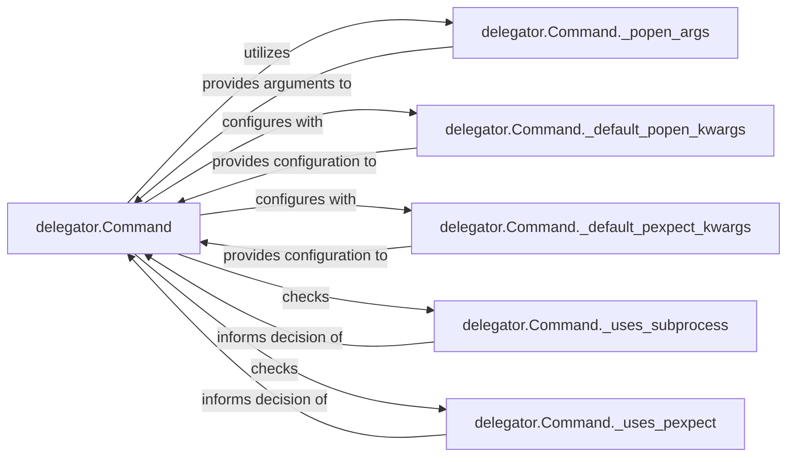

## Details

An internal subsystem within the `delegator.Command` class that encapsulates the complexities of underlying OS process management and third-party libraries (`subprocess` and `pexpect`), providing a simplified interface for process creation, communication, and stream handling.

### delegator.Command
The primary facade of the `delegator` library, providing a unified API for executing shell commands. Within this subsystem, it acts as the orchestrator, invoking the specific low-level components to manage subprocesses and their I/O.

**Related Classes/Methods**:

- <a href="https://github.com/amitt001/delegator.py/blob/master/delegator.py" target="_blank" rel="noopener noreferrer">`delegator.Command`</a>

### delegator.Command._popen_args
An internal method responsible for preparing and formatting command arguments into a structure suitable for the `subprocess.Popen` constructor. It translates the user's command input into the precise format required by the underlying `subprocess` module.

**Related Classes/Methods**:

- <a href="https://github.com/amitt001/delegator.py/blob/master/delegator.py#L50-L285" target="_blank" rel="noopener noreferrer">`delegator.Command._popen_args`:50-285</a>

### delegator.Command._default_popen_kwargs
An internal method or attribute that provides a standardized set of default keyword arguments for `subprocess.Popen`. This ensures consistent configuration of new processes, such as setting `stdin`, `stdout`, `stderr`, and `shell` parameters.

**Related Classes/Methods**:

- <a href="https://github.com/amitt001/delegator.py/blob/master/delegator.py#L50-L285" target="_blank" rel="noopener noreferrer">`delegator.Command._default_popen_kwargs`:50-285</a>

### delegator.Command._default_pexpect_kwargs
An internal method or attribute that supplies default keyword arguments specifically for `pexpect` operations. This configures how interactive processes behave, including timeout settings and encoding.

**Related Classes/Methods**:

- <a href="https://github.com/amitt001/delegator.py/blob/master/delegator.py#L50-L285" target="_blank" rel="noopener noreferrer">`delegator.Command._default_pexpect_kwargs`:50-285</a>

### delegator.Command._uses_subprocess
An internal flag or method that determines if the `subprocess` module is the active backend for process management. It acts as a decision point for routing process execution to the appropriate low-level library.

**Related Classes/Methods**:

- <a href="https://github.com/amitt001/delegator.py/blob/master/delegator.py#L50-L285" target="_blank" rel="noopener noreferrer">`delegator.Command._uses_subprocess`:50-285</a>

### delegator.Command._uses_pexpect
An internal flag or method that determines if the `pexpect` library is the active backend for process interaction. Similar to `_uses_subprocess`, it guides the system in choosing the correct communication mechanism for interactive processes.

**Related Classes/Methods**:

- <a href="https://github.com/amitt001/delegator.py/blob/master/delegator.py#L50-L285" target="_blank" rel="noopener noreferrer">`delegator.Command._uses_pexpect`:50-285</a>

### [FAQ](https://github.com/CodeBoarding/GeneratedOnBoardings/tree/main?tab=readme-ov-file#faq)